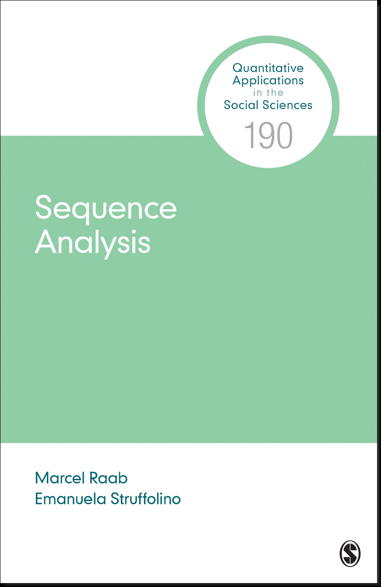

```{r setup, include=FALSE}
knitr::opts_chunk$set(echo = FALSE)
# Load and download (if necessary) required packages ----

# Save package names as a vector of strings
pkgs <- c("fontawesome", "icons", "knitr", "tufte") 

# Options that might help to prevent some errors in the installation process
options(install.packages.check.source = "no")
options(install.packages.compile.from.source = "never")

## Install uninstalled packages
lapply(pkgs[!(pkgs %in% installed.packages())], 
       install.packages, repos = getOption("repos")["CRAN"])

## Load all packages to library and adjust options
lapply(pkgs, library, character.only = TRUE)

```

::: {.floatting}

```{r out.width='25%', out.extra='style="float:right; padding:10px"', fig.link='https://us.sagepub.com/en-us/nam/sequence-analysis/book272086'}

```

This site is intended to enhance your use of the book **Sequence Analysis** by Marcel Raab & Emanuela Struffolino. On this webpage we provide accompanying material illustrating how to conduct sequence analysis in `r icon_style(fontawesome("r-project"), fill = "#384CB7")` using *TraMineR*, *TraMineRExtras* [@gabadinho2011] ^[also see <http://traminer.unige.ch>] , and *WeightedCluster* [@studer2013].


Please note that most of the materials on this site are designed to be used in tandem with the book published by SAGE (`r fontawesome::fa("shopping-cart")` pre-order from [SAGE](https://us.sagepub.com/en-us/nam/sequence-analysis/book272086) or [Amazon](https://www.amazon.com/dp/B09MJCBKC3/ref=cm_sw_em_r_mt_dp_YDSYM9W43ZEDWMZK27PV)). 

:::


<aside>

\

> "This book provides a comprehensive and updated introduction to sequence analysis,
>  I highly recommend it for anyone who wants to learn the topic systematically."
>
> `r tufte::quote_footer('--- Tim F. Liao (University of Illinois at Urbana-Champaign)')`

\

</aside>
 


```{=html}
<style>
div.green { background-color:#8DCEA4; border-radius: 5px; padding: 20px;}
</style>
```

::: green
**Note:**<br> This site is under construction! We kindly ask you to cite us anyway, if you use the material shared on this page.
:::


## Citation {.appendix}

For attribution, please cite this work as:

<!-- <style>
div.green { background-color:#8DCEA4; border-radius: 3px; padding: 10px;}
</style>
<div class = "green">
**Raab, M. & Struffolino, E. (2022). Sequence Analysis. Thousand Oaks, CA: Sage.**
</div> -->

<pre class="citation-appendix short">
Raab, M. & Struffolino, E. (2022). Sequence Analysis. Thousand Oaks, CA: Sage.
</pre>

<p>BibTeX citation</p>
<pre class="citation-appendix long">@book{raabstruffolino2022,
	author = {Raab, Marcel and Struffolino, Emanuela},
	year = {2022},
	title = {Sequence Analysis},
	series = {Quantitative Applications in the Social Sciences},
	number = {190},
	publisher = {SAGE},
	address = {Thousand Oaks, CA},
	isbn = {9781071801888}
}</pre>

