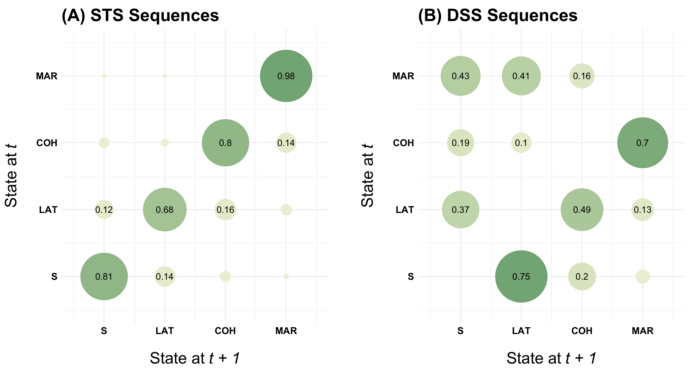
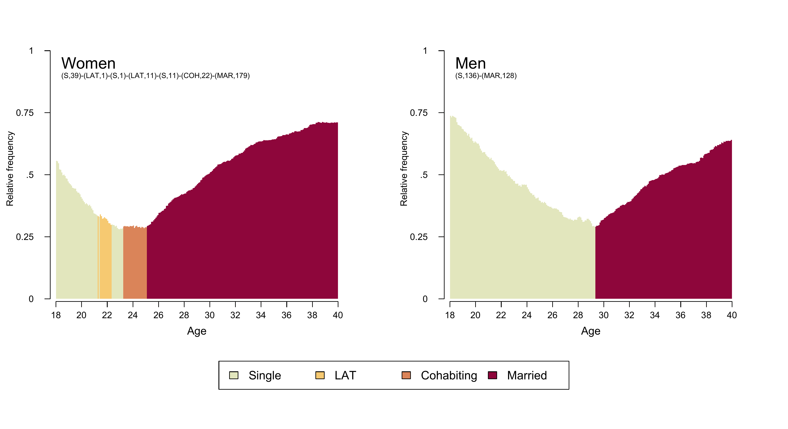
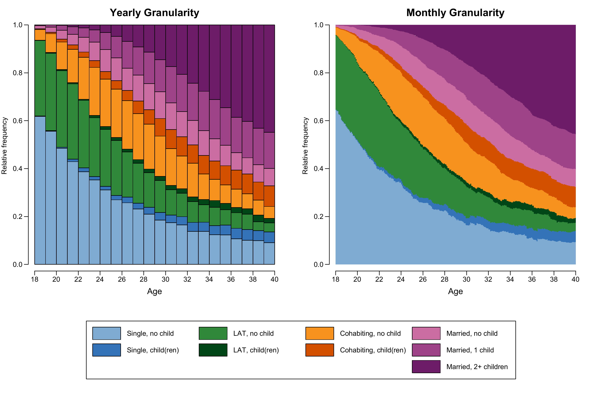
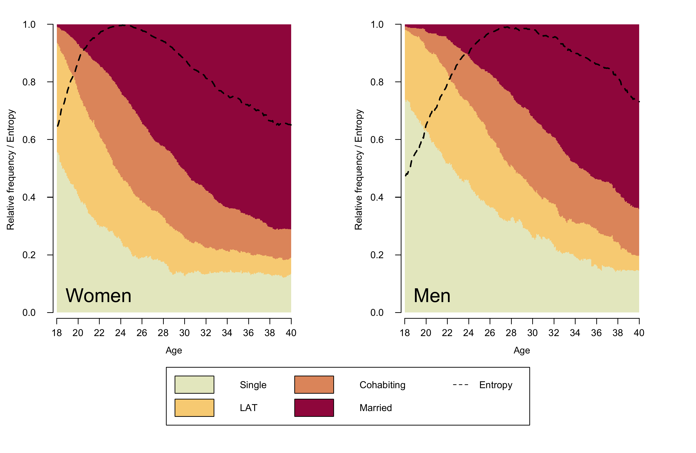

  
```{r setup, include=FALSE}
# Load required packages
library(here)
source(here("source", "load_libraries.R"))

# Output options
knitr::opts_chunk$set(eval=TRUE, echo=TRUE)
options("kableExtra.html.bsTable" = T)

# load data for Chapter 2
load(here("data", "2-0_ChapterSetup.RData"))
```

```{r, xaringanExtra-clipboard, echo=FALSE}
htmltools::tagList(
  xaringanExtra::use_clipboard(
    button_text = "<i class=\"fa fa-clone fa-2x\" style=\"color: #c58dce\"></i>",
    success_text = "<i class=\"fa fa-check fa-2x\" style=\"color: #90BE6D\"></i>",
    error_text = "<i class=\"fa fa-times fa-2x\" style=\"color: #F94144\"></i>"
  ),
  rmarkdown::html_dependency_font_awesome()
)
```

<details><summary>**Click here to get instructions...**</summary>

- Please download and unzip the replication files for Chapter 2
([`r fontawesome::fa("far fa-file-zipper")` Chapter02.zip](source/Chapter02.zip)). 
- Read `readme.html` and run `2-0_ChapterSetup.R`. This will create `2-0_ChapterSetup.RData` in the sub folder `data/R`. This file contains the data required to re-produce the results shown below. 
- We also recommend to load the libraries listed in the Chapter 2's `LoadInstallPackages.R`

```{r, eval=FALSE}
# assuming you are working within .Rproj environment
library(here)

# install (if necessary) and load other required packages
source(here("source", "load_libraries.R"))

# load environment generated in "2-0_ChapterSetup.R"
load(here("data", "R", "2-0_ChapterSetup.RData"))

```
</details>


The figures in the book are printed in grayscale. Here we present the colored versions of the figures. The zip archive with the replication files for chapter 2 contains both the code required to produce the grayscale and the colored figures. Note that the code for the grayscale plots rendered with `seqplot` is considerably longer than the code for the colored figures because adding shading lines requires some extra coding (see tutorial [*Color palette: Grayscale Edition*](rChapter2-4_grayscale.html))

The first plots presented in **Chapter 2.4.1** are based on a reduced alphabet distinguishing four different partnership states. For the last examples we use a extended state space that combines information on partnership status and fertility. The corresponding tabular presentation can be found [here](rChapter2-3.html). 

## Transition plot

**Figure 2.1** is the only plot in the book which is not generated by using the [`{TraMineR}`](http://traminer.unige.ch){target="_blank"} package. It is rendered using [`{ggplot2}`](https://ggplot2.tidyverse.org/){target="_blank"}. The transition matrix is obtained by [`{TraMineR}`](http://traminer.unige.ch){target="_blank"}'s `seqtrate` function and turned into a dataframe using [`{reshape2}`](https://github.com/hadley/reshape){target="_blank"}'s `melt` function.

The figure shows two transitions plots. The first is based on sequences stored in the STS format (allows for recurrence of the same state) while the second uses data stored in the DSS format (focusing on the order of distinct states).

The following code chunk illustrates how to generate the data for the transition plot based on STS sequences:

```{r eval = TRUE, echo = TRUE}

# ... using yearly sequence data (STS format)

transmat <- seqtrate(partner.year.seq)

rownames(transmat) <- c(1, 2, 3, 4)
colnames(transmat) <- c(1, 2, 3, 4)

seqtrate_df <- as_tibble(reshape2::melt(transmat)) %>% 
  rename(origin = Var1,
         destination = Var2)

seqtrate_df
```

<details><summary>**Alternative approach using `pivot_longer` instead of `melt`**</summary>

[`{reshape2}`](https://github.com/hadley/reshape){target="_blank"} has been declared [](https://lifecycle.r-lib.org/articles/stages.html#superseded){target="_blank"}. Therefore, we also briefly illustrate how to produce the dataframe for the transition plot using [`{tidyr}`](https://tidyr.tidyverse.org/){target="_blank"}'s `pivot_longer`.

```{r eval = TRUE, echo = TRUE}
transmat <- seqtrate(partner.year.seq)

seqtrate_df <- as_tibble(transmat, .name_repair = ~as.character(1:4)) %>%
  mutate(origin = row_number()) %>%
  pivot_longer(1:4,
               names_to = "destination",
               names_transform = list(destination = as.integer))

seqtrate_df
```

</details>


Based on this dataframe the transition plot is generated using [`{ggplot2}`](https://ggplot2.tidyverse.org/){target="_blank"}'s geom for scatterplots (`geom_point`). The point size is linked the size of the observed transition rates (`size = value`). Likewise, the color of the points (bubbles) is tied to the transition rates using `scale_color_continuous_sequential` from the [`{colorspace}`](http://colorspace.r-forge.r-project.org/index.html){target="_blank"} library. For transitions rates exceeding a threshold of .10 we also print the observed values using `geom_text`. The remainder of the rather verbose ggplot command is concerned with the labeling of the axes and the overall appearance (i.e., theme) of the plot. It's beyond the scope of this website to provide an introduction to [`{ggplot2}`](https://ggplot2.tidyverse.org/){target="_blank"} and we refer to excellent resources such as the [R Graph Gallery](https://www.r-graph-gallery.com/){target="_blank"}, Kieran Healy's practical introduction on [Data Visualization](https://socviz.co/){target="_blank"}, or the tutorials by [Cédric Scherer](https://cedricscherer.netlify.app/tags/tutorial/){target="_blank"}. 

```{r eval = FALSE, echo = TRUE}

# note: color palette is a little reverence to the iconic "green" of QASS
fig.sts <- seqtrate_df %>%
  ggplot(aes(x = destination, y = origin)) + 
  geom_point(aes(color = value, size = value), alpha = .9) +
  scale_color_continuous_sequential(palette = "Green-Yellow", 
                                    begin = 0.2, end = 0.8) +
  scale_size(range = c(0, 30)) + 
  geom_text(data = filter(seqtrate_df, value>.10), 
            aes(label=round(value, 2)), size = 4) +
  ggtitle("(A) STS Sequences") +
  scale_x_continuous(name=expression('State at'~italic("t + 1")), 
                     breaks=c(1,2,3,4), 
                     labels=c("S", "LAT", "COH", "MAR"), 
                     limits=c(0.5, 4.5)) +
  scale_y_continuous(name=expression('State at'~italic("t")),
                     breaks=c(1,2,3,4), 
                     labels=c("S", "LAT", "COH", "MAR"), 
                     limits=c(0.5, 4.5)) +
  theme_minimal() +
  theme(plot.margin = unit(c(5.5, 20.5, 5.5, 0.5), "pt"),
        legend.position = "none",
        title = element_text(size = 18, face = "bold"), 
        axis.text = element_text(color = "black", 
                                 size = 12, face = "bold"),
        axis.title = element_text(color = "black", 
                                  size = 20, face = "bold"),
        axis.title.y = element_text(margin = margin(0, 20, 0, 0)),
        axis.title.x = element_text(margin = margin(20, 0, 0, 0)))  

```

We store the plot in `fig.sts`, combine it with the second plot `fig.dss` (based on sequences stored in the DSS format) using [`{patchwork}`](https://patchwork.data-imaginist.com/){target="_blank"}, and save the resulting figure in the desired formats.

<details><summary>**The same procedure for sequences in DSS format**</summary>


```{r eval = FALSE, echo = TRUE}

# ... using yearly sequence data converted to DSS format (spell perspective)

transmat <- seqtrate(seqdss(partner.year.seq))

rownames(transmat) <- c(1, 2, 3, 4)
colnames(transmat) <- c(1, 2, 3, 4)

seqtrate_df <- as_tibble(reshape2::melt(transmat)) %>% 
  rename(origin = Var1,
         destination = Var2)

fig.dss <- seqtrate_df %>%
  ggplot(aes(x = destination, y = origin)) + 
  geom_point(aes(color = value, size = value), alpha = .9) +
  scale_color_continuous_sequential(palette = "Green-Yellow", 
                                    begin = 0.2, end = 0.8) +
  scale_size(range = c(0, 30)) + 
  geom_text(data = filter(seqtrate_df, value>.10), 
            aes(label=round(value, 2)), size = 4) +
  ggtitle("(B) DSS Sequences") +
  scale_x_continuous(name=expression('State at'~italic("t + 1")), 
                     breaks=c(1,2,3,4), 
                     labels=c("S", "LAT", "COH", "MAR"), 
                     limits=c(0.5, 4.5)) +
  scale_y_continuous(name=expression('State at'~italic("t")),
                     breaks=c(1,2,3,4), 
                     labels=c("S", "LAT", "COH", "MAR"), 
                     limits=c(0.5, 4.5)) +
  theme_minimal() +
  theme(plot.margin = unit(c(5.5, 0.5, 5.5, 20.5), "pt"),
        legend.position = "none",
        title = element_text(size = 18, face = "bold"), 
        axis.text = element_text(color = "black", 
                                 size = 12, face = "bold"),
        axis.title = element_text(color = "black", 
                                  size = 20, face = "bold"),
        axis.title.y = element_text(margin = margin(0, 20, 0, 0)),
        axis.title.x = element_text(margin = margin(20, 0, 0, 0))) 

```

</details>

```{r eval = FALSE, echo = TRUE}

fig.sts + fig.dss 

ggsave(here("figures", "2-4-1_Fig2-1_TransitionPlot_color.pdf"),
       width = 12, height = 6.55, device = cairo_pdf)

pdf_convert(here("figures", "2-4-1_Fig2-1_TransitionPlot_color.pdf"),
            format = "png", dpi = 300, pages = 1,
            here("figures", "2-4-1_Fig2-1_TransitionPlot_color.png"))

```

\  


```{r, echo=FALSE, layout="l-page"}

```


## Modal state plot

For the modal state plot we use a state space of four partnership states stored in the sequence object `partner.month.seq`. Then we define two objects (`modal_women` and `modal_men`) storing the modal sequence for women and men in SPS format. The modal sequence is extracted with [`{TraMineR}`](http://traminer.unige.ch){target="_blank"}'s `seqmodst` function. Note that we subset with reference to the source dataframe `family` which contains the sequence variables as well as additional indicators such as gender (`sex`). The subsetting - e.g. `[family$sex==1,]` - only works correctly if the rows in the sequence object `partner.month.seq` are arranged in the same sorting order as the rows in the `family` dataframe.


```{r eval=FALSE, echo=TRUE}
modal_women <- seqdef(as_tibble(seqmodst(partner.month.seq[family$sex==1,])))
modal_women <- print(modal_women, format = "SPS")

modal_men <- seqdef(as_tibble(seqmodst(partner.month.seq[family$sex==0,])))
modal_men <- print(modal_men, format = "SPS")
```

The sequence object `partner.month.seq` stored in `2-0_ChapterSetup.RData` already contains a user defined color palette of based on [`{colorspace}`](http://colorspace.r-forge.r-project.org/index.html){target="_blank"}'s "Heat" palette. The palette was defined with the `sequential_hcl` function.

```{r eval=TRUE, echo=TRUE}
colspace.partner <- sequential_hcl(4, palette = "Heat", rev = TRUE)
colspace.partner
```

```{r eval=FALSE, echo=TRUE}
swatchplot(colspace.partner)
```

```{r, echo=FALSE, fig.height = 1, fig.width = 7}
par(mar = c(0, 4, 0, 2) + 0.1)
swatchplot(colspace.partner)
```

If you want to access or change the color palette of a sequence object you have to use the corresponding attribute

```{r eval=TRUE, echo=TRUE}
attributes(partner.month.seq)$cpal
```

If you just want to change the palette for a specific `seqplot` call, you also could temporarily overrule a sequence object's color palette by defining an alternative palette using the argument `cpal`.  


**Figure 2.2.** is a combined graph depicting the modal partnership trajectories for men and women. It is composed using [`{TraMineR}`](http://traminer.unige.ch){target="_blank"}'s `seqmsplot` and by arranging the plots with base R's `graphics::layout`. The layout required for **Figure 2.2.** consists of three elements: two modal state plots and one joint legend. The desired plot composition is obtained by the following layout specification.

```{r eval=TRUE, echo=TRUE}
# use layout for generating a combined graph
layout.fig1 <- layout(matrix(c(1,2,3,3), 2, 2, byrow = TRUE),
                      heights = c(.75,.25))
layout.show(layout.fig1)
```

Once the layout has been defined the empty spaces are occupied in the specified order:
 1. Modal state plot for women
 2. Modal state plot for men
 3. Joint Legend
 
In our figure we enhanced the regular modal state plots by displaying the modal sequences in SPS format in the upper left corner of the plot area using `graphics::text`. In addition, we did not want to display `seqmsplot`'s default title/caption (?) output *"Modal state sequence (# occurrences, freq=#%)"* which indicates how often the modal sequences is observed in the data. This is because in many applications the modal sequence is not actually observed (this is also true for the data used here). Unfortunately, the default caption  seems to be hard coded into `seqmsplot` and we did not find a straight-forward solution of getting rid of it. A quick-and-dirty workaround to the problem is shown in the code below: we simply add a white box with `graphics::rect` that is overplotting the default text.

The legend is the third element of our plot arrangement. In this example we produce the legend using [`{TraMineR}`](http://traminer.unige.ch){target="_blank"}'s `seqlegend`. Different from the default `legend` function, `seqlegend` can be produced as a standalone plot. If you want to produce the legend with the `legend` function, you first have to draw an empty plot (see [here](rChapter2-4_grayscale.html#legend-link) for an example).

Note that the following code does not display the plot in your interactive R session but rather saves it as .pdf/.png file with the specified width, height and dpi parameters. This procedure ensures that the figure can be exactly reproduced on different devices. 

```{r eval=FALSE, echo=TRUE}

cairo_pdf(here("figures", "2-4-1_Fig2-2_seqmsplot_color.pdf"),
          width=12,
          height=6.55)

layout.fig1 <- layout(matrix(c(1,2,3,3), 2, 2, byrow = TRUE),
                      heights = c(.75,.25))
layout.show(layout.fig1)

par(mar = c(2, 4, 0, 4) + 0.1, las = 1, 
    mgp=c(2.7,1,-.5))
seqmsplot(partner.month.seq[family$sex==1,],
          ylab = "Relative frequency               ", # add spaces for alignment (there might be better solutions)
          with.legend = "FALSE", border = NA, axes = FALSE)
rect(10, 1.05, 254, 1.15, col = "white", border = NA)
text(5,.95, "Women", cex = 1.75, adj = c(0,.5))
text(5,.9, modal_women, cex = .8, adj = c(0,.5))
par(mgp=c(3,1,0.25))
axis(1, at=(seq(0,264, by = 24)), labels = seq(18,40, by = 2))
mtext(text = "Age", cex = 1,
      side = 1,#side 1 = bottom
      line = 2.5)

par(mar = c(2, 4, 0, 4) + 0.1, las = 1, 
    mgp=c(2.7,1,-.5))
seqmsplot(partner.month.seq[family$sex==0,], 
          ylab = "Relative frequency               ",
          with.legend = "FALSE", border = NA, axes = FALSE)
rect(10, 1.05, 254, 1.15, col = "white", border = NA)
text(5,.95, "Men", cex = 1.75, adj = c(0,.5))
text(5,.9, modal_men, cex = .8, adj = c(0,.5))
par(mgp=c(3,1,0.25))
axis(1, at=(seq(0,264, by = 24)), labels = seq(18,40, by = 2))
mtext(text = "Age", cex = 1,
      side = 1,#side 1 = bottom
      line = 2.5)

par(mar=c(0, 1, 0, 1))
seqlegend(partner.month.seq, cex = 1.3, position = "center", 
          ncol = 4)

dev.off()

pdf_convert(here("figures", "2-4-1_Fig2-2_seqmsplot_color.pdf"),
            format = "png", dpi = 300, pages = 1,
            here("figures", "2-4-1_Fig2-2_seqmsplot_color.png"))
```


```{r, echo=FALSE, layout="l-page"}

```


## State distribution plots

The state distribution plots shown in **Figure 2.3** is using sequence data with an alphabet of size nine combining information on partnership status and fertility. Below we only show the code for generating a colored version of the plot. For technical details on generating a grayscale version please visit the respective [tutorial page](rChapter2-4_grayscale.html). 

We start generating our plot by fine-tuning the appearance of the legend (for a detailed account of the procedure see [here](rChapter2-4_grayscale.html#legend-link)). We add "blank" entries (no label, white boxes) to ensure that each of the columns in the legend corresponds to a distinct partnership state (Single, LAT, Cohabitation, Marriage). 

```{r eval=TRUE, echo=TRUE, fig.height = 2, fig.width = 12, layout="l-body-outset"}
# ...adding empty labels below Single, LAT, and Cohabitation
longlab.partner.child2 <- append(longlab.partner.child, "", after=2)  
longlab.partner.child2 <- append(longlab.partner.child2, "", after=5) 
longlab.partner.child2 <- append(longlab.partner.child2, "", after=8) 

# ...adding white cells below Single, LAT, and Cohabitation
colspace.partner.child2 <- append(colspace.partner.child,"#FFFFFF",after=2)
colspace.partner.child2 <- append(colspace.partner.child2,"#FFFFFF",after=5)
colspace.partner.child2 <- append(colspace.partner.child2,"#FFFFFF",after=8)

# ...defining border colors for the boxes in legend:
#       regular color = black
#       color for empty cells = white
bordercol.partner.child <- c(rep(c("black","black","White"),3),
                             rep("black", 3))


# source a tweaked version of the legend function
source(here("source", "legend_large_box.R"))


# Produce a test version of the legend (empty plot with legend)
plot(NULL ,xaxt='n',yaxt='n',bty='n',ylab='',xlab='', xlim=0:1, ylim=0:1)

legend_large_box("center", legend = longlab.partner.child2,
                 ncol=4, fill=colspace.partner.child2, 
                 border = bordercol.partner.child,
                 box.cex=c(4.5,1.5),  y.intersp=2,
                 inset=c(0,-.4), xpd=TRUE)

```

The final figure is combining three plots using the `layout` function. It presents two distribution plots based on sequences of (1) yearly and  (2) monthly granularity as well as (3) the joint legend.

```{r eval=FALSE, echo=TRUE}

cairo_pdf(here("figures", "2-4-1_Fig2-3_DplotYearMonth_color.pdf"),
          width=12,
          height=8)

layout.fig1 <- layout(matrix(c(1,2,3,3), 2, 2, byrow = TRUE),
                      heights = c(.75,.25))
layout.show(layout.fig1)


par(mar=c(4, 3, 3, 2), las = 1,
    mgp=c(2,1,-.4)) # because y-axis is too far away from plot region
seqdplot(partner.child.year.seq, # yearly granularity
         ylab = "Relative frequency",
         with.legend = "FALSE" , axes = FALSE,
         main = "Yearly Granularity", cex.main = 1.5, 
         cpal = colspace.partner.child)
par(mgp=c(3,1,0.5)) # adjust parameters for x-axis
axis(1, at=(seq(0,22, by = 2)), labels = seq(18,40, by = 2))
mtext(text = "Age",
      side = 1,#side 1 = bottom
      line = 2.5)

par(mar=c(4, 3, 3, 2), las = 1, 
    mgp=c(2,1,-.4))
seqdplot(partner.child.month.seq, , # monthly granularity 
         ylab = "Relative frequency",
         with.legend = "FALSE", axes = FALSE, border = NA,
         main = "Monthly Granularity", cex.main = 1.5, 
         cpal = colspace.partner.child)
par(mgp=c(3,1,0.5))
axis(1, at=(seq(0,264, by = 24)), labels = seq(18,40, by = 2))
mtext(text = "Age",
      side = 1,#side 1 = bottom
      line = 2.5)

par(mar=c(0, 1, 0, 1))
plot(NULL ,xaxt='n',yaxt='n',bty='n',ylab='',xlab='', xlim=0:1, ylim=0:1)

legend_large_box("center", legend = longlab.partner.child2,
                 ncol=4, fill=colspace.partner.child2, 
                 border = bordercol.partner.child,
                 box.cex=c(4.5,1.5),  y.intersp=2,
                 inset=c(0,-.4), xpd=TRUE)
dev.off()

pdf_convert(here("figures", "2-4-1_Fig2-3_DplotYearMonth_color.pdf"),
            format = "png", dpi = 270, pages = 1, antialias = TRUE,
            here("figures", "2-4-1_Fig2-3_DplotYearMonth_color.png"))

```

```{r, echo=FALSE, layout="l-page"}

```


## State distribution plots with entropy

**Figure 2.4** is an enhanced version of a state distribution plot of partnership biographies (`partner.month.seq`)  by gender (stored in the dataframe `family`) which also displays the Shannon entropy. The plot requires some adjustment of the legend (adding an entry for "Entropy") and two objects that store the gender-specific entropy distributions. 

```{r eval=FALSE, echo=TRUE}

# Define color palette
colspace.partner <- sequential_hcl(4, palette = "Heat", rev = TRUE)


# Adjust legend to accommodate additional information (Entropy)
col.legend <- c(colspace.partner, "white")  # add additional (white) legend key
lab.legend <- c(longlab.partner, "Entropy") # add label for new entry
bcol.legend <- c(rep("black",4), "white")   # define border color for legend keys


# Extract Entropy for each sex 
# (will be appear as additional line in the state distribution plot)
entropy.women <- seqstatd(partner.month.seq[family$sex==1,])$Entropy
entropy.men <- seqstatd(partner.month.seq[family$sex==0,])$Entropy

```

After these adjustments the figure can be composed using the `layout` function: Two the gender-specific plots are arranged side-by-side and the joint legend is placed at the bottom of the figure (layout matrix: 1 - women; 2 - men; 3 - legend). When drawing the two distribution plots lines for corresponding entropies are added with the `lines` function. Finally, an adjusted version of the legend - including a new entry for entropy - completes the figure.

```{r eval=FALSE, echo=TRUE}

cairo_pdf(here("figures", "2-4-2_Fig2-4_DplotEntropy_color.pdf"),
          width=10,
          height=6.5)

layout.fig1 <- layout(matrix(c(1,2,3,3), 2, 2, byrow = TRUE),
                      heights = c(.75,.25))
layout.show(layout.fig1)

par(mar = c(2, 4, 2, 4) + 0.1, las = 1, 
    mgp=c(2.7,1,-.5))
seqdplot(partner.month.seq[family$sex==1,], ylab = "Relative frequency / Entropy",
         with.legend = "FALSE", border = NA, axes = FALSE,
         cpal = colspace.partner)
text(10,.06, "Women", cex = 2, adj = c(0,.5))
lines(entropy.women, col = "black", lwd = 2, lty = 2)

par(mgp=c(3,1,0.25))
axis(1, at=(seq(0,264, by = 24)), labels = seq(18,40, by = 2))
mtext(text = "Age", cex = .8,
      side = 1,#side 1 = bottom
      line = 2.5)

par(mar = c(2, 4, 2, 4) + 0.1, las = 1, 
    mgp=c(2.7,1,-.5))

seqdplot(partner.month.seq[family$sex==0,], ylab = "Relative frequency / Entropy",
         with.legend = "FALSE", border = NA, axes = FALSE,
         cpal = colspace.partner)
text(10,.06, "Men", cex = 2, adj = c(0,.5))
lines(entropy.men, col = "black", lwd = 2, lty = 2)

par(mgp=c(3,1,0.25))
axis(1, at=(seq(0,264, by = 24)), labels = seq(18,40, by = 2))
mtext(text = "Age", cex = .8,
      side = 1,#side 1 = bottom
      line = 2.5)


par(mar=c(0, 1, 0, 1))
plot(NULL ,xaxt='n',yaxt='n',bty='n',ylab='',xlab='', xlim=0:1, ylim=0:1)

# Alternative specification of legend (using tweaked version of legend)
legend_large_box("center", legend = lab.legend,
                 ncol=3, fill=col.legend,
                 lty=c(rep(0,4),2), border = bcol.legend,
                 box.cex=c(4.5,1.5),  y.intersp=2,
                 inset=c(0,-.4), xpd=TRUE)

dev.off()

pdf_convert(here("figures", "2-4-2_Fig2-4_DplotEntropy_color.pdf"),
            format = "png", dpi = 289, pages = 1, antialias = TRUE,
            here("figures", "2-4-2_Fig2-4_DplotEntropy_color.png"))
```


```{r, echo=FALSE, layout="l-page"}

```

