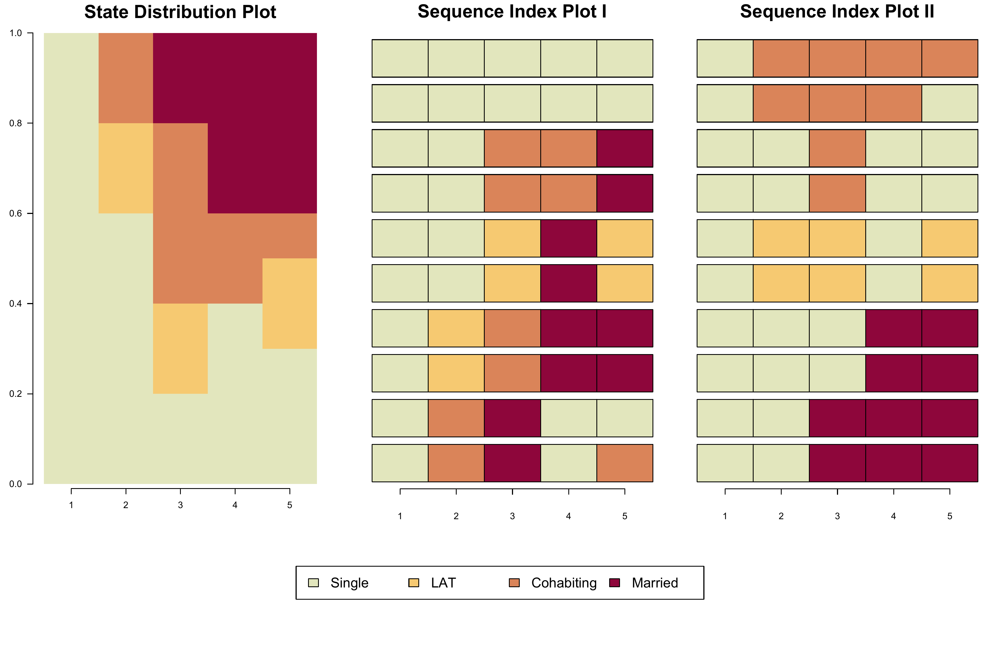
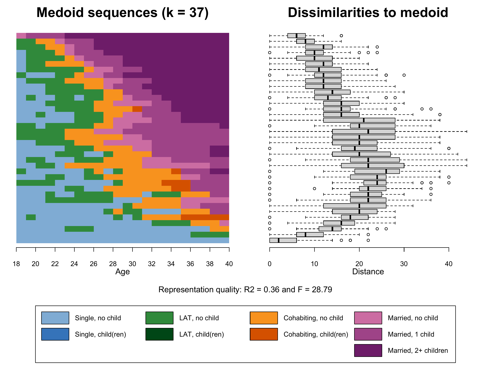
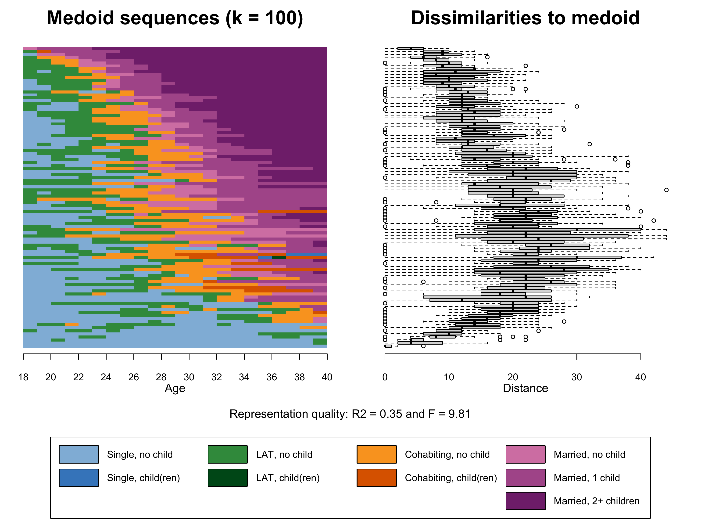
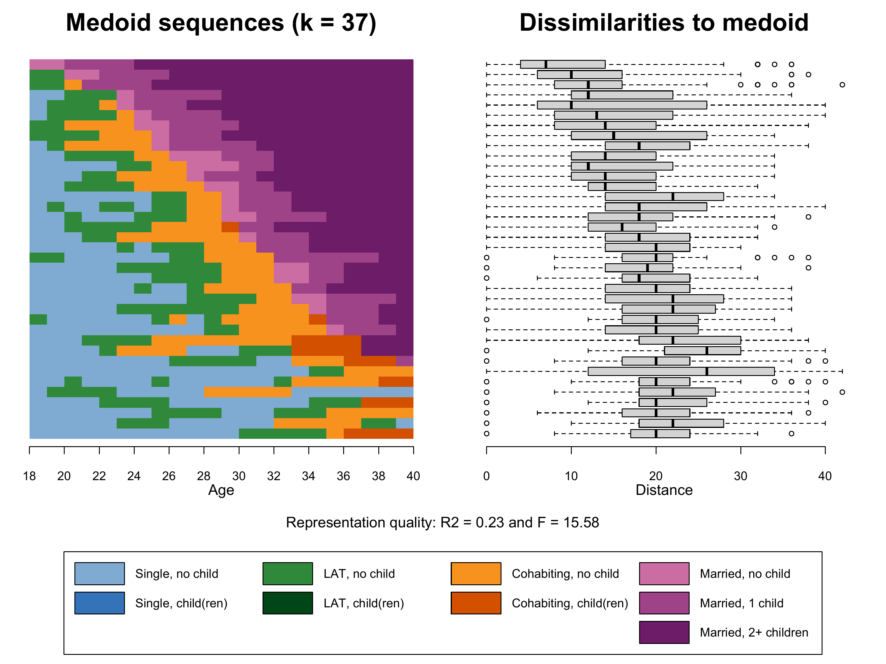
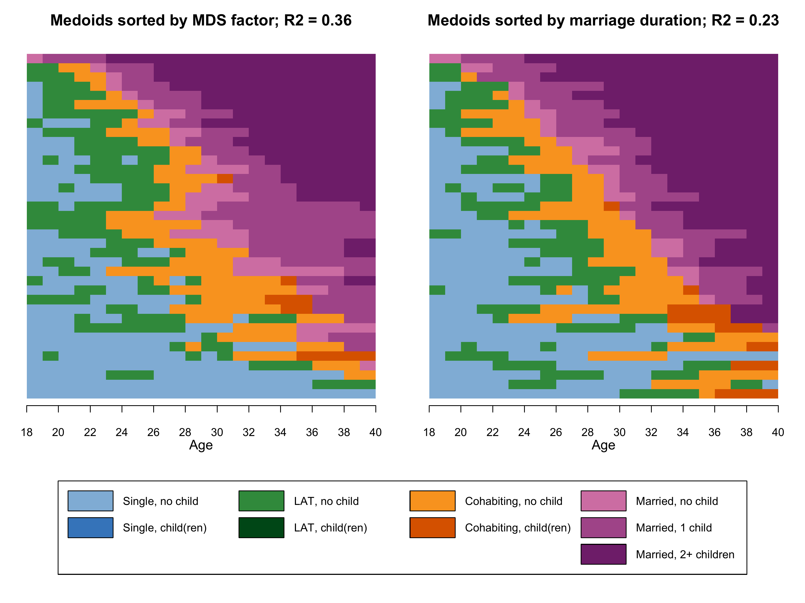

```{r setup, include=FALSE}
# Load required packages
library(here)
source(here("source", "load_libraries.R"))

# Output options
knitr::opts_chunk$set(eval=TRUE, echo=TRUE)
options("kableExtra.html.bsTable" = T)

# load data for Chapter 2
load(here("data", "2-0_ChapterSetup.RData"))
```

```{r, xaringanExtra-clipboard, echo=FALSE}
htmltools::tagList(
  xaringanExtra::use_clipboard(
    button_text = "<i class=\"fa fa-clone fa-2x\" style=\"color: #c58dce\"></i>",
    success_text = "<i class=\"fa fa-check fa-2x\" style=\"color: #90BE6D\"></i>",
    error_text = "<i class=\"fa fa-times fa-2x\" style=\"color: #F94144\"></i>"
  ),
  rmarkdown::html_dependency_font_awesome()
)
```

<details><summary>**Click here to get instructions...**</summary>

- Please download and unzip the replication files for Chapter 2
([`r fontawesome::fa("far fa-file-archive")` Chapter02.zip](source/Chapter02.zip)). 
- Read `readme.html` and run `2-0_ChapterSetup.R`. This will create `2-0_ChapterSetup.RData` in the sub folder `data/R`. This file contains the data required to re-produce the results shown below. 
- We also recommend to load the libraries listed in the Chapter 2's `LoadInstallPackages.R`

```{r, eval=FALSE}
# assuming you are working within .Rproj environment
library(here)

# install (if necessary) and load other required packages
source(here("source", "load_libraries.R"))

# load environment generated in "2-0_ChapterSetup.R"
load(here("data", "R", "2-0_ChapterSetup.RData"))

```
</details>


The figures in the book are printed in grayscale. Here we present the colored versions of the figures. The zip archive with the replication files for Chapter 2 contains both the code required to produce the grayscale and the colored figures. Note that the code for the grayscale plots rendered with `seqplot` is considerably longer than the code for the colored figures because adding shading lines requires some extra coding (see tutorial [*Color palette: Grayscale Edition*](rChapter2-4_grayscale.html))


## Different sets of sequences, <br/>same state distribution 

Using two small example datasets each containing ten constructed partnership biographies, **Figure 2.5** illustrates that the aggregation of different sets of sequences can yield identical aggregated state distributions.

The two example datasets are defined as:

```{r eval = TRUE, echo = TRUE}

# ===============================================
# Generating two example datasets; k = 5; n = 10
# ===============================================

ex1 <- tibble(state1 = c(1, 1, 1, 1, 1, 1, 1, 1, 1, 1),
              state2 = c(1, 1, 1, 1, 2, 2, 1, 1, 3, 3),
              state3 = c(1, 1, 3, 3, 3, 3, 2, 2, 4, 4),
              state4 = c(1, 1, 3, 3, 4, 4, 4, 4, 1, 1),
              state5 = c(1, 1, 4, 4, 4, 4, 2, 2, 3, 1))


ex2 <- tibble(state1 = c(1, 1, 1, 1, 1, 1, 1, 1, 1, 1),
              state2 = c(1, 1, 1, 1, 2, 2, 1, 1, 3, 3),
              state3 = c(1, 1, 4, 4, 2, 2, 3, 3, 3, 3),
              state4 = c(4, 4, 4, 4, 1, 1, 1, 1, 3, 3),
              state5 = c(4, 4, 4, 4, 2, 2, 1, 1, 1, 3))

```

In a next step the datasets are defined as sequence objects:

```{r eval = TRUE, echo = TRUE}

# Define long and short labels
shortlab.partner <- c("S", "LAT", "COH", "MAR")
longlab.partner <-  c("Single", "LAT", "Cohabiting", "Married")

# Definition of color palette using the colorspace package
colspace.partner <- sequential_hcl(4, palette = "Heat", rev = TRUE)


# Define sequence objects

partner.ex1.seq  <- seqdef(ex1, states = shortlab.partner,
                           labels = longlab.partner, alphabet = c(1:4),
                           cpal = colspace.partner) 

partner.ex2.seq  <- seqdef(ex2, states = shortlab.partner,
                           labels = longlab.partner, alphabet = c(1:4),
                           cpal = colspace.partner)
  
  
```  

This gives us the following two sets of sequences, which are plotted as state distribution and index plots in the next step. Both sets can be described by the same distribution plot, although they produce different index plots. The equality of the two state distributions is demonstrated with the `all.equal` function.


```{r eval = TRUE, echo = TRUE}
print(partner.ex1.seq, format = "SPS")
print(partner.ex2.seq, format = "SPS")

all.equal(seqstatd(partner.ex1.seq), seqstatd(partner.ex2.seq))
```

Like in Chapter 2.4.1 we use R's layout function to arrange the plots of the figure.


```{r}
layout.fig1 <- layout(matrix(c(1,2,3,4,4,4), 2, 3, byrow = TRUE),
                      heights = c(.75,.25), widths = c(.35, .325, .325))
layout.show(layout.fig1)
```

The plot consists of 4 elements:

1) State distribution plot (`seqdplot`): In the code below the plot is based on `partner.ex1.seq` but it would be the same if we had used `partner.ex2.seq` instead. 
2) Sequence index plot (`seqiplot`) of `partner.ex1.seq`
3) Sequence index plot (`seqiplot`) of `partner.ex2.seq`
4) Joint legend produced with `seqlegend`


```{r echo=TRUE, eval=FALSE}

# ~~~~~~~~~~~~~~~~~~~~~~~~~~~~~~~~~~~~~~~~~~~~~~~~~
# Figure 2-5: Two Iplots, one Dplots (colored) ----
# ~~~~~~~~~~~~~~~~~~~~~~~~~~~~~~~~~~~~~~~~~~~~~~~~~

cairo_pdf(here("figures", "2-4-2_Fig2-5_dplot_iplots_color.pdf"),
          width=12,
          height=8)

layout.fig1 <- layout(matrix(c(1,2,3,4,4,4), 2, 3, byrow = TRUE),
                      heights = c(.75,.25), widths = c(.35, .325, .325))
layout.show(layout.fig1)

par(mar = c(1, 3, 3, 2), las = 1)
seqdplot(partner.ex1.seq, ylab = "Relative frequency", 
         with.legend = "FALSE", border = NA,  axes = FALSE) 
title(main = "State Distribution Plot", cex.main = 2, line = 1.35)
axis(1, at=c(.5:4.5), labels = c(1:5))

par(mar = c(0, 2, 2, 2), mgp = c(3, 1, -.97))
seqiplot(partner.ex1.seq, sortv = seqfpos(partner.ex1.seq,"MAR"),
         with.legend = "FALSE", yaxis = FALSE, axes = FALSE,
         main = "Sequence Index Plot I", cex.main = 2)
axis(1, at=c(.5:4.5), labels = c(1:5))
seqiplot(partner.ex2.seq, sortv = seqfpos(partner.ex2.seq,"MAR"),
         with.legend = "FALSE", yaxis = FALSE, axes = FALSE,
         main = "Sequence Index Plot II", cex.main = 2)
axis(1, at=c(.5:4.5), labels = c(1:5))

par(mar = c(0, 2, 0, 2))
seqlegend(partner.ex1.seq, cex = 1.5, position = "center", ncol = 4)

dev.off()

pdf_convert(here("figures", "2-4-2_Fig2-5_dplot_iplots_color.pdf"),
            format = "png", dpi = 300, pages = 1, antialias = TRUE,
            here("figures", "2-4-2_Fig2-5_dplot_iplots_color.png"))
```


```{r, echo=FALSE, layout="l-page"}

```


## The relative frequency index plot

This section illustrates how to render relative frequency index plot using the standard `seqIplot` function instead of [`{TraMineRExtras}`](http://traminer.unige.ch){target="_blank"}'s `seqplot.rf`. Although `seqplot.rf` produces an appealing result, the function lacks flexibility. For instance, it does not allow to adjust specific aspects of its two sub-plots (e.g., axis labels and titles) and it is not suited for producing grayscale figures that use shading lines to differentiate between states.

Accordingly, we generated a tweaked version of `seqplot.rf` which does not render the graph but stores the information required to generate the desired visualization *manually*. This information is saved in a list object and the different elements of this list will be used to render the plot.

Here you can download the tweaked version of `seqplot.rf`: 

[`r icons::fontawesome("download")` relfreqseq-obj.R](source/relfreqseq-obj.R).

Generating a relative frequency index plot requires the sequences to be sorted according to a substantively meaningful principle. By default `seqplot.rf` (and `relfreqseq-obj.R`) sorts the sequences according to their score on the first factor derived by applying multidimensional scaling on a matrix of pairwise dissimilarities between sequences. This matrix has to be computed prior to the call of the `seqplot.rf` function. The following command is generating such a matrix using Optimal Matching with the default cost specification (indel = 1, substitution = 2) on our family formation sequence data (yearly granularity). For further details on dissimilarity measures see tutorials for [Chapter 3](rChapter3-0.html).

```{r eval = FALSE, echo = TRUE}
partner.child.year.om <- seqdist(partner.child.year.seq, 
                                 method="OM", sm= "CONSTANT")
```

Once the dissimilarity matrix is generated, the information required for the plots can be extracted and saved as a list object by the new `relfreqseq-obj` function. 
The example data comprise 1866 sequences and we extract 37 frequency groups each containing $1866/37 = 50$ sequences. 


```{r eval=FALSE}
# adjusted version of seqplot.rf saving objects required for plotting
source(here("source", "relfreqseq-obj.R"))

# Extract representative sequences for 37 frequency groups
k37.mds <- relfreqseq.obj(partner.child.year.seq,
                          diss=partner.child.year.om, 
                          k=37)
```


Based on this object we finally can produce Figure 2.6. Note that we use the `legend_large_box` function instead of the the default `legend` function and rearrange the elements shown in the legend to obtain a more appealing result. 


<details><summary>**Details on setting up the legend**</summary>

We start generating our plot by fine-tuning the appearance of the legend (for a detailed account of the procedure see [here](rChapter2-4_grayscale.html#legend-link)). We add "blank" entries (no label, white boxes) to ensure that each of the columns in the legend corresponds to a distinct partnership state (Single, LAT, Cohabitation, Marriage). 

```{r eval=TRUE, echo=TRUE, fig.height = 2, fig.width = 12, layout="l-body-outset"}
# ...adding empty labels below Single, LAT, and Cohabitation
longlab.partner.child2 <- append(longlab.partner.child, "", after=2)  
longlab.partner.child2 <- append(longlab.partner.child2, "", after=5) 
longlab.partner.child2 <- append(longlab.partner.child2, "", after=8) 

# ...adding white cells below Single, LAT, and Cohabitation
colspace.partner.child2 <- append(colspace.partner.child,"#FFFFFF",after=2)
colspace.partner.child2 <- append(colspace.partner.child2,"#FFFFFF",after=5)
colspace.partner.child2 <- append(colspace.partner.child2,"#FFFFFF",after=8)

# ...defining border colors for the boxes in legend:
#       regular color = black
#       color for empty cells = white
bordercol.partner.child <- c(rep(c("black","black","White"),3),
                             rep("black", 3))


# source a tweaked version of the legend function
source(here("source", "legend_large_box.R"))


# Produce a test version of the legend (empty plot with legend)
plot(NULL ,xaxt='n',yaxt='n',bty='n',ylab='',xlab='', xlim=0:1, ylim=0:1)

legend_large_box("center", legend = longlab.partner.child2,
                 ncol=4, fill=colspace.partner.child2, 
                 border = bordercol.partner.child,
                 box.cex=c(4.5,1.5),  y.intersp=2,
                 inset=c(0,-.4), xpd=TRUE)

```

</details>

Like for the previous plot we use the `layout` function to arrange the three elements of **Figure 2.6**.

1) The index plot of the representative sequences (`seqIplot`) stored in the first element of the list `k37.mds`
2) Boxplot of within frequency group distances to medoid (`boxplot`)  based on the second and third element of the list `k37.mds`
3) The legend depicting colors and labels of the alphabet

Note that we also extract the information on the representation quality ($R^2$ and $F$) from `k37.mds` (elements 7 and 8). (Tip for R novices: You can refer to the elements of a list either by referring to their list position or their name, e.g. `k37.mds[["R2"]] == k37.mds[[7]]`. The names can be obtained by `names(k37.mds)`)


```{r eval = FALSE, echo = TRUE}

cairo_pdf(here("figures", "2-4-3_Fig2-6_relfreqIplot_mds_color.pdf"),
          width=10,
          height=7.5)

layout.fig1 <- layout(matrix(c(1,2,3,3), 2, 2, byrow = TRUE),
                      heights = c(.75,.25))
layout.show(layout.fig1)

par(mar=c(3, 2, 3, 2))
seqIplot(k37.mds[[1]], 
         with.legend=FALSE,
         axes = FALSE,
         yaxis = FALSE, ylab = NA,
         main="Medoid sequences (k = 37)", cex.main = 2,  
         sortv=k37.mds[[2]])

par(mgp=c(3,1,-0.5)) # adjust parameters for x-axis
axis(1, at=(seq(0,22, by = 2)), labels = seq(18,40, by = 2))
mtext(text = "Age",
      side = 1,#side 1 = bottom
      line = 2)

par(mar=c(3, 2, 3, 2),
    mgp=c(3,1,-0.5)) # adjust parameters for x-axis
boxplot(k37.mds[[3]]~k37.mds[[2]], 
        horizontal=TRUE, 
        width=k37.mds[[4]], 
        frame=FALSE, 
        main="Dissimilarities to medoid", cex.main = 2, 
        at=k37.mds[[6]],
        yaxt='n', ylab = NA, xlab = NA)
mtext(text = "Distance",
      side = 1,#side 1 = bottom
      line = 2)

par(mar=c(1, 1, 4, 1))
plot(NULL ,xaxt='n',yaxt='n',bty='n',ylab='',xlab='', xlim=0:1, ylim=0:1)

legend_large_box("center", legend = longlab.partner.child2,
                 ncol=4, fill=colspace.partner.child2, 
                 border = bordercol.partner.child,
                 box.cex=c(4.5,1.5),  y.intersp=2,
                 inset=c(0,-.4), xpd=TRUE)

title(main = paste("Representation quality: R2 =", 
                   round(as.numeric(k37.mds["R2"]),2),
                   "and F =", round(as.numeric(k37.mds["Fstat"]),2)), 
      line = 2, font.main = 1)

dev.off()

pdf_convert(here("figures", "2-4-3_Fig2-6_relfreqIplot_mds_color.pdf"),
            format = "png", dpi = 300, pages = 1, antialias = TRUE,
            here("figures", "2-4-3_Fig2-6_relfreqIplot_mds_color.png"))

```

```{r, echo=FALSE, layout="l-page"}

```


## Bonus material: <br/>Additional relative frequency sequence plots

The quality and the appearance of relative frequency sequence plots heavily depend on the underlying analytical choices. Below we illustrate how the plot looks like with 

1) more frequency groups (k=100) or 
2) a different sorting criterion (time spent in marriage). The marital states are the last three states of the alphabet (`alphabet(partner.child.year.seq)[7:9]`), the respective state frequencies are extracted with `{TraMineR}`'s `seqistatd` function, and summed up using `rowSums`. 

The plots are generated in excactly the same way as above. We only have to replace `k37.mds` with `k100.mds` (+ the number of the frequency groups in the left plot title) and `k37.mardur` respectively.

```{r eval = FALSE, echo = TRUE}

k100.mds <- relfreqseq.obj(partner.child.year.seq,
                          diss=partner.child.year.om, 
                          k=100)

k37.mardur <- relfreqseq.obj(partner.child.year.seq,
                             diss=partner.child.year.om,
                             sortv = rowSums(seqistatd(partner.child.year.seq)[,7:9]),
                             k=37)
```

```{r, echo=FALSE, layout="l-page"}


```


Compared to the plot shown in the book (`k37.mds`) the addition of 63 additional frquency groups (`k100.mds`) leads to a slightly more nuanced index plot. The medoids, however, are not performing better in representing the sequences within their frequency groups (see $R^2$).

Regarding `k37.mardur` the dissimilarities to medoid plot and the lower $R^2$ show that the alternative sorting criterion performs worse than the MDS-based solution with the same number of frequency groups (`k37.mds`). 

In the next figure we re-plot only the two medoid sequences of the two $k=37$ solutions to ease the comparison. In terms of code this requires to replace the box-whisker-plot from the previous code snippet (`boxplot(k37.mds[[3]]~k37.mds[[2]] ...`) by another `seqIplot`. In addition, we slightly adjust the two index plots' titles to print the two $R^2$ values.


```{r eval = FALSE, echo = TRUE}
cairo_pdf(here("figures", "2-4-3_Fig2-6_bonus_relfreqIplot_mds_vs_mardur_color.pdf"),
          width=10,
          height=7.5)


layout.fig1 <- layout(matrix(c(1,2,3,3), 2, 2, byrow = TRUE),
                      heights = c(.75,.25))
layout.show(layout.fig1)


par(mar=c(3, 2, 3, 2))
seqIplot(k37.mds[[1]], 
         with.legend=FALSE,
         axes = FALSE,
         yaxis = FALSE, ylab = NA,
         main= paste("Medoids sorted by MDS factor; R2 =", 
                     round(as.numeric(k37.mds["R2"]),2)),
         cex.main = 1.4,  
         sortv=k37.mds[[2]])

par(mgp=c(3,1,-0.5)) # adjust parameters for x-axis
axis(1, at=(seq(0,22, by = 2)), labels = seq(18,40, by = 2))
mtext(text = "Age",
      side = 1,#side 1 = bottom
      line = 2)

par(mar=c(3, 2, 3, 2))
seqIplot(k37.mardur[[1]], 
         with.legend=FALSE,
         axes = FALSE,
         yaxis = FALSE, ylab = NA,
         main= paste("Medoids sorted by marriage duration; R2 =", 
                     round(as.numeric(k37.mardur["R2"]),2)),
         cex.main = 1.4,
         sortv=k37.mardur[[2]])

par(mgp=c(3,1,-0.5)) # adjust parameters for x-axis
axis(1, at=(seq(0,22, by = 2)), labels = seq(18,40, by = 2))
mtext(text = "Age",
      side = 1,#side 1 = bottom
      line = 2)

par(mar=c(1, 1, 1, 1))
plot(NULL ,xaxt='n',yaxt='n',bty='n',ylab='',xlab='', xlim=0:1, ylim=0:1)

legend_large_box("center", legend = longlab.partner.child2,
                 ncol=4, fill=colspace.partner.child2, 
                 border = bordercol.partner.child,
                 box.cex=c(4.5,1.5),  y.intersp=2,
                 inset=c(0,-.4), xpd=TRUE)

dev.off()


pdf_convert(here("figures", "2-4-3_Fig2-6_bonus_relfreqIplot_mds_vs_mardur_color.pdf"),
            format = "png", dpi = 300, pages = 1, antialias = TRUE,
            here("figures", "2-4-3_Fig2-6_bonus_relfreqIplot_mds_vs_mardur_color.png"))

```

```{r, echo=FALSE, layout="l-page"}

```


While the two plots clearly resemble each other, they also show some marked differences. The medoids in the right panel are much more dominated by the state "Married 2+ children". Note that both plots still represent the same data. The sorting criterion just led to a different selection of medoids and consequently to different visual representations of the same data. 

Ultimately, relative frequency sequence plots are a data reduction strategy whose results depend on the input parameters. Luckily, the $R^2$ and $F$ values allow to evaluate and to compare the quality of different solutions. 

It is also worthwile to inspect how the state distributions at different positions of the sequence compare to those shown in the state distribution plot (which presents a summary of the entire data set as opposed to a selection of representative sequences). Based on these criteria we prefer the sorting based on multidimensional scaling for generating relative frequency sequence plots with our example data.

In general, we recommend to test different specifications of the sorting criteria, the dissimilarity measure, and the number of chosen frequency groups. In the example shown in our book, for instance, we used a rather low number of frequency groups in order to ensure readibilty of the grayscale figures. The results, however, were robust to changes in the number of frequency groups. 
