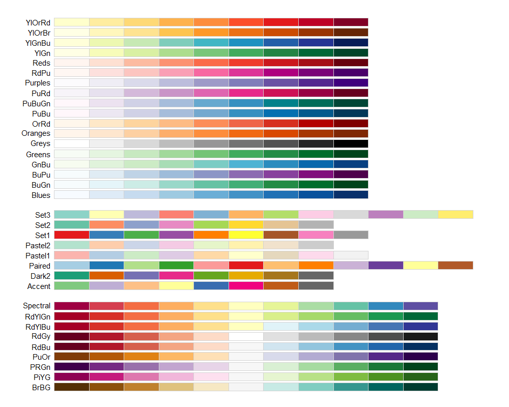
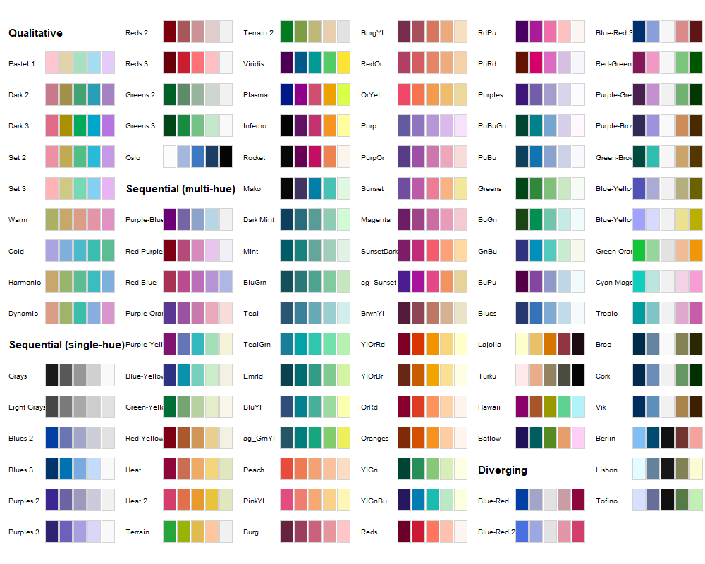
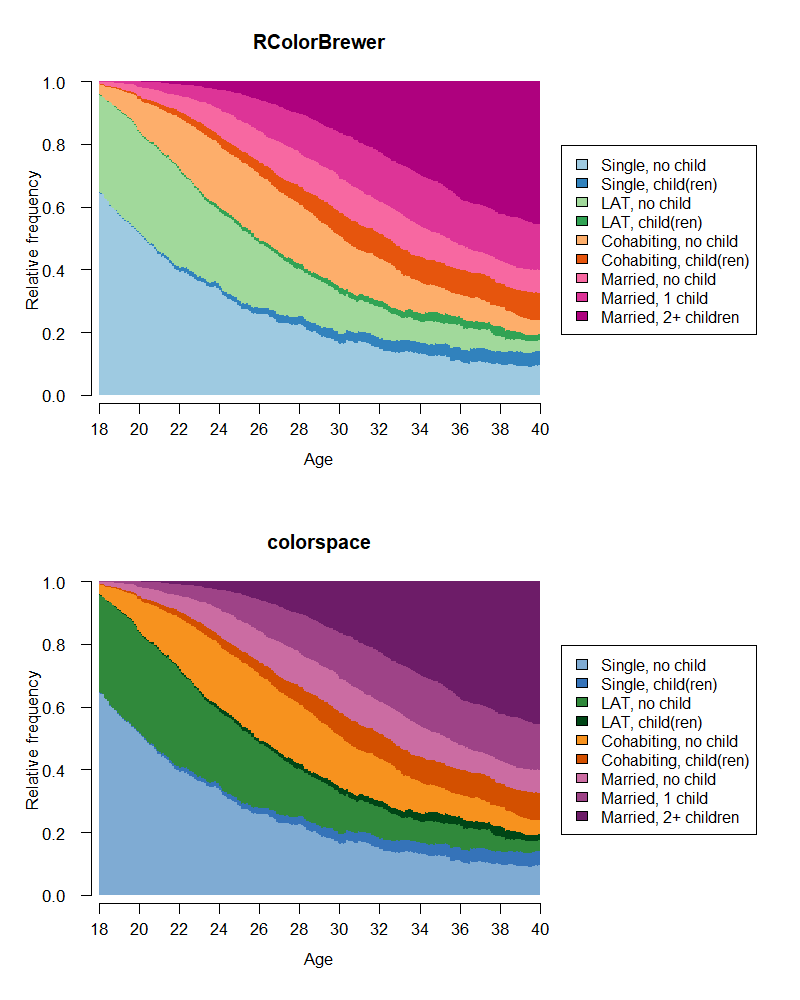

```{r setup, include=FALSE}
# Load required packages
library(here)
source(here("source", "load_libraries.R"))

# Output options
knitr::opts_chunk$set(eval=TRUE, echo=TRUE)
options("kableExtra.html.bsTable" = T)

# load data for Chapter 2
load(here("data", "2-0_ChapterSetup.RData"))
```

```{r, xaringanExtra-clipboard, echo=FALSE}
htmltools::tagList(
  xaringanExtra::use_clipboard(
    button_text = "<i class=\"fa fa-clone fa-2x\" style=\"color: #c58dce\"></i>",
    success_text = "<i class=\"fa fa-check fa-2x\" style=\"color: #90BE6D\"></i>",
    error_text = "<i class=\"fa fa-times fa-2x\" style=\"color: #F94144\"></i>"
  ),
  rmarkdown::html_dependency_font_awesome()
)
```

<details><summary>**Click here to get instructions...**</summary>

- Please download and unzip the replication files for Chapter 2
([`r fontawesome::fa("far fa-file-zipper")` Chapter02.zip](source/Chapter02.zip)). 
- Read `readme.html` and run `2-0_ChapterSetup.R`. This will create `2-0_ChapterSetup.RData` in the sub folder `data/R`. This file contains the data required to produce the state distribution plot shown below. 
- We also recommend to load the libraries listed in the Chapter 2's `LoadInstallPackages.R`

```{r, eval=FALSE}
# assuming you are working within .Rproj environment
library(here)

# install (if necessary) and load other required packages
source(here("source", "load_libraries.R"))

# load environment generated in "2-0_ChapterSetup.R"
load(here("data", "R", "2-0_ChapterSetup.RData"))

```
</details>

\  

The community of `r icon_style(fontawesome("r-project"), fill = "#384CB7")` developers provides you with plenty of tools for finding suitable colors for sequence visualization. We illustrate how to use [`{RColorBrewer}`](https://cran.r-project.org/web/packages/RColorBrewer/RColorBrewer.pdf){target="_blank"} (which is also used by `TraMiner::seqdef`) and [`{colorspace}`](http://colorspace.r-forge.r-project.org/index.html){target="_blank"} to choose colors. If you are using R Studio you also might want to consider the very helpful package [`{colourpicker}`](https://github.com/daattali/colourpicker){target="_blank"}.

For a brief introduction to "Selecting Colors for Statistical Graphics" we recommend the paper by Zeileis et al. 2009 [-@zeileis2009]. For a more detailed discussion of color palettes based on the HCL (Hue-Chroma-Luminance) color space using R we refer to Zeileis et al. 2020 [-@zeileis2020]. 

For color palette enthusiast we also highly recommend the [comprehensive list of color palettes in R](https://github.com/EmilHvitfeldt/r-color-palettes){target="_blank"} as well as the very handy [`{paletteer}`](https://emilhvitfeldt.github.io/paletteer/) package by [Emil Hvitfeldt](https://www.emilhvitfeldt.com/){target="_blank"}.


In our example presented below we want to find a suitable color palette for visualizing sequences with the following state space (alphabet):


```{r echo=FALSE}
kable(tibble(state = longlab.partner.child, 
             shortlabel = shortlab.partner.child), 
      col.names = c("State", "Short Label")) %>%
  kable_styling(bootstrap_options = 
                  c("striped", "hover", "condensed"),
                full_width = F)
```


\  

## Defining the sequence color palette

The state space is a combination of partnership status and fertility. For each partnership state we assign a unique color using pre-defined color palettes.

- Single = Blue
- LAT = Green
- Cohabitation = Orange
- Marriage = Purple/Magenta

In order to indicate differences in fertility within partnership states we increase the chroma of the respective color.  

\  

## Choosing colors with [`{RColorBrewer}`](https://cran.r-project.org/web/packages/RColorBrewer/RColorBrewer.pdf){target="_blank"}

Typing `display.brewer.all()` provides you with an overview of the pre-defined color palettes available in the [`{RColorBrewer}`](https://cran.r-project.org/web/packages/RColorBrewer/RColorBrewer.pdf){target="_blank"} package.

```{r layout="l-body-outset", echo=FALSE}

```

Knowing the names of the palettes we want to use (`"Blues", "Greens", "Oranges", "RdPu"`) we can continue by choosing specific colors from these palettes. Usually this is an iterative process which involves inspecting multiple palettes.

For example, [`{RColorBrewer}`](https://cran.r-project.org/web/packages/RColorBrewer/RColorBrewer.pdf){target="_blank"} gives us different sets of Blues when we inspect sequential palettes of different length. It is up to you to decide which colors fit your purposes best and to extract them for your sequence color palette.

```{r, eval=FALSE, echo=TRUE}
display.brewer.pal(3, "Blues")
display.brewer.pal(7, "Blues")
```

```{r, echo=FALSE, fig.height = 1, fig.width = 7}
par(mar = c(1, 4, 0, 2) + 0.1)
display.brewer.pal(3, "Blues")
title(xlab="Blues (sequential, n = 3)", line=0)
display.brewer.pal(7, "Blues")
title(xlab="Blues (sequential, n = 7)", line=0)
```

This is the code for extracting the colors and creating a vector that contains the colors in the desired order: 

```{r, echo=TRUE}
col1 <- brewer.pal(3, "Blues")[2:3]   # Single states
col2 <- brewer.pal(3, "Greens")[2:3]  # LAT states
col3 <- brewer.pal(3, "Oranges")[2:3] # Cohabitation states
col4 <- brewer.pal(7, "RdPu")[4:6] # Marriage states

# define complete color palette
colspace1 <- c(col1, col2, col3, col4)
```


The resulting color palette can be inspected using the `swatchplot` function of the [`{colorspace}`](http://colorspace.r-forge.r-project.org/index.html){target="_blank"} package. 

```{r eval = FALSE, echo=TRUE}
swatchplot(colspace1)
```

```{r, echo=FALSE, fig.height = 1, fig.width = 7}
par(mar = c(2, 4, 0, 2) + 0.1)
swatchplot(colspace1)
```

## Choosing colors with [`{colorspace}`](http://colorspace.r-forge.r-project.org/index.html){target="_blank"}

Like in the previous step we start by plotting the pre-defined color palettes available in the package:

```{r, eval=FALSE}
hcl_palettes(plot = TRUE)
```

```{r layout="l-body-outset", echo=FALSE}

```

Again, we continue with inspecting the suitable palettes.

```{r eval=FALSE, echo=TRUE}
swatchplot(sequential_hcl(5, palette = "Blues"))
```

```{r, echo=FALSE, fig.height = 1, fig.width = 7}
par(mar = c(0, 4, 0, 2) + 0.1)
swatchplot(sequential_hcl(5, palette = "Blues"))
```

Note that the resulting color vector starts with the darkest blue, whereas our intended color palette should start with a light blue. Accordingly, the colors must be extracted in reverse order (as in the code below) or one could change the order of the vector by adding the option `rev = TRUE` when running `sequential_hcl`.

This is our final choice using the palettes provided by [`{colorspace}`](http://colorspace.r-forge.r-project.org/index.html){target="_blank"}: 

```{r, eval=FALSE, echo=TRUE}
col1 <- sequential_hcl(5, palette = "Blues")[3:2]
col2 <- sequential_hcl(5, palette = "Greens")[2:1]
col3 <- sequential_hcl(5, palette = "Oranges")[3:2]
col4 <- sequential_hcl(5, palette = "magenta")[3:1]

colspace2 <- c(col1, col2, col3, col4)

swatchplot(colspace2)
```

```{r, echo=FALSE, fig.height = 1, fig.width = 7}
col1 <- sequential_hcl(5, palette = "Blues")[3:2]
col2 <- sequential_hcl(5, palette = "Greens")[2:1]
col3 <- sequential_hcl(5, palette = "Oranges")[3:2]
col4 <- sequential_hcl(5, palette = "magenta")[3:1]

colspace2 <- c(col1, col2, col3, col4)

par(mar = c(2, 4, 0, 2) + 0.1)
swatchplot(colspace2)
```

## Comparison of the two different color palettes

Both approaches produce satisfactory results: 

```{r, echo=TRUE, eval=FALSE}
swatchplot("RColorBrewer" = colspace1,
           "colorspace" = colspace2)
```

```{r, echo=FALSE, fig.height = 1, fig.width = 7}
par(mar = c(2, 4, 0, 2) + 0.1)
swatchplot("RColorBrewer" = colspace1,
           "colorspace" = colspace2)
```

For our final decision we compare the palettes by inspecting the state distribution plots of our example data using the `seqdplot` function (see [Chapter 2.4.1](rChapter2-4-1.html)). We prefer the solution obtained by [`{colorspace}`](http://colorspace.r-forge.r-project.org/index.html){target="_blank"} and will proceed with the respective color palette.


```{r layout="l-body-outset", echo=FALSE}

```

