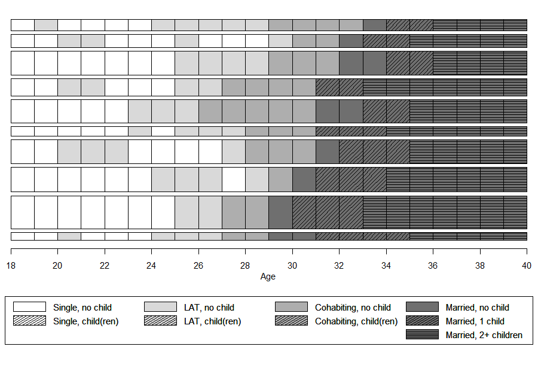
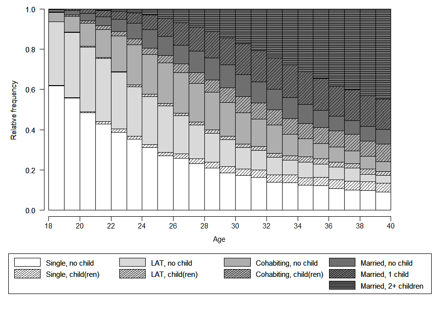
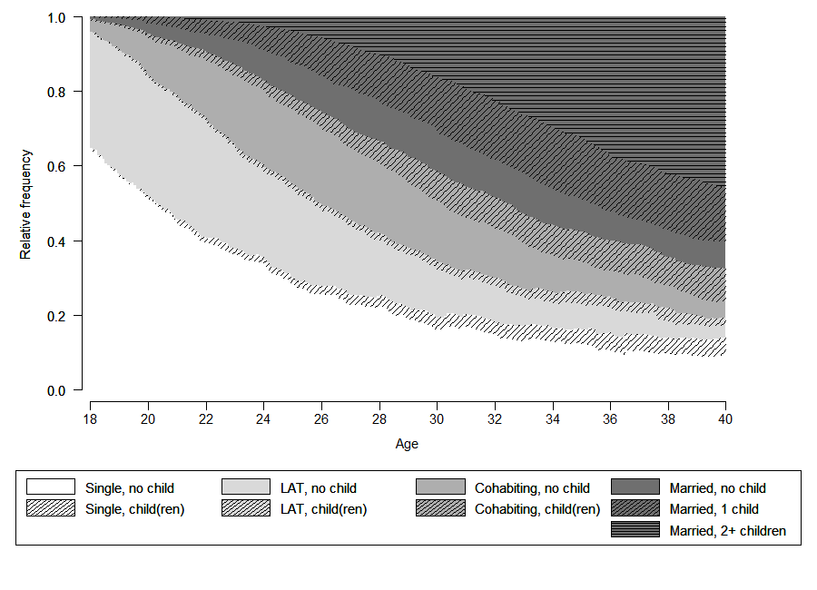

```{r setup, include=FALSE}
# Load and download (if necessary) required packages ----

# Save package names as a vector of strings
pkgs <- c("colorspace", "glue", "here", "Hmisc", "htmltools", "icons", "kableExtra", 
          "knitr", "magrittr", "patchwork", "pdftools", "RColorBrewer", "reshape2", 
          "sjPlot", "summarytools", "tidyverse", "TraMineR", "TraMineRextras", 
          "xaringanExtra") 

# Options that might help to prevent some errors in the installation process
options(install.packages.check.source = "no")
options(install.packages.compile.from.source = "never")

## Install uninstalled packages
lapply(pkgs[!(pkgs %in% installed.packages())], 
       install.packages, repos = getOption("repos")["CRAN"])

## Load all packages to library and adjust options
lapply(pkgs, library, character.only = TRUE)

# Output options
knitr::opts_chunk$set(eval=TRUE, echo=TRUE)
options("kableExtra.html.bsTable" = T)

# load data for Chapter 2
load(here("data", "Chapter_02.RData"))

source(here("source", "legend_large_box.R"))

```

Although the full potential of visualizing sequences can only be reached by using colored figures, some restrictions - particularly hight cost of colored printing - might require using grayscale figures and shaded lines. This page illustrates how to produce *acceptable* figures without using colors visualizing sequences with an alphabet of 9 states. Based on our own experience we consider an alphabet of size 12 as the upper limit when the usage of colors is not an option.

```{r echo=FALSE}
kable(tibble(state = longlab.partner.child, shortlabel = shortlab.partner.child), 
      col.names = c("State", "Short Label")) %>%
  kable_styling(bootstrap_options = 
                  c("responsive", "hover", "condensed"),
                full_width = F)
```


## Defining the "color" palette & shading lines

We use R's inbuilt `gray.colors` function to choose grays approriate for our purpose. We apply the following strategy: (1) choose a "color" for each partnership state; (2) add shading lines for fertility information.

We use a palette of nine grays to choose three different grays to represent the partnership states "LAT", "Cohabitation", and "Marriage". The single status will be depicted by White (HEX = "#FFFFFF"). 

```{r eval=FALSE}
barplot(rep(1,9), col = gray.colors(9), axes = FALSE)
```

```{r echo=FALSE, fig.height = 1, fig.width = 6}
par(mar = c(0, 4, 0, 2) + 0.1)
barplot(rep(1,9), col = gray.colors(9), axes = FALSE)
text(1.87, .3, "MAR",cex=.75,pos=3) 
text(5.52, .3, "COH",cex=.75,pos=3)
text(9.12, .3, "LAT",cex=.75,pos=3)
```

We added labels to the figure above to illustrate which grays constitute our palette. With the following code we specify and illustrate our final palette.


```{r, eval=FALSE, echo=TRUE}
colgrey.partner.child <- c(rep("#FFFFFF",2),
                           rep(gray.colors(9)[8],2),
                           rep(gray.colors(9)[5],2), 
                           rep(gray.colors(9)[2],3))
                           
barplot(rep(1,9), col = colgrey.partner.child, axes = FALSE)                           
```

```{r, echo=FALSE, fig.height = 1, fig.width = 6}
par(mar = c(0, 4, 0, 2) + 0.1)
colgrey.partner.child <- c(rep("#FFFFFF",2),
                           rep(gray.colors(9)[8],2),
                           rep(gray.colors(9)[5],2), 
                           rep(gray.colors(9)[2],3))
                           
barplot(rep(1,9), col = colgrey.partner.child, axes = FALSE)                           
```

According to the definition of our alphabet we need two single states, two LAT states, two cohabitation states, and three marriage states. Adding shading lines allows for distinguishing different fertility levels. Shading lines are added by specifying vectors for `density` and `angle`. We use different angles (i.e., 0° and 45°) to separate the two parity states within marriage.

Note that we have to create two overlapping graph objects by typing `par(new=TRUE)`. The first plot creates bars with the desired colors, the second one adds black shading lines.

```{r, eval=FALSE, echo=TRUE}
barplot(rep(1,9), col = colgrey.partner.child, axes = FALSE)                           

par(new=TRUE)
barplot(rep(1,9), col = "black", axes = FALSE,
        density=c(0,20,0,20,0,20,0,20,20), 
        angle=c(0,45,0,45,0,45,0,45,0)) 
```


```{r, echo=FALSE, fig.height = 1, fig.width = 6}
par(mar = c(0, 4, 0, 2) + 0.1)
barplot(rep(1,9), col = colgrey.partner.child, axes = FALSE)                           

par(new=TRUE)
barplot(rep(1,9), col = "black", axes = FALSE,
        density=c(0,20,0,20,0,20,0,20,20), 
        angle=c(0,45,0,45,0,45,0,45,0)) 
```

## Adjusting the legend {#legend-link}

Based on the section above we draw a legend with the following standard code:


```{r, eval=FALSE, echo=TRUE}
plot(NULL ,xaxt='n',yaxt='n',bty='n',ylab='',xlab='', xlim=0:1, ylim=0:1)

legend("center", legend = longlab.partner.child,
       ncol=3, fill=colgrey.partner.child)
par(new=TRUE)
legend_large_box("center", legend = longlab.partner.child,
                 ncol=3, bg = "transparent",
                 density=c(0,20,0,20,0,20,0,20,20), 
                 angle=c(0,45,0,45,0,45,0,45,0))
```

```{r, echo=FALSE, fig.height = 2, fig.width = 8, layout="l-body-outset"}
par(mar = c(0, 1, 0, 1) + 0.1)
plot(NULL ,xaxt='n',yaxt='n',bty='n',ylab='',xlab='', xlim=0:1, ylim=0:1)

legend("center", legend = longlab.partner.child,
       ncol=3, fill=colgrey.partner.child)
par(new=TRUE)
legend_large_box("center", legend = longlab.partner.child,
                 ncol=3, bg = "transparent",
                 density=c(0,20,0,20,0,20,0,20,20), 
                 angle=c(0,45,0,45,0,45,0,45,0))

```

Although the legend looks OK at first glance, it has two crucial drawbacks: (1) The grayscale boxes (with shading lines) are too small to be distinguished easily; (2) two different partnership states are appearing in the first two columns of the legend. Both issues call for some extra coding because they cannot be solved with the options available in the standard version of the legend function. 

Addressing the first issue we draw on a tweaked version of the legend suggested by [Ben Bolker](http://ms.mcmaster.ca/~bolker/) and [Paul Hurtado](https://www.pauljhurtado.com/) in a thread at [Stack Overflow](https://stackoverflow.com/questions/13644149/increasing-the-size-of-the-coloured-squares-on-histogram-legends-in-r).

Here you can dowload the tweaked version of the legend function: `r icons::fontawesome("download")` [legend_large_box.R](source/legend_large_box.R). 

We include the function by sourcing the file within our R-script by typing:

```{r eval=FALSE, echo =TRUE}
source("legend_large_box.R")
```

Next to changing the size of the colored boxes we want to re-arrange the labels of the legend. The new legend should have four columns each representing one partnership state. Each of the first three columns ("Single", "LAT", "Cohabitation") has two entries ("childless", "with child(ren)"). The last column ("Marriage") has three entries ("no child", "one child", "2 or more children").

Typing `ncol=4` when specifying the legend would not do the trick. It would produce a four columns legend with three entries in the first three columns and zero entries in the last column.

To obtain the desired result we have to add empty cells to the legend and adjust our "color" vector accordingly. This is accomplished by the following code:

```{r, eval=TRUE, echo=TRUE}
# Adding empty cells at the right positions

# add empty labels below Single, LAT, and Cohabitation
longlab.partner.child2 <- append(longlab.partner.child, "", after=2)  
longlab.partner.child2 <- append(longlab.partner.child2, "", after=5) 
longlab.partner.child2 <- append(longlab.partner.child2, "", after=8) 

# add white colored cells below Single, LAT, and Cohabitation
colgrey.partner.child2 <- append(colgrey.partner.child,"#FFFFFF",after=2)
colgrey.partner.child2 <- append(colgrey.partner.child2,"#FFFFFF",after=5)
colgrey.partner.child2 <- append(colgrey.partner.child2,"#FFFFFF",after=8)

# define border colors for the boxes in legend:
  # regular color = black
  # color for empty cells = white
bordercol.partner.child <- c(rep(c("black","black","White"),3),
                             rep("black", 3))
```

Finally, we can draw the tweaked legend box. Again, we have to create two overlapping plot objects to get both the desired "color" palette and the black shading lines.

```{r, eval=FALSE, echo=TRUE}
plot(NULL ,xaxt='n',yaxt='n',bty='n',ylab='',xlab='', xlim=0:1, ylim=0:1)
legend_large_box("center", legend = longlab.partner.child2,
                 ncol=4, fill=colgrey.partner.child2, 
                 border = bordercol.partner.child,
                 box.cex=c(4.5,1.5),  y.intersp=2)
par(new=TRUE)
legend_large_box("center", legend = longlab.partner.child2,
                 ncol=4, bg = "transparent", 
                 border = bordercol.partner.child,
                 box.cex=c(4.5,1.5),  y.intersp=2,
                 density=c(0,20,0,0,20,0,0,20,0,0,20,20), 
                 angle=c(0,45,0,0,45,0,0,45,0,0,45,0))
```

```{r, echo=FALSE, fig.height = 2, fig.width = 12, layout="l-body-outset"}
par(mar = c(0, 1, 0, 1) + 0.1)
plot(NULL ,xaxt='n',yaxt='n',bty='n',ylab='',xlab='', xlim=0:1, ylim=0:1)
legend_large_box("center", legend = longlab.partner.child2,
                 ncol=4, fill=colgrey.partner.child2, 
                 border = bordercol.partner.child,
                 box.cex=c(4.5,1.5),  y.intersp=2)
par(new=TRUE)
legend_large_box("center", legend = longlab.partner.child2,
                 ncol=4, bg = "transparent", 
                 border = bordercol.partner.child,
                 box.cex=c(4.5,1.5),  y.intersp=2,
                 density=c(0,20,0,0,20,0,0,20,0,0,20,20), 
                 angle=c(0,45,0,0,45,0,0,45,0,0,45,0))
```


## Sequence index plot <br/>of representative sequences

In the book we elaborate on the pros and cons of sequence index plots (see Chapter 2.4.2 in the book; the corresponding code can be found [here](rChapter2-4-2.html)). Based on this discussion we recommend to abstain from standard index plots of all sequences in large data sets. This is even more true if colors are not available for visualization.

Accordingly, the subsequent example plot only renders a selection of 10 representative sequences extracted by `seqrep` using sequences with a yearly granularity.


```{r, eval=TRUE, echo=TRUE}
# Identify 10 representative sequences
partner.child.year.rep <- seqrep(partner.child.year.seq, 
                                 diss=partner.child.year.om, 
                                 criterion="dist", nrep = 10)

# Extract sequences to be plotted and save in object
plot.seq <- partner.child.year.seq[attributes(partner.child.year.rep)$Index,]

# extract same sequences from sequence data using reduced alphabet (partnership status only)
  # this will be used for sorting the index plots by the 
  # first occurrence of the partnership status "MAR" (marriage)
plot.aux <- partner.year.seq[attributes(partner.child.year.rep)$Index,]
```

Like in the previous examples two overlapping plots and legends have to be created in order to obtain the "color" palette and the shading lines. Note the differences in the specification of colors, `angle`, and `density` between the index plot and the legend. They result from the necessity to define extra empty cells in the legend (see [section above](#legend-link))


```{r, eval=TRUE, echo=TRUE, results='hide'}
# Save final plot as png file
png(file = here("images", "rChapter2-4_iplot_grayYearly.png"), 
    width = 900, height = 650, res = 90)


par(mar=c(13, 1, 1, 1))
seqiplot(plot.seq, 
         border = TRUE, 
         with.legend = FALSE, 
         axes = FALSE,
         yaxis = FALSE, ylab = NA,
         sortv = seqfpos(plot.aux, "MAR"),
         cpal = colgrey.partner.child)
par(new=TRUE)
seqiplot(plot.seq,  
         border = TRUE, 
         with.legend = FALSE, 
         axes = FALSE,
         yaxis = FALSE, ylab = NA,
         sortv = seqfpos(plot.aux, "MAR"),
         cpal=rep("black",9),
         density=c(0,20,0,20,0,20,0,20,20), 
         angle=c(0,45,0,45,0,45,0,45,0))

axis(1, at=(seq(0,22, by = 2)), labels = seq(18,40, by = 2))
mtext(text = "Age",
      side = 1,#side 1 = bottom
      line = 2)

par(mar=c(0, 1, 0, 1))
legend_large_box("bottom", legend = longlab.partner.child2,
                 ncol=4, fill =colgrey.partner.child2, 
                 border = bordercol.partner.child,
                 box.cex=c(4,1.5),  y.intersp=2,
                 inset=c(0,-.4), xpd=TRUE)
par(new=TRUE)
legend_large_box("bottom", legend = longlab.partner.child2,
                 ncol=4, bg = "transparent", 
                 border = bordercol.partner.child,
                 box.cex=c(4,1.5),  y.intersp=2,
                 inset=c(0,-.4), xpd=TRUE,
                 density=c(0,20,0,0,20,0,0,20,0,0,20,20), 
                 angle=c(0,45,0,0,45,0,0,45,0,0,45,0))

dev.off()
```


```{r layout="l-body-outset"}

```


## State distribution plots using <br/>yearly & monthly sequence data

Although they are often less insightful than sequence index plots state distribution plots are widely used and often falsely interpreted (see chapter 2-4-2). One reason for their popularity is that they are quite easy to render. Even with our alphabet of size nine and monthly sequence data of length 264 it is possible to produce accessible plots without using colors. 

Below we provide the code to produce the plots with yearly and monthly data. We again have to create overlapping plots and legends to add the shading lines.


### Yearly sequence data

```{r, eval=TRUE, echo=TRUE, results='hide'}
png(file = here("images", "rChapter2-4_dplot_grayYearly.png"), 
    width = 900, height = 650, res = 90)


par(mar=c(12, 4, 1, 4), las = 1,
    mgp=c(2,0,-1))
seqdplot(partner.child.year.seq, 
         ylab = "Relative frequency",
         with.legend = "FALSE" , axes = FALSE,
         cpal = colgrey.partner.child)
par(new=TRUE)
seqdplot(partner.child.year.seq, 
         ylab = "Relative frequency",
         with.legend = "FALSE" , axes = FALSE,
         cpal=rep("#000000",9),
         density=c(0,20,0,20,0,20,0,20,20), 
         angle=c(0,45,0,45,0,45,0,45,0))
par(mgp=c(3,1,0.5))
axis(1, at=(seq(0,22, by = 2)), labels = seq(18,40, by = 2))
mtext(text = "Age",
      side = 1,
      line = 2.5)


par(mar=c(0, 1, 0, 1))
legend_large_box("bottom", legend = longlab.partner.child2,
                 ncol=4, fill=colgrey.partner.child2, 
                 border = bordercol.partner.child,
                 box.cex=c(4.5,1.5),  y.intersp=2,
                 inset=c(0,-.4), xpd=TRUE)
par(new=TRUE)
legend_large_box("bottom", legend = longlab.partner.child2,
                 ncol=4, bg = "transparent", 
                 border = bordercol.partner.child,
                 box.cex=c(4.5,1.5),  y.intersp=2,
                 inset=c(0,-.4), xpd=TRUE,
                 density=c(0,20,0,0,20,0,0,20,0,0,20,20), 
                 angle=c(0,45,0,0,45,0,0,45,0,0,45,0))

dev.off()
```

```{r layout="l-body-outset"}

```

### Monthly sequence data

```{r, eval=TRUE, echo=TRUE, results='hide'}
png(file = here("images", "rChapter2-4_dplot_grayMonthly.png"), 
    width = 900, height = 650, res = 90)


par(mar=c(12, 4, 1, 4), las = 1, 
    mgp=c(2,0,-1))
seqdplot(partner.child.month.seq, 
         ylab = "Relative frequency",
         with.legend = "FALSE" , axes = FALSE, border = NA,
         cpal = colgrey.partner.child)
par(new=TRUE)
seqdplot(partner.child.month.seq, 
         ylab = "Relative frequency",
         with.legend = "FALSE" , axes = FALSE, border = NA,
         cpal=rep("#000000",9),
         density=c(0,20,0,20,0,20,0,20,20), 
         angle=c(0,45,0,45,0,45,0,45,0))
par(mgp=c(3,1,0.5))
axis(1, at=(seq(0,264, by = 24)), labels = seq(18,40, by = 2))
mtext(text = "Age",
      side = 1,
      line = 2.5)

par(mar=c(0, 1, 0, 1))
legend_large_box("bottom", legend = longlab.partner.child2,
                 ncol=4, fill=colgrey.partner.child2, 
                 border = bordercol.partner.child,
                 box.cex=c(4.5,1.5),  y.intersp=2,
                 inset=c(0,-.4), xpd=TRUE)
par(new=TRUE)
legend_large_box("bottom", legend = longlab.partner.child2,
                 ncol=4, bg = "transparent", 
                 border = bordercol.partner.child,
                 box.cex=c(4.5,1.5),  y.intersp=2,
                 inset=c(0,-.4), xpd=TRUE,
                 density=c(0,20,0,0,20,0,0,20,0,0,20,20), 
                 angle=c(0,45,0,0,45,0,0,45,0,0,45,0))


dev.off()
```


```{r layout="l-body-outset"}

```

Like the graph based on yearly data this figure might suggest that roughly 10% of the sample are permanent childless singles. Note, however, that state distribution plots just depict cross-sections at each position of the sequence. A simple tabulation of the occurence of states using `seqistatd` & `freq` (table not shown) ...

```{r, eval=FALSE, echo=TRUE}
# Extract state frequency for being Single (without children)
singlecount <- seqistatd(partner.child.year.seq) %>%
  as_tibble() %>%
  select(S)

# use summarytools::freq for weighted frequency table
freq(singlecount, weights = family$weight40)
```

```{r, eval=TRUE, echo=FALSE}
# Extract state frequency for being Single (without children)
singlecount <- seqistatd(partner.child.year.seq) %>%
  as_tibble() %>%
  select(S)

# use summarytools::freq for weighted frequency table
singlefreq <- freq(singlecount, weights = family$weight40)
```

...illustrates that only  **`r round(as.numeric(singlefreq[23,2]),2)`%** of the sample are permanent single.
