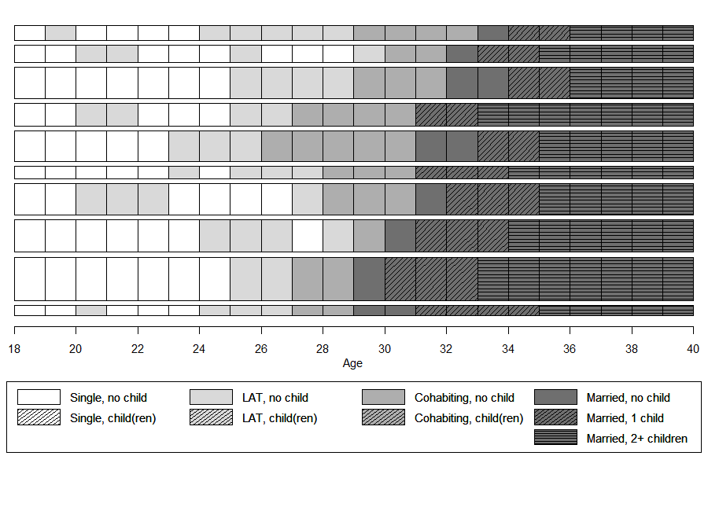

```{r setup, include=FALSE}
# Load required packages
library(here)
source(here("source", "load_libraries.R"))

# Output options
knitr::opts_chunk$set(eval=TRUE, echo=TRUE)
options("kableExtra.html.bsTable" = T)

# load data for Chapter 2
load(here("data", "2-0_ChapterSetup.RData"))

# Load tweaked legend function
source(here("source", "legend_large_box.R"))

```

```{r, xaringanExtra-clipboard, echo=FALSE}
htmltools::tagList(
  xaringanExtra::use_clipboard(
    button_text = "<i class=\"fa fa-clone fa-2x\" style=\"color: #c58dce\"></i>",
    success_text = "<i class=\"fa fa-check fa-2x\" style=\"color: #90BE6D\"></i>",
    error_text = "<i class=\"fa fa-times fa-2x\" style=\"color: #F94144\"></i>"
  ),
  rmarkdown::html_dependency_font_awesome()
)
```

<details><summary>**Click here to get instructions...**</summary>

- Please download and unzip the replication files for Chapter 2
([`r fontawesome::fa("far fa-file-archive")` Chapter02.zip](source/Chapter02.zip)). 
- Read `readme.html` and run `2-0_ChapterSetup.R`. This will create `2-0_ChapterSetup.RData` in the sub folder `data/R`. This file contains the data required to produce the plots shown below. 
- You also have to add the function `legend_large_box` to your environment in order to render the tweaked version of the legend described below. You find this file in the `source` folder of the unzipped Chapter 2 archive.
- We also recommend to load the libraries listed in the Chapter 2's `LoadInstallPackages.R`

```{r, eval=FALSE}
# assuming you are working within .Rproj environment
library(here)

# adjusted version of the legend function
source(here("source", "legend_large_box.R"))

# install (if necessary) and load other required packages
source(here("source", "load_libraries.R"))

# load environment generated in "2-0_ChapterSetup.R"
load(here("data", "R", "2-0_ChapterSetup.RData"))

```
</details>

\

Although the full potential of visualizing sequences can only be reached by using colored figures, some restrictions - particularly hight cost of colored printing - might require using grayscale figures and shaded lines. This page illustrates how to produce *acceptable* figures without using colors visualizing sequences with an alphabet of 9 states. Based on our own experience we consider an alphabet of size 12 as the upper limit when the usage of colors is not an option.

```{r echo=FALSE}
kable(tibble(state = longlab.partner.child, shortlabel = shortlab.partner.child), 
      col.names = c("State", "Short Label")) %>%
  kable_styling(bootstrap_options = 
                  c("responsive", "hover", "condensed"),
                full_width = F)
```


## Defining the "color" palette & shading lines

We use R's inbuilt `gray.colors` function to choose grays approriate for our purpose. We apply the following strategy: (1) choose a "color" for each partnership state; (2) add shading lines for fertility information.

We use a palette of nine grays to choose three different grays to represent the partnership states "LAT", "Cohabitation", and "Marriage". The single status will be depicted by White (HEX = "#FFFFFF"). 

```{r eval=FALSE}
barplot(rep(1,9), col = gray.colors(9), axes = FALSE)
```

```{r nine-grays, echo=FALSE, fig.height = 1, fig.width = 6}
par(mar = c(0, 4, 0, 2) + 0.1)
barplot(rep(1,9), col = gray.colors(9), axes = FALSE)
text(1.87, .3, "MAR",cex=.75,pos=3) 
text(5.52, .3, "COH",cex=.75,pos=3)
text(9.12, .3, "LAT",cex=.75,pos=3)
```

We added labels to the figure above to illustrate which grays constitute our palette. With the following code we specify and illustrate our final palette.


```{r, eval=FALSE, echo=TRUE}
colgrey.partner.child <- c(rep("#FFFFFF",2),
                           rep(gray.colors(9)[8],2),
                           rep(gray.colors(9)[5],2), 
                           rep(gray.colors(9)[2],3))
                           
barplot(rep(1,9), col = colgrey.partner.child, axes = FALSE)                           
```

```{r white-to-gray, echo=FALSE, fig.height = 1, fig.width = 6}
par(mar = c(0, 4, 0, 2) + 0.1)
colgrey.partner.child <- c(rep("#FFFFFF",2),
                           rep(gray.colors(9)[8],2),
                           rep(gray.colors(9)[5],2), 
                           rep(gray.colors(9)[2],3))
                           
barplot(rep(1,9), col = colgrey.partner.child, axes = FALSE)                           
```

According to the definition of our alphabet we need two single states, two LAT states, two cohabitation states, and three marriage states. Adding shading lines allows for distinguishing different fertility levels. Shading lines are added by specifying vectors for `density` and `angle`. We use different angles (i.e., 0° and 45°) to separate the two parity states within marriage. Specifying zero for the `density` parameter ensures that no shading lines are added for the four "childless" states. 

Note that we have to create two overlapping graph objects by typing `par(new=TRUE)`. The first plot creates bars with the desired colors, the second one adds black shading lines.

```{r, eval=FALSE, echo=TRUE}
barplot(rep(1,9), col = colgrey.partner.child, axes = FALSE)                           

par(new=TRUE)
barplot(rep(1,9), col = "black", axes = FALSE,
        density=c(0,20,0,20,0,20,0,20,20), 
        angle=c(0,45,0,45,0,45,0,45,0)) 
```


```{r nine-bars-shaded, echo=FALSE, fig.height = 1, fig.width = 6}
par(mar = c(0, 4, 0, 2) + 0.1)
barplot(rep(1,9), col = colgrey.partner.child, axes = FALSE)                           

par(new=TRUE)
barplot(rep(1,9), col = "black", axes = FALSE,
        density=c(0,20,0,20,0,20,0,20,20), 
        angle=c(0,45,0,45,0,45,0,45,0)) 
```

## Adjusting the legend {#legend-link}

Based on the section above we draw a legend with the following standard code:


```{r, eval=FALSE, echo=TRUE}
plot(NULL ,xaxt='n',yaxt='n',bty='n',ylab='',xlab='', xlim=0:1, ylim=0:1)

legend("center", legend = longlab.partner.child,
       ncol=3, fill=colgrey.partner.child)
par(new=TRUE)
legend_large_box("center", legend = longlab.partner.child,
                 ncol=3, bg = "transparent",
                 density=c(0,20,0,20,0,20,0,20,20), 
                 angle=c(0,45,0,45,0,45,0,45,0))
```

```{r legend-small-boxes, echo=FALSE, fig.height = 2, fig.width = 8, layout="l-body-outset"}
par(mar = c(0, 1, 0, 1) + 0.1)
plot(NULL ,xaxt='n',yaxt='n',bty='n',ylab='',xlab='', xlim=0:1, ylim=0:1)

legend("center", legend = longlab.partner.child,
       ncol=3, fill=colgrey.partner.child)
par(new=TRUE)
legend_large_box("center", legend = longlab.partner.child,
                 ncol=3, bg = "transparent",
                 density=c(0,20,0,20,0,20,0,20,20), 
                 angle=c(0,45,0,45,0,45,0,45,0))

```

Although the legend looks OK at first glance, it has two crucial drawbacks: (1) The grayscale boxes (with shading lines) are too small to be distinguished easily; (2) two different partnership states are appearing in the first two columns of the legend. Both issues call for some extra coding because they cannot be solved with the options available in the standard version of the legend function. 

Addressing the first issue we draw on a tweaked version of the legend suggested by [Ben Bolker](http://ms.mcmaster.ca/~bolker/){target="_blank"} and [Paul Hurtado](https://www.pauljhurtado.com/){target="_blank"} in a thread at [Stack Overflow](https://stackoverflow.com/questions/13644149/increasing-the-size-of-the-coloured-squares-on-histogram-legends-in-r){target="_blank"}.

Here you can download the tweaked version of the legend function: 
[`r icons::fontawesome("download")` legend_large_box.R](source/legend_large_box.R). 

We include the function by sourcing the file within our R-script by typing:

```{r eval=FALSE, echo =TRUE}
source(here("source", "legend_large_box.R"))
```

Next to changing the size of the colored boxes we want to re-arrange the labels of the legend. The new legend should have four columns each representing one partnership state. Each of the first three columns ("Single", "LAT", "Cohabitation") has two entries ("childless", "with child(ren)"). The last column ("Marriage") has three entries ("no child", "one child", "2 or more children").

Typing `ncol=4` when specifying the legend would not do the trick. It would produce a four columns legend with three entries in the first three columns and zero entries in the last column.

To obtain the desired result we have to add empty cells to the legend and adjust our "color" vector accordingly. This is accomplished by the following code:

```{r, eval=TRUE, echo=TRUE}
# Adding empty cells at the right positions

# add empty labels below Single, LAT, and Cohabitation
longlab.partner.child2 <- append(longlab.partner.child, "", after=2)  
longlab.partner.child2 <- append(longlab.partner.child2, "", after=5) 
longlab.partner.child2 <- append(longlab.partner.child2, "", after=8) 

# add white colored cells below Single, LAT, and Cohabitation
colgrey.partner.child2 <- append(colgrey.partner.child,"#FFFFFF",after=2)
colgrey.partner.child2 <- append(colgrey.partner.child2,"#FFFFFF",after=5)
colgrey.partner.child2 <- append(colgrey.partner.child2,"#FFFFFF",after=8)

# define border colors for the boxes in legend:
  # regular color = black
  # color for empty cells = white
bordercol.partner.child <- c(rep(c("black","black","White"),3),
                             rep("black", 3))
```

Finally, we can draw the tweaked legend box. Again, we have to create two overlapping plot objects to get both the desired "color" palette and the black shading lines.

```{r, eval=FALSE, echo=TRUE}
plot(NULL ,xaxt='n',yaxt='n',bty='n',ylab='',xlab='', xlim=0:1, ylim=0:1)
legend_large_box("center", legend = longlab.partner.child2,
                 ncol=4, fill=colgrey.partner.child2, 
                 border = bordercol.partner.child,
                 box.cex=c(4.5,1.5),  y.intersp=2)
par(new=TRUE)
legend_large_box("center", legend = longlab.partner.child2,
                 ncol=4, bg = "transparent", 
                 border = bordercol.partner.child,
                 box.cex=c(4.5,1.5),  y.intersp=2,
                 density=c(0,20,0,0,20,0,0,20,0,0,20,20), 
                 angle=c(0,45,0,0,45,0,0,45,0,0,45,0))
```

```{r legend-large-boxes, echo=FALSE, fig.height = 2, fig.width = 12, layout="l-body-outset"}
par(mar = c(0, 1, 0, 1) + 0.1)
plot(NULL ,xaxt='n',yaxt='n',bty='n',ylab='',xlab='', xlim=0:1, ylim=0:1)
legend_large_box("center", legend = longlab.partner.child2,
                 ncol=4, fill=colgrey.partner.child2, 
                 border = bordercol.partner.child,
                 box.cex=c(4.5,1.5),  y.intersp=2)
par(new=TRUE)
legend_large_box("center", legend = longlab.partner.child2,
                 ncol=4, bg = "transparent", 
                 border = bordercol.partner.child,
                 box.cex=c(4.5,1.5),  y.intersp=2,
                 density=c(0,20,0,0,20,0,0,20,0,0,20,20), 
                 angle=c(0,45,0,0,45,0,0,45,0,0,45,0))
```


## Sequence index plot <br/>of representative sequences

In the book we elaborate on the pros and cons of sequence index plots (see Chapter 2.4.2 in the book; the corresponding code can be found [here](rChapter2-4-2.html)). Based on this discussion we recommend to abstain from standard index plots of all sequences when working with large data sets. This is even more true if colors are not available for visualization.

In the subsequent example we therefore illustrate how to produce grayscale plots with [`{TraMineR}`](http://traminer.unige.ch){target="_blank"}'s `seqplot` function rendering a selection of 10 representative sequences extracted by `seqrep` using sequences with a yearly granularity. 


```{r, eval=TRUE, echo=TRUE}
# Identify 10 representative sequences
partner.child.year.rep <- seqrep(partner.child.year.seq, 
                                 diss=partner.child.year.om, 
                                 criterion="dist", nrep = 10)

# Extract sequences to be plotted and save in object
plot.seq <- partner.child.year.seq[attributes(partner.child.year.rep)$Index,]

# extract same sequences from sequence data using reduced alphabet (partnership status only)
  # this will be used for sorting the index plots by the 
  # first occurrence of the partnership status "MAR" (marriage)
plot.aux <- partner.year.seq[attributes(partner.child.year.rep)$Index,]
```

Like in the previous examples two overlapping plots and legends have to be created in order to obtain the "color" palette and the shading lines. Note the differences in the specification of colors, `angle`, and `density` between the index plot and the legend. They result from the necessity to define extra empty cells in the legend (see [section above](#legend-link)). We also adjusted the default margin  sizes (`par(mar=c(bottom, left, top, right))`) to ensure enough space for the enlarged legend. Note that the appearance of your plot depends on both the specification of the parameters of the `png` function (`width`, `height`, `res`) and the graphical parameters defined by `par`. An alternative approach to arrange multiple plots (e.g., index plot and legend plot) using the `layout` function is shown in the example code for chapters [2.4.1](rChapter2-4-1.html) & [2.4.2](rChapter2-4-2.html).


```{r, eval=FALSE, echo=TRUE}
# Save plot as png file
png(file = here("figures", "2-4-0_bonus_iplot_grayYearly.png"), 
    width = 900, height = 650, res = 90)


par(mar=c(13, 1, 1, 1))
seqiplot(plot.seq, 
         border = TRUE, 
         with.legend = FALSE, 
         axes = FALSE,
         yaxis = FALSE, ylab = NA,
         sortv = seqfpos(plot.aux, "MAR"),
         cpal = colgrey.partner.child)
par(new=TRUE)
seqiplot(plot.seq,  
         border = TRUE, 
         with.legend = FALSE, 
         axes = FALSE,
         yaxis = FALSE, ylab = NA,
         sortv = seqfpos(plot.aux, "MAR"),
         cpal=rep("black",9),
         density=c(0,20,0,20,0,20,0,20,20), 
         angle=c(0,45,0,45,0,45,0,45,0))

axis(1, at=(seq(0,22, by = 2)), labels = seq(18,40, by = 2))
mtext(text = "Age",
      side = 1,#side 1 = bottom
      line = 2)

par(mar=c(0, 1, 5, 1))
legend_large_box("bottom", legend = longlab.partner.child2,
                 ncol=4, fill =colgrey.partner.child2, 
                 border = bordercol.partner.child,
                 box.cex=c(4,1.5),  y.intersp=2,
                 inset=c(0,-.4), xpd=TRUE)
par(new=TRUE)
legend_large_box("bottom", legend = longlab.partner.child2,
                 ncol=4, bg = "transparent", 
                 border = bordercol.partner.child,
                 box.cex=c(4,1.5),  y.intersp=2,
                 inset=c(0,-.4), xpd=TRUE,
                 density=c(0,20,0,0,20,0,0,20,0,0,20,20), 
                 angle=c(0,45,0,0,45,0,0,45,0,0,45,0))

dev.off()
```


```{r bonusplot, layout="l-body-outset", echo=FALSE}

```
