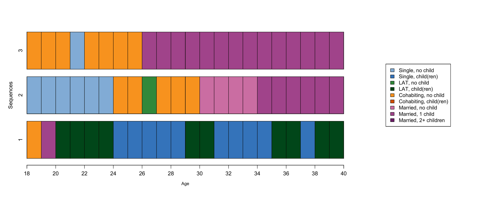

```{r setup, include=FALSE}

# Load required packages
library(here)
source(here("source", "load_libraries.R"))

# Output options
knitr::opts_chunk$set(eval=TRUE, echo=TRUE)
options("kableExtra.html.bsTable" = T)

# load data for Chapter 3
load(here("data", "3-0_ChapterSetup.RData"))

```


```{r, xaringanExtra-clipboard, echo=FALSE}
htmltools::tagList(
  xaringanExtra::use_clipboard(
    button_text = "<i class=\"fa fa-clone fa-2x\" style=\"color: #301e64\"></i>",
    success_text = "<i class=\"fa fa-check fa-2x\" style=\"color: #90BE6D\"></i>",
    error_text = "<i class=\"fa fa-times fa-2x\" style=\"color: #F94144\"></i>"
  ),
  rmarkdown::html_dependency_font_awesome()
)
```


<details><summary>**Click here to get instructions...**</summary>

- Please download and unzip the replication files for Chapter 3
([`r fontawesome::fa("far fa-file-archive")` Chapter03.zip](source/Chapter03.zip)). 
- Read `readme.html` and run `3-0_ChapterSetup.R`. This will create `3-0_ChapterSetup.RData` in the sub folder `data/R`. This file contains the data required to produce the plots shown below. 
- You also have to add the function `legend_large_box` to your environment in order to render the tweaked version of the legend described below. You find this file in the `source` folder of the unzipped Chapter 3 archive.
- We also recommend to load the libraries listed in Chapter 3's `LoadInstallPackages.R`

```{r, eval=FALSE}
# assuming you are working within .Rproj environment
library(here)

# install (if necessary) and load other required packages
source(here("source", "load_libraries.R"))

# load environment generated in "3-0_ChapterSetup.R"
load(here("data", "R", "3-0_ChapterSetup.RData"))

```
</details>

\


In chapter 3.3, we introduce alignment-based extensions of OM. The data come from a sub-sample of the German Family Panel - pairfam. For further information on the study and on how to access the full scientific use file see [here](https://www.pairfam.de/en/){target="_blank"}.


## Theory-based costs

We generate a substitution costs matrix to be used in the next step based on the following theory-based costs:

   substitution=1 if one if different number of children but same partnership status 
   substitution=2 any substitution of different partnership statuses

```{r, eval=TRUE, echo=TRUE}
theo <- matrix(
  c(0,1,2,2,2,2,2,2,2,
    1,0,2,2,2,2,2,2,2,
    2,2,0,1,2,2,2,2,2,
    2,2,1,0,2,2,2,2,2,
    2,2,2,2,0,1,2,2,2,
    2,2,2,2,1,0,2,2,2,
    2,2,2,2,2,2,0,1,1,
    2,2,2,2,2,2,1,0,1,
    2,2,2,2,2,2,1,1,0),
  nrow = 9, ncol = 9, byrow = TRUE,
  dimnames = list(longlab.partner.child, shortlab.partner.child))
```

and display the resulting matrix:

```{r, eval=TRUE, echo=TRUE}
theo
```

We use this matrix to calculate pairwise dissimilarities:

```{r, eval=TRUE, echo=TRUE}
om.theo<-seqdist(partner.child.year.seq, method = "OM", indel = 1,sm = theo)
```

Let's consider three sequences from the initial sample:

```{r fig.width=6, fig.height=4,echo=FALSE, echo=FALSE}

```

In the book, this corresponds to Figure 3.1: if you want to generate this figure in color as we do here, you can use the following code 

```{r, eval=FALSE, echo=TRUE}

layout.fig1 <- layout(matrix(seq(1:2), 1, 2, byrow = TRUE),
                      widths = c(.7, .3))
layout.show(layout.fig1)

par(mar = c(5, 4, 4, 0) + 0.1, las = 1, 
    mgp=c(2,1,-.5))
seqiplot(partner.child.year.seq[1:3, ], 
         ylab = "Sequences",
         with.legend = "FALSE", 
         border = TRUE, 
         axes = FALSE,
         cpal = colspace.partner.child, 
         main = "",
         weighted=FALSE)
par(mgp=c(3,1,0.25))
axis(1, at=(seq(0,22, 2)), labels = seq(18,40, by = 2))
mtext(text = "Age", cex = .8,
      side = 1,#side 1 = bottom
      line = 2.5)

par(mar = c(5, 0, 4, 0) + 0.1)
seqlegend(partner.child.year.seq, 
          cpal = colspace.partner.child, 
          cex = .95, position = "center")

dev.off()
```

We can now inspect a selection of the dissimilarity matrix between the three sequences above:

```{r, eval=TRUE, echo=TRUE}
om.theo[1:3, 1:3]
```

## Costs based on state properties

Generate two vectors with the following properties for each possible state:

     partner: 0=single, 1=couple 
     child: 0=no, 1=yes

```{r, eval=TRUE, echo=TRUE}
partner <- c(0, 0, 1, 1, 1, 1, 1,1,1)
child <- c(0,1,0,1,0,1,0,1,1)
```
 
Create a data.frame with the vectors:

```{r, eval=TRUE, echo=TRUE}
alphabetprop <- data.frame(partner = partner, child = child)
```

Label the rows of the data.frame after the states' names:

```{r, eval=TRUE, echo=TRUE}
rownames(alphabetprop) <- alphabet(partner.child.year.seq)
```

... and display the data.frame

```{r, eval=TRUE, echo=TRUE}
alphabetprop
```

Generate a substitution costs matrix based on the properties with "Gower" algorithm

```{r, eval=TRUE, echo=TRUE}
prop <- as.matrix(daisy(alphabetprop, metric = "gower"))
prop
```

Alternatively, this code can be used within the ?seqcost command (where `FEATURES` corresponds to the properties):

```{r, eval=TRUE, echo=TRUE}
prop2 <- seqcost(partner.child.year.seq, 
                 method="FEATURES",
                 state.features = alphabetprop, 
                 feature.weights = NULL)
prop2
```

We then use the matrix to calculate pairwise dissimilarities, and display a selection of the dissimilarity matrix between sequences in the figure above (Fig. 3.1):

```{r, eval=TRUE, echo=TRUE}
om.prop<-seqdist(partner.child.year.seq, 
                 method = "OM", 
                 indel = 1,
                 sm = prop)
om.prop[1:3, 1:3]
```

Here an alternative code to use the matrix to calculate pairwise dissimilarities and display the dissimilarity matrix between the usual sequences (Fig. 3.1):


```{r, eval=TRUE, echo=TRUE}
om.prop2<-seqdist(partner.child.year.seq, 
                  method = "OM", 
                  indel = 1, 
                  sm = prop2$sm)
om.prop2[1:3, 1:3]
```

## Data driven-costs

For illustrative purpose, we use three example sequences (6 time-points, 3 states: A, B, C)

```{r, eval=TRUE, echo=TRUE}
ch3.ex2 <- c("A-B-B-C-C-C", "A-B-B-B-B-B", "B-C-C-C-B-B")

ch3.ex2.seq <- seqdef(ch3.ex2)
```

The command ?seqcost generates substitution costs, in this case based on transition rates. The command returns also the value of `indel`. 

```{r, eval=TRUE, echo=TRUE}
trate1<-seqcost(ch3.ex2.seq, method="TRATE")
```

We can display the substitution costs matrix based on transition rates:

```{r, eval=TRUE, echo=TRUE}
trate1
```

As an alternative code, ?seqsubm generates substitution costs (here based on transition rates as above), but does not return `indel`:

```{r, eval=TRUE, echo=TRUE}
trate2 <- seqsubm(ch3.ex2.seq, method="TRATE")
```

We can display the substitution costs matrix based on transition rates:

```{r, eval=TRUE, echo=TRUE}
trate2
```

We now want to extract the transition rated between states for the three example sequences:

```{r, eval=TRUE, echo=TRUE}
tr.rates<-seqtrate(ch3.ex2.seq, sel.states = NULL, 
                   time.varying = FALSE, 
                   weighted = TRUE,
                   lag = 1, 
                   with.missing = FALSE, 
                   count = FALSE)
```

...and use the ?seqalign command to get a summary of the optimal number and costs of OM operations with data-driven (transition rates) substitution costs: 

```{r, eval=TRUE, echo=TRUE}
al1.OM.dd <- seqalign(ch3.ex2.seq, 1:2, indel=1, sm=trate2)
print(al1.OM.dd)
```

```{r, eval=TRUE, echo=TRUE}
al2.OM.dd <- seqalign(ch3.ex2.seq, c(1,3), indel=1, sm=trate2)
print(al2.OM.dd)
```

```{r, eval=TRUE, echo=TRUE}
al3.OM.dd <- seqalign(ch3.ex2.seq, 2:3, indel=1, sm=trate2)
print(al3.OM.dd)
```

## Dynamic Hamming distance 

We continue using the three example sequences and compute the dissimilarity matrix using the following costs: `indel`=1, `sm`=dynamic Hamming distance 

```{r, eval=TRUE, echo=TRUE}
dhd.diss<-seqdist(ch3.ex2.seq, method="DHD")
```

...and display the resulting DHD-based dissimilarity matrix:

```{r, eval=TRUE, echo=TRUE}
dhd.diss
```

