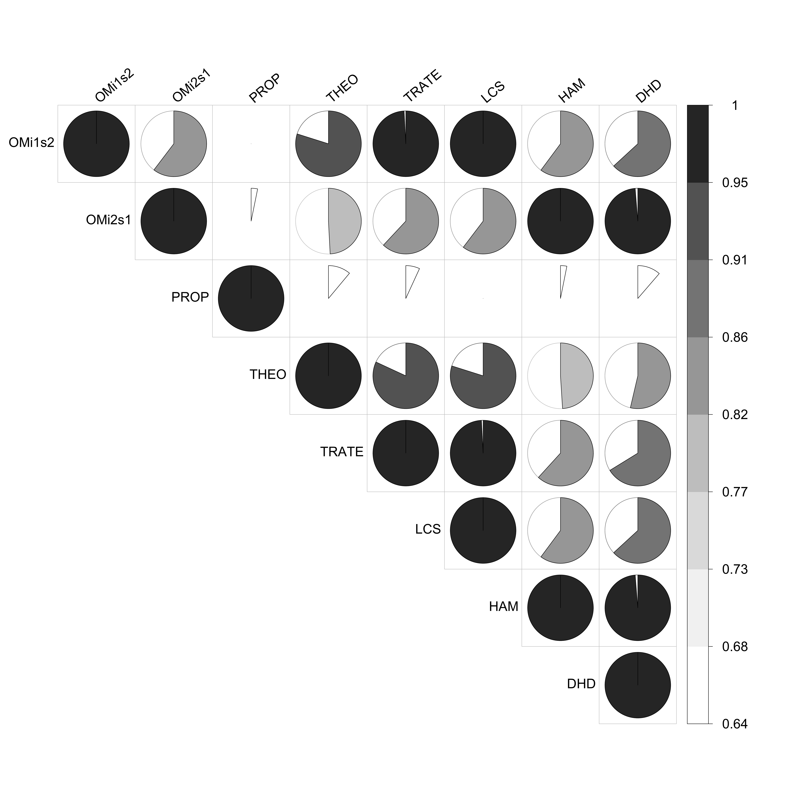

```{r setup, include=FALSE}

# Load required packages
library(here)
source(here("source", "load_libraries.R"))

# Output options
knitr::opts_chunk$set(eval=TRUE, echo=TRUE)
options("kableExtra.html.bsTable" = T)

# load data for Chapter 3
load(here("data", "3-0_ChapterSetup.RData"))

```


```{r, xaringanExtra-clipboard, echo=FALSE}
htmltools::tagList(
  xaringanExtra::use_clipboard(
    button_text = "<i class=\"fa fa-clone fa-2x\" style=\"color: #301e64\"></i>",
    success_text = "<i class=\"fa fa-check fa-2x\" style=\"color: #90BE6D\"></i>",
    error_text = "<i class=\"fa fa-times fa-2x\" style=\"color: #F94144\"></i>"
  ),
  rmarkdown::html_dependency_font_awesome()
)
```


<details><summary>**Click here to get instructions...**</summary>

- Please download and unzip the replication files for Chapter 3
([`r fontawesome::fa("far fa-file-archive")` Chapter03.zip](source/Chapter03.zip)). 
- Read `readme.html` and run `3-0_ChapterSetup.R`. This will create `3-0_ChapterSetup.RData` in the sub folder `data/R`. This file contains the data required to produce the plots shown below. 
- You also have to add the function `legend_large_box` to your environment in order to render the tweaked version of the legend described below. You find this file in the `source` folder of the unzipped Chapter 3 archive.
- We also recommend to load the libraries listed in Chapter 3's `LoadInstallPackages.R`

```{r, eval=FALSE}
# assuming you are working within .Rproj environment
library(here)

# install (if necessary) and load other required packages
source(here("source", "load_libraries.R"))

# load environment generated in "3-0_ChapterSetup.R"
load(here("data", "R", "3-0_ChapterSetup.RData"))

```
</details>

\


In chapter 3.5, we consider how to compute a correlation matrix of sequences' pairwise dissimilarity matrices obtained using different strategies. The data come from a sub-sample of the German Family Panel - pairfam. For further information on the study and on how to access the full scientific use file see [here](https://www.pairfam.de/en/){target="_blank"}.


## Preparatory work: computing the dissimilarity matrices to be compared

Two OM-based with different substitution costs, first equal to 2 and then equal to 1:

```{r, eval=TRUE, echo=TRUE}
costs.sm2 <- matrix(
  c(0,2,2,2,2,2,2,2,2,
    2,0,2,2,2,2,2,2,2,
    2,2,0,2,2,2,2,2,2,
    2,2,2,0,2,2,2,2,2,
    2,2,2,2,0,2,2,2,2,
    2,2,2,2,2,0,2,2,2,
    2,2,2,2,2,2,0,2,2,
    2,2,2,2,2,2,2,0,2,
    2,2,2,2,2,2,2,2,0
  ),
  nrow = 9, 
  ncol = 9, 
  byrow = TRUE)
``` 
  
```{r, eval=TRUE, echo=TRUE}
costs.sm1 <- matrix(
  c(0,1,1,1,1,1,1,1,1,
    1,0,1,1,1,1,1,1,1,
    1,1,0,1,1,1,1,1,1,
    1,1,1,0,1,1,1,1,1,
    1,1,1,1,0,1,1,1,1,
    1,1,1,1,1,0,1,1,1,
    1,1,1,1,1,1,0,1,1,
    1,1,1,1,1,1,1,0,1,
    1,1,1,1,1,1,1,1,0
  ),
  nrow = 9, 
  ncol = 9, 
  byrow = TRUE)
```

OM with substitution costs based on state properties (or features):

```{r, eval=TRUE, echo=TRUE}
partner <- c(0, 0, 1, 1, 1, 1, 1,1,1)
child <- c(0,1,0,1,0,1,0,1,2)

alphabetprop <- data.frame(partner = partner, 
                           child = child)

rownames(alphabetprop) <- alphabet(partner.child.year.seq)

prop <- seqcost(partner.child.year.seq, 
                method="FEATURES",
                state.features = alphabetprop)
```

OM with theory-based substitution costs:

```{r, eval=TRUE, echo=TRUE}
theo <- matrix(
  c(0,1,2,2,2,2,2,2,2,
    1,0,2,2,2,2,2,2,2,
    2,2,0,1,2,2,2,2,2,
    2,2,1,0,2,2,2,2,2,
    2,2,2,2,0,1,2,2,2,
    2,2,2,2,1,0,2,2,2,
    2,2,2,2,2,2,0,1,1,
    2,2,2,2,2,2,1,0,1,
    2,2,2,2,2,2,1,1,0),
  nrow = 9, 
  ncol = 9, 
  byrow = TRUE,
  dimnames = list(shortlab.partner.child, 
                  shortlab.partner.child))
```

## Correlation between the different dissimilarity matrices

We now compute the dissimilarity matrices with different options to be compared:

```{r, eval=TRUE, echo=TRUE}
om.s2.i1<-seqdist(partner.child.year.seq, 
                  method = "OM", 
                  indel = 1,
                  sm = costs.sm2)

om.s1.i4<-o<-seqdist(partner.child.year.seq, 
                     method = "OM", 
                     indel = 2,
                     sm = costs.sm1)

om.prop<-seqdist(partner.child.year.seq, 
                 method = "OM", 
                 indel = 1,
                 sm = prop$sm)

om.theo<-seqdist(partner.child.year.seq, 
                 method = "OM", 
                 indel = 1,
                 sm = theo)

trate<-seqdist(partner.child.year.seq, 
               method = "OM", 
               indel=1, 
               sm= "TRATE")
lcs<-seqdist(partner.child.year.seq, 
             method = "LCS")

ham<-seqdist(partner.child.year.seq, 
             method = "HAM")

dhd<-seqdist(partner.child.year.seq, 
             method = "DHD")
```

Further, we have to create a `data.frame` that bring together the various dissimilarity matrices:

```{r, eval=TRUE, echo=TRUE}
diss.partner.child <- data.frame(
  OMi1s2 = vech(om.s2.i1),
  OMi2s1 = vech(om.s1.i4),
  prop = vech(om.prop),
  theo = vech(om.theo),
  trate = vech(trate),
  lcs = vech(lcs),
  ham = vech(ham),
  dhd = vech(dhd)
)
```

We can now calculate the correlation between the various dissimilarity matrices:

```{r, eval=TRUE, echo=TRUE}
corr.partner.child <- cor(diss.partner.child)
```

...and display the resulting correlation matrix 

```{r, eval=TRUE, echo=TRUE}
corr.partner.child
```

## Correlation between the different normalized dissimilarity matrices

It is wise to compute the dissimilarity matrices with different options to be compared by setting the normalization method (see `?seqdist` to learn more about this):

```{r, eval=TRUE, echo=TRUE}
om.s2.i1.n<-seqdist(partner.child.year.seq, 
                    method = "OM", 
                    indel = 1,
                    sm = costs.sm2, 
                    norm="auto")

om.s1.i4.n<-o<-seqdist(partner.child.year.seq, 
                       method = "OM", 
                       indel = 2,
                       sm = costs.sm1, 
                       norm="auto")

om.prop.n<-seqdist(partner.child.year.seq, 
                   method = "OM", 
                   indel = 1,
                   sm = prop$sm, 
                   norm="auto")

om.theo.n<-seqdist(partner.child.year.seq,
                   method = "OM", 
                   indel = 1,
                   sm = theo, 
                   norm="auto")

trate.n<-seqdist(partner.child.year.seq,
                 method = "OM", 
                 indel=1, 
                 sm= "TRATE", 
                 norm="auto")

lcs.n<-seqdist(partner.child.year.seq,
               method = "LCS", 
               norm="auto")

ham.n<-seqdist(partner.child.year.seq, 
               method = "HAM", 
               norm="auto")

dhd.n<-seqdist(partner.child.year.seq, 
               method = "DHD", 
               norm="auto")
```

Also in this case, we create a `data.frame` of the various normalized dissimilarity matrices:

```{r, eval=TRUE, echo=TRUE}
diss.partner.child.n <- data.frame(
  OMi1s2 = vech(om.s2.i1.n),
  OMi2s1 = vech(om.s1.i4.n),
  PROP = vech(om.prop.n),
  THEO = vech(om.theo.n),
  TRATE = vech(trate.n),
  LCS = vech(lcs.n),
  HAM = vech(ham.n),
  DHD = vech(dhd.n)
)
```

...and then calculate the correlation between the various dissimilarity matrices:

```{r, eval=TRUE, echo=TRUE}
corr.partner.child.n <- cor(diss.partner.child.n)
```

....and display the resulting correlation matrix 

```{r, eval=TRUE, echo=TRUE}
corr.partner.child.n
```

Several options for the visualization of the correlation matrix are available, here we suggest a pie from the `?coorplot` package:

```{r fig.width=6, fig.height=4,echo=FALSE, echo=FALSE}

```

If you want to explore the code to produce this graph, here it is:

```{r, eval=FALSE, echo=TRUE}
corrplot(corr.partner.child.n, 
         method =("pie"), 
         type = "upper", 
         tl.col = "black", 
         tl.srt = 40, 
         tl.cex	= 2,
         cl.cex	= 2,
         col=brewer.pal(n = 8, name = "Greys"),
         is.corr = FALSE)
dev.off()
```

