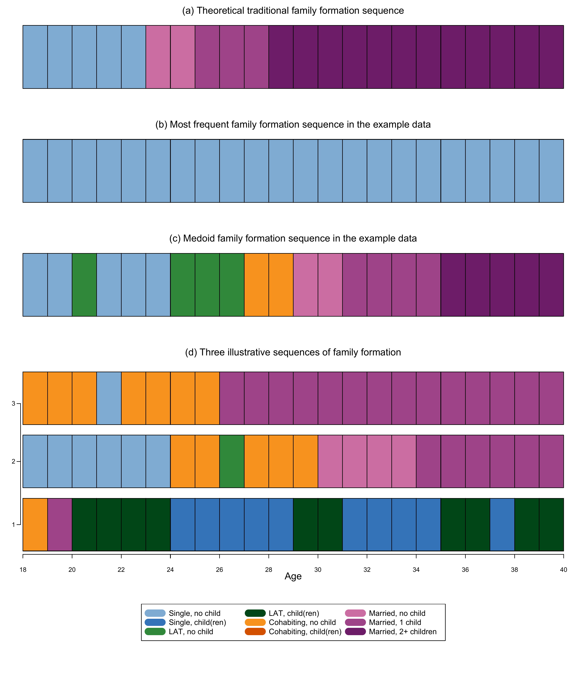

```{r setup, include=FALSE}

# Load required packages
library(here)
source(here("source", "load_libraries.R"))

# Output options
knitr::opts_chunk$set(eval=TRUE, echo=TRUE)
options("kableExtra.html.bsTable" = T)

# load data for Chapter 3
load(here("data", "3-0_ChapterSetup.RData"))

```


```{r, xaringanExtra-clipboard, echo=FALSE}
htmltools::tagList(
  xaringanExtra::use_clipboard(
    button_text = "<i class=\"fa fa-clone fa-2x\" style=\"color: #301e64\"></i>",
    success_text = "<i class=\"fa fa-check fa-2x\" style=\"color: #90BE6D\"></i>",
    error_text = "<i class=\"fa fa-times fa-2x\" style=\"color: #F94144\"></i>"
  ),
  rmarkdown::html_dependency_font_awesome()
)
```


<details><summary>**Click here to get instructions...**</summary>

- Please download and unzip the replication files for Chapter 3
([`r fontawesome::fa("far fa-file-zipper")` Chapter03.zip](source/Chapter03.zip)). 
- Read `readme.html` and run `3-0_ChapterSetup.R`. This will create `3-0_ChapterSetup.RData` in the sub folder `data/R`. This file contains the data required to produce the plots shown below. 
- You also have to add the function `legend_large_box` to your environment in order to render the tweaked version of the legend described below. You find this file in the `source` folder of the unzipped Chapter 3 archive.
- We also recommend to load the libraries listed in Chapter 3's `LoadInstallPackages.R`

```{r, eval=FALSE}
# assuming you are working within .Rproj environment
library(here)

# install (if necessary) and load other required packages
source(here("source", "LoadInstallPackages.R"))

# load environment generated in "3-0_ChapterSetup.R"
load(here("data", "R", "3-0_ChapterSetup.RData"))

```
</details>

\


In chapter 3.7, we introduce techniques to compare all sequences in a dataset to a reference sequences instead of conducting a full-sample pairwise comparison. The data come from a sub-sample of the German Family Panel - pairfam. For further information on the study and on how to access the full scientific use file see [here](https://www.pairfam.de/en/){target="_blank"}.


## Defining a theoretical sequence

First, we generate an object that contains the theoretical sequence id the SPS format of the same length of the sequences in the sample:

```{r, eval=TRUE, echo=TRUE}
theo.seq<-as.matrix("(S,5)-(MAR,2)-(MARc1,3)-(MARc2+,12)")
```

...and print it

```{r, eval=TRUE, echo=TRUE}
theo.seq
```

We then recode the theoretical sequence from SPS to STS and overwrite the object that contains it

```{r, eval=TRUE, echo=TRUE}
theo.seq <- seqformat(theo.seq, from = "SPS", to = "STS")
```

We overwrite it again, by formally define it as a sequence using the `TraMineR` `?seqdef` command:

```{r, eval=TRUE, echo=TRUE}
theo.seq<-seqdef(theo.seq, 
                 states = shortlab.partner.child,
                 alphabet = shortlab.partner.child, 
                 xtstep = 1)
```

We can now compute the dissimilarity between the theoretical sequence and all sequences in the data. Here we use OM with constant substitution costs and `indel` =1. The `theo.seq` object has to be specified as argument to the option `refseq`

```{r, eval=TRUE, echo=TRUE}
dist.theo<-seqdist(partner.child.year.seq, 
                   method = "OM", 
                   indel = 1, 
                   sm = "CONSTANT", 
                   refseq = theo.seq)
```

## Identify the most frequent sequence in the data

We can identify the most frequent sequence by using the `?seqtab` command and specify the `idxs` as follows and store it in a separate object, here called `mostfreq.seq`

```{r, eval=TRUE, echo=TRUE}
mostfreq.seq<-seqtab(partner.child.year.seq, 
                     idxs = 1, 
                     weighted = FALSE, 
                     format = "SPS")
```

We print the most frequent sequence

```{r, eval=TRUE, echo=TRUE}
mostfreq.seq
```

... and compute the dissimilarity between the most frequent sequence and all sequences in the data. The `mostfreq.seq` object has to be specified as argument to the option `refseq`

```{r, eval=TRUE, echo=TRUE}
dist.mostfreq<-seqdist(partner.child.year.seq, 
                       method = "OM", 
                       indel = 1, 
                       sm = "CONSTANT", 
                       refseq = mostfreq.seq)
```

## Identify the medoid sequence in the data

First, we have to compute a dissimilarity matrix, here we use OM with constant substitution costs of 2 and `indel`=1

```{r, eval=TRUE, echo=TRUE}
om.s2.i1<-seqdist(partner.child.year.seq, 
                  method = "OM", 
                  indel = 1, 
                  sm = "CONSTANT")
```

We can then identify the medoid by using the `?disscenter` command and specify the `medoids.index` options as follows

```{r, eval=TRUE, echo=TRUE}
medoid.seq <- disscenter(om.s2.i1, 
                         medoids.index="first")
```

The medoid can be also printed directly by using the following code

```{r, eval=TRUE, echo=TRUE}
print(partner.child.year.seq[medoid.seq,], 
      format="SPS")
```

We can now compute the dissimilarity between the medoid sequence and all sequences in the data. The `medoid.seq` object has to be specified as argument to the option `refseq`

```{r, eval=TRUE, echo=TRUE}
dist.medoid<-seqdist(partner.child.year.seq, 
                     method = "OM", 
                     indel = 1, 
                     sm = "CONSTANT", 
                     refseq = medoid.seq[1])
```

# Summary and visual comparison 

We display the dissimilarity values for the first three sequences in the sample and the three reference sequences:

```{r, eval=TRUE, echo=TRUE}
dist.theo[1:3] 
```

```{r, eval=TRUE, echo=TRUE}
dist.mostfreq[1:3]
```

```{r, eval=TRUE, echo=TRUE}
dist.medoid[1:3]
```

For a visual comparison, here is the version in colors of Figure 3.3, displayed in black and white in the book:

```{r fig.width=6, fig.height=8,echo=FALSE, echo=FALSE}

```

Here the code to generate the figure above 

```{r, eval=FALSE, echo=TRUE}

layout.fig1 <- layout(matrix(c(1,2,3,4,5), 5, 1, byrow = TRUE),
                      heights = c(.20,.20,.20,.42,.20))
layout.show(layout.fig1)

par(mar=c(3, 3, 3, 2))

#theoretical
seqiplot(theo.seq, 
         with.legend=FALSE,
         border = TRUE, 
         axes = FALSE,
         yaxis = FALSE, ylab = NA,
         main="", 
         cex.main = 2,  
         cpal = colspace.partner.child)
mtext(text = "(a) Theoretical traditional family formation sequence",
      side = 3,#side 1 = bottom
      line = 1,
      las=1)

#most freqent
seqiplot(mostfreq.seq, 
         with.legend=FALSE,
         border = TRUE, 
         axes = FALSE,
         yaxis = FALSE, ylab = NA,
         main="", 
         cex.main = 2,  
         cpal = colspace.partner.child)
mtext(text = "(b) Most frequent family formation sequence in the example data",
      side = 3,#side 1 = bottom
      line = 1,
      las=1)

# medoid
seqiplot(partner.child.year.seq[medoid.seq,], 
         with.legend=FALSE,
         border = TRUE, 
         axes = FALSE,
         yaxis = FALSE, ylab = NA,
         main="", 
         cex.main = 2,  
         cpal = colspace.partner.child)
mtext(text = "(c) Medoid family formation sequence in the example data",
      side = 3,#side 1 = bottom
      line = 1,
      las=1)

#example 3 seq
seqiplot(partner.child.year.seq [1:3, ], 
         with.legend=FALSE,
         border = TRUE, 
         axes = FALSE,
         yaxis = FALSE, ylab = NA,
         main="", 
         cex.main = 2,  
         cpal = colspace.partner.child,
         weighted=FALSE)

par(mgp=c(3,1,-0.5)) # adjust parameters for x-axis
axis(1, at=(seq(0,22, 2)), labels = seq(18,40, by = 2))
par(mgp=c(3,1,0.3), las=1)
axis(2, at=c(0.7,1.9,3), labels = c(1,2,3))
mtext(text = "(d) Three illustrative sequences of family formation",
      side = 3,#side 1 = bottom
      line = 1)
mtext(text = "Age",
      side = 1,#side 1 = bottom
      line = 2)

#legend
plot(NULL ,xaxt='n',yaxt='n',bty='n',ylab='',xlab='', xlim=0:1, ylim=0:1)

legend(x = "top",inset = 0, 
       legend = longlab.partner.child, 
       col=colspace.partner.child, 
       lwd=12, 
       cex=1.2, 
       ncol=3,lty = 7)

par(mar=c(1, 1, 4, 1))

title(main = "", 
      line = 2, font.main = 1)

dev.off()
```
