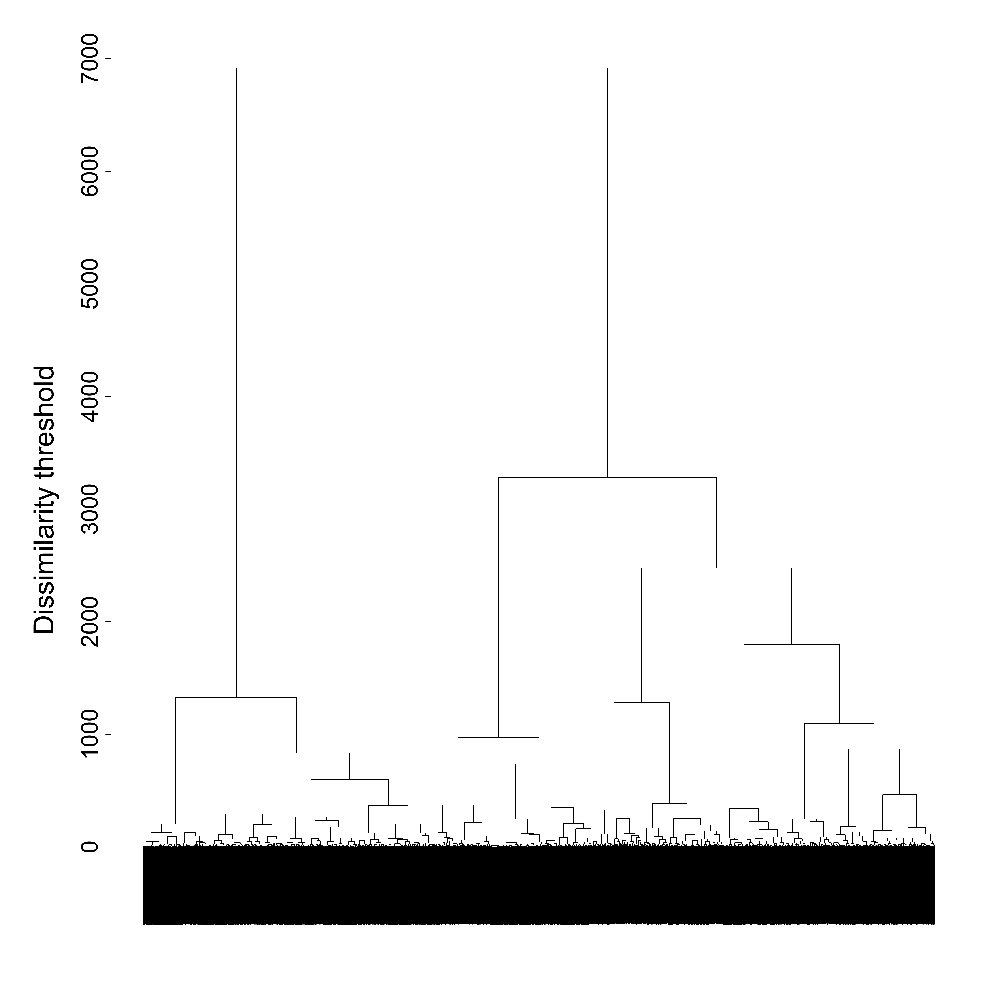

```{r setup, include=FALSE}

# Load required packages
library(here)
source(here("source", "load_libraries.R"))

# Output options
knitr::opts_chunk$set(eval=TRUE, echo=TRUE)
options("kableExtra.html.bsTable" = T)

# load data for Chapter 4
load(here("data", "4-0_ChapterSetup.RData"))

```


```{r, xaringanExtra-clipboard, echo=FALSE}
htmltools::tagList(
  xaringanExtra::use_clipboard(
    button_text = "<i class=\"fa fa-clone fa-2x\" style=\"color: #301e64\"></i>",
    success_text = "<i class=\"fa fa-check fa-2x\" style=\"color: #90BE6D\"></i>",
    error_text = "<i class=\"fa fa-times fa-2x\" style=\"color: #F94144\"></i>"
  ),
  rmarkdown::html_dependency_font_awesome()
)
```

<details><summary>**Click here to get instructions...**</summary>

- Please download and unzip the replication files for Chapter 4
([`r fontawesome::fa("far fa-file-archive")` Chapter04.zip](source/Chapter03.zip)). 
- Read `readme.html` and run `4-0_ChapterSetup.R`. This will create `4-0_ChapterSetup.RData` in the sub folder `data/R`. This file contains the data required to produce the plots shown below. 
- You also have to add the function `legend_large_box` to your environment in order to render the tweaked version of the legend described below. You find this file in the `source` folder of the unzipped Chapter 4 archive.
- We also recommend to load the libraries listed in Chapter 4's `LoadInstallPackages.R`

```{r, eval=FALSE}
# assuming you are working within .Rproj environment
library(here)

# install (if necessary) and load other required packages
source(here("source", "load_libraries.R"))

# load environment generated in "4-0_ChapterSetup.R"
load(here("data", "R", "4-0_ChapterSetup.RData"))

```
</details>

\

In chapter 4.1, we introduce crisp/hard clustering algorithms and cluster quality indeces to be considered when making decisions on the number of clusters to extract from the initial sample. The data come from a sub-sample of the German Family Panel - pairfam. For further information on the study and on how to access the full scientific use file see [here](https://www.pairfam.de/en/){target="_blank"}.

## Crisp (or hard) clustering algorithms

We apply a hierarchical cluster analysis by using the command `?hclust` to the dissimilarity matrix `partner.child.year.om` for the family formation sequences, computed based on OM with `indel`=1 and `sm`=2. We use non-squared dissimilarities (see the `method` option) and weights (see the `members` option, where we have to specify to which `data.frame` the vector with the weights belongs to). 

```{r, eval=TRUE, echo=TRUE}
fam.ward1 <- hclust(as.dist(partner.child.year.om), 
                    method = "ward.D", 
                    members = family$weight40)
```                

The nested structure emerging from the hierarchical clustering algorithm can be displayed using a dendrogram:

```{r, eval=FALSE, echo=TRUE}
par(mar = c(3, 10, 3, 3))
plot(fam.ward1, labels = FALSE, 
     main ="", 
     ylab="",
     xlab="", sub="",
     cex.axis=2.5,
     cex.lab=2.5)
mtext("Dissimilarity threshold", side = 2, line = 5, cex = 3)

dev.off()
```

```{r fig.width=3, fig.height=3,echo=FALSE, echo=FALSE}

```
