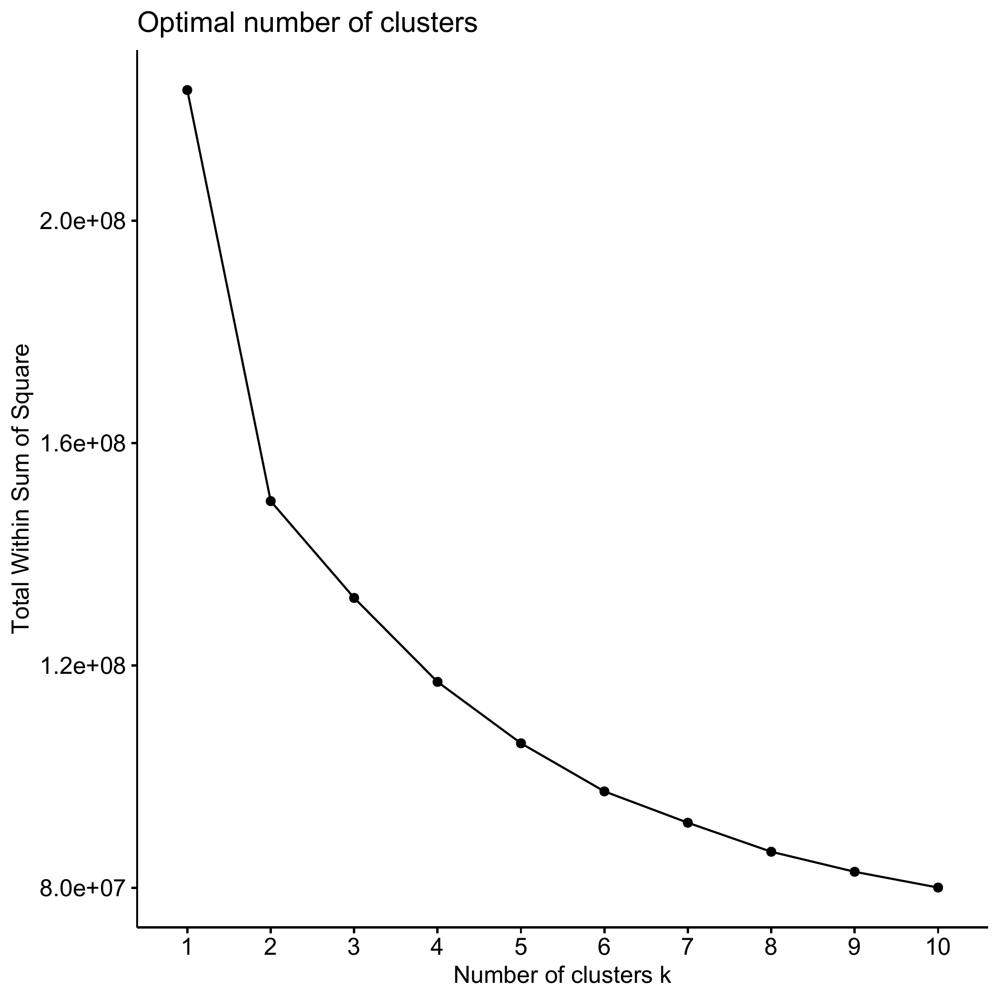
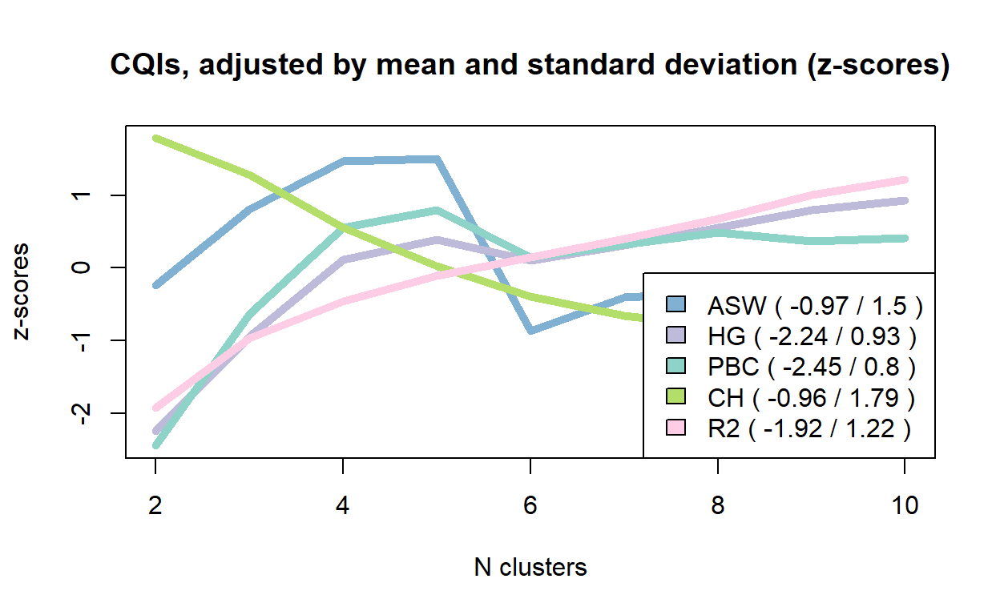
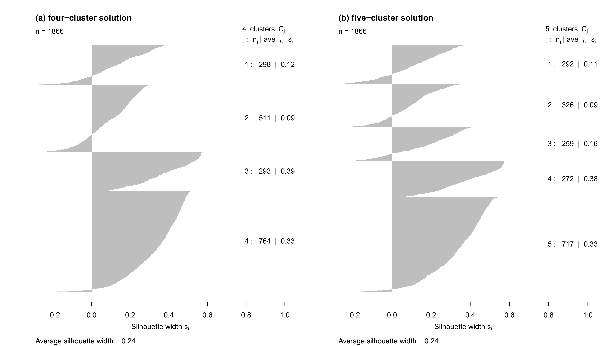
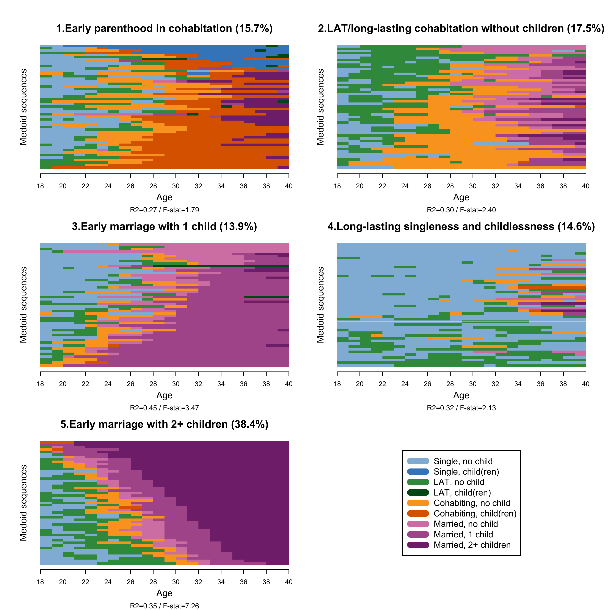
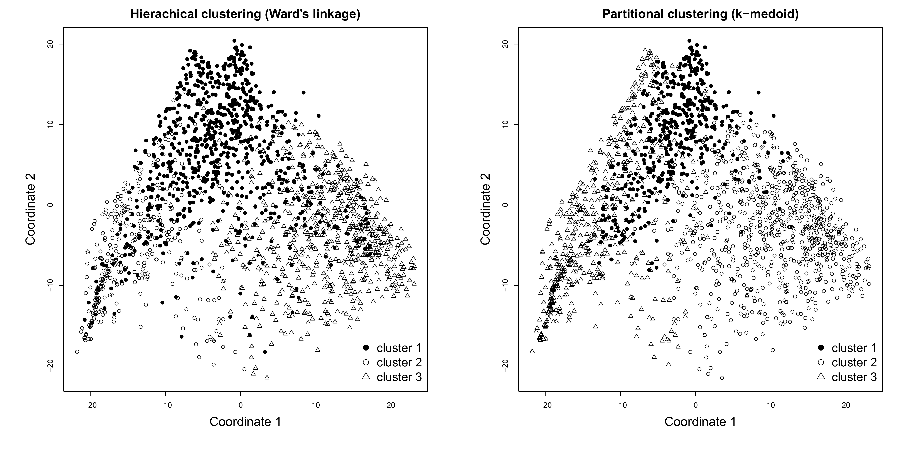

```{r setup, include=FALSE}

# Load required packages
library(here)
source(here("source", "load_libraries.R"))

# Output options
knitr::opts_chunk$set(eval=TRUE, echo=TRUE)
options("kableExtra.html.bsTable" = T)

# load data for Chapter 4
load(here("data", "4-0_ChapterSetup.RData"))

```


```{r, xaringanExtra-clipboard, echo=FALSE}
htmltools::tagList(
  xaringanExtra::use_clipboard(
    button_text = "<i class=\"fa fa-clone fa-2x\" style=\"color: #301e64\"></i>",
    success_text = "<i class=\"fa fa-check fa-2x\" style=\"color: #90BE6D\"></i>",
    error_text = "<i class=\"fa fa-times fa-2x\" style=\"color: #F94144\"></i>"
  ),
  rmarkdown::html_dependency_font_awesome()
)
```

<details><summary>**Click here to get instructions...**</summary>

- Please download and unzip the replication files for Chapter 4
([`r fontawesome::fa("far fa-file-zipper")` Chapter04.zip](source/Chapter04.zip)). 
- Read `readme.html` and run `4-0_ChapterSetup.R`. This will create `4-0_ChapterSetup.RData` in the sub folder `data/R`. This file contains the data required to produce the plots shown below. 
- You also have to add the function `legend_large_box` to your environment in order to render the tweaked version of the legend described below. You find this file in the `source` folder of the unzipped Chapter 4 archive.
- We also recommend to load the libraries listed in Chapter 4's `LoadInstallPackages.R`

```{r, eval=FALSE}
# assuming you are working within .Rproj environment
library(here)

# install (if necessary) and load other required packages
source(here("source", "load_libraries.R"))

# load environment generated in "4-0_ChapterSetup.R"
load(here("data", "R", "4-0_ChapterSetup.RData"))

```
</details>

\

In chapter 4.2, we apply hierarchical and partitional clustering to family formation sequences. The data come from a sub-sample of the German Family Panel - pairfam. For further information on the study and on how to access the full scientific use file see [here](https://www.pairfam.de/en/){target="_blank"}.

## Hierarchical clustering: Ward’s linkage

We apply a hierarchical cluster analysis by using the command `?hclust` to the dissimilarity matrix `partner.child.year.om` for the family formation sequences, computed based on OM with `indel`=1 and `sm`=2. We use non-squared dissimilarities (see the `method` option) and weights (see the `members` option, where we have to specify to which `data.frame` the vector with the weights belongs to). 

```{r, eval=TRUE, echo=TRUE}
fam.ward1 <- hclust(as.dist(partner.child.year.om), 
                    method = "ward.D", 
                    members = family$weight40)
```

One can combine different heuristics to select the number of clusters. One is the so-called "elbow" method, based on a line graph which can be obtained by using the `?fviz_nbclust` command. Notice that we specify here the method option (the method to be used for estimating the optimal number of clusters) as `wss`, that is the total within sum of square. The input of the command is the dissimilarity matrix `partner.child.year.om`: 

```{r, eval=FALSE, echo=TRUE}
fviz_nbclust(partner.child.year.om, 
             FUN = hcut, 
             method = "wss",
             barfill = "black",
             barcolor = "black",
             linecolor = "black")
dev.off()
```

```{r fig.width=2, fig.height=2,echo=FALSE, echo=FALSE}

```

As an alternative or to be used in combination with the elbow method (please refer Chapter 4.2 in the book), we can use the `?as.clustrange` command by using the `?hclust` results (here stored in the object `fam.ward1`) as input. `?as.clustrange` will return a series of cluster quality indicators. Notice that we have to specify the `diss` option by using the dissimilarity matrix of interest and the number of clusters we want the command to "test" (here 10 in the `ncluster` option)

```{r, eval=TRUE, echo=TRUE}
fam.ward.test <- as.clustrange(fam.ward1, 
                               diss = partner.child.year.om,
                               weights =family$weight40, 
                               ncluster = 10)
```

Let's look at the cluster quality indicators

```{r, eval=TRUE, echo=TRUE}
fam.ward.test
```

We can also visualize the trends in the indicators. Here some selected cluster quality indicators, visualized as z-scores

```{r, eval=FALSE, echo=TRUE}
plot(fam.ward.test, stat = c("ASW", "HG", "PBC", "CH", "R2"), 
     lty = 1,
     norm = "zscore", 
     main = "CQIs, adjusted by mean and standard deviation (z-scores)", 
     lwd = 5, 
     ylab="z-scores")

dev.off()
```

```{r fig.width=2, fig.height=1,echo=FALSE, echo=FALSE}

```

Based on considerations presented in the book, we extract the 5-cluster solution. This can be done with the `?cutree` command, specifying the `?hclust`-generate object and the `k` number of clusters to be extracted. We store this information into an object called `fam.ward.5cl`

```{r, eval=TRUE, echo=TRUE}
fam.ward.5cl <-cutree(fam.ward1, k = 5)
```

...that we add to the main `data.frame` `family`:

```{r, eval=TRUE, echo=TRUE}
family$fam.ward.5cl<-fam.ward.5cl
```

Because we want to illustrate how to compare different cluster solutions, we also extract 4 clusters and repeat the procedure

```{r, eval=TRUE, echo=TRUE}
fam.ward.4cl <-cutree(fam.ward1, k = 4)

family$fam.ward.4cl<-fam.ward.4cl
```

We can now cross-tabulate the 4- and 5-cluster solutions storing the table into an object...

```{r, eval=TRUE, echo=TRUE}
comp.ward<-table(fam.ward.5cl, fam.ward.4cl)
```

... that we can print at our convenience:

```{r, eval=TRUE, echo=TRUE}
comp.ward
```

## Partitional clustering: PAM

We use the `?wcKMedRange` command to obtain the cluster quality indicators for a number of clusters between 2 and 10 (see the `kvals` option) using the PAM algorithm. We also specify weights (see `weights` option). Further, we specify the `initialclust` option by using the `?hclust`-generated object we used above

```{r, eval=TRUE, echo=TRUE}
fam.pam.ward <- wcKMedRange(partner.child.year.om, 
                            weights = family$weight40, 
                            kvals = 2:10,
                            initialclust = fam.ward1)
```

Let's consider the cluster quality criteria for this PAM clustering  

```{r, eval=TRUE, echo=TRUE}
fam.pam.ward
```

We first extract a 4-cluster solution

```{r, eval=TRUE, echo=TRUE}
fam.pam.ward.4cl<-fam.pam.ward$clustering$cluster4
```

... attach the vector with the 4-cluster solution to the main `data.frame`:

```{r, eval=TRUE, echo=TRUE}
family$fam.pam.ward.4cl<-fam.pam.ward.4cl
```

... and re-label clusters from 1 to 4 instead of medoid identifier by using the `?recode` command:

```{r, eval=TRUE, echo=TRUE}
family$fam.pam.ward.4cl<-car::recode(family$fam.pam.ward.4cl, 
                                     "1532=1; 1664=2; 1643=3; 985=4")
```

We then extract the 5-cluster solution with the same procedure:

```{r, eval=TRUE, echo=TRUE}
fam.pam.ward.5cl<-fam.pam.ward$clustering$cluster5

family$fam.pam.ward.5cl<-fam.pam.ward.5cl

family$fam.pam.ward.5cl<-car::recode(family$fam.pam.ward.5cl, 
                                     "982=1; 790=2; 373=3; 1643=4; 985=5")
```

We want to compare the 4 and 5-cluster solutions for PAM+Ward clustering. We can use the `?table` command and store the table into an object...

```{r, eval=TRUE, echo=TRUE}
comp.pam.ward<-table(family$fam.pam.ward.5cl, family$fam.pam.ward.4cl)
```

...to be printed at our convenience

```{r, eval=TRUE, echo=TRUE}
comp.pam.ward
```

We now compute the average silhouette width by cluster: we can use the `?silhouette` command and specify the dissimilarity matrix in the `dmatrix` option. We do that for the 4- and the 5-cluster solutions. As usual, we store the results into an object...

```{r, eval=TRUE, echo=TRUE}
silh.pam.ward.5cl <- silhouette(family$fam.pam.ward.5cl, 
                                dmatrix = partner.child.year.om)
silh.pam.ward.4cl <- silhouette(family$fam.pam.ward.4cl, 
                                dmatrix = partner.child.year.om)
```

...that can be plotted:

```{r, eval=FALSE, echo=TRUE}

par(mfrow=c(1,2))
plot(silh.pam.ward.4cl, main = "(a) four-cluster solution", 
     col="grey", border=NA)
plot(silh.pam.ward.5cl, main = "(b) five-cluster solution", 
     col="grey", border=NA)

dev.off()
```

```{r fig.width=3, fig.height=3,echo=FALSE, echo=FALSE}

```

We now proceed with the 5-cluster solution and generate substantively meaningful label for the clusters. Notice that to do this, we need to first visualize the clusters and ideally explore each of them with the descriptive tools presented in Chapter 2

```{r, eval=TRUE, echo=TRUE}

fam.pam.ward.lab.5cl <- c("Early parenthood in cohabitation", 
                          "LAT and long-lasting cohabitation without children",
                          "Early marriage with 1 child", 
                          "Long-lasting singleness and childlessness", 
                          "Early marriage with 2+ children")
```

We attach the labels to the clusters by generating a factor variable: beware of the order of the clusters (option `levels`) and of the labels (option `labels` which is specified with the object created above), as it has to correspond!

```{r, eval=TRUE, echo=TRUE}
fam.pam.ward.factor.5cl <- factor(family$fam.pam.ward.5cl, 
                                  levels = c(1,2,3,4,5), 
                                  labels=fam.pam.ward.lab.5cl)
```

We can now attach the cluster-vector (with labels) to the main `data.frame`:

```{r, eval=TRUE, echo=TRUE}
family$fam.pam.ward.factor.5cl<-fam.pam.ward.factor.5cl
```

To be sure, one might want to confirm that family with the newly attached vectors is a whole data frame

```{r, eval=TRUE, echo=TRUE}
family<-data.frame(family)
```

Among the many options for visualization introduced in Chapter 2, we use the relative frequency plot. The standard `?seqplot.rf` command for this graph produces a combined figure: the sequences and the distance-to-medoid plot. One can also plot only one of the two by specifying the option `which.plot`. In the archive Chapter04.zip in the download area of this webpage, you can find a code to efficiently plot only the sequences part of the relative frequency plot especially if you want to plot the clusters in the same figure. Assuming you are working within `.Rproj` environment, you can use the following code 

```{r, eval=FALSE, echo=TRUE}
source(here("source", "rfplotsleft.R"))
```

Notice that we recommend to always display the distance-to-medoid plot for each cluster at least in the appendix of your article: an example of this can be found in [`Struffolino and Van Winkle 2021`](https://doi.org/10.1016/j.ssresearch.2021.102585){target="_blank"} (open-access version [here](https://osf.io/preprints/socarxiv/b2qpu/){target="_blank"}).

For a nice display of the clusters using the sourced code `rfplotsleft.R`, we first generate separate objects containing the sequences allocated to each clusters:

```{r, eval=TRUE, echo=TRUE}

cl1_5cl<-(partner.child.year.seq[family$fam.pam.ward.factor.5cl=="Early parenthood in cohabitation",1:22])

cl2_5cl<-(partner.child.year.seq[family$fam.pam.ward.factor.5cl=="LAT and long-lasting cohabitation without children",1:22])

cl3_5cl<-(partner.child.year.seq[family$fam.pam.ward.factor.5cl=="Early marriage with 1 child",1:22])

cl4_5cl<-(partner.child.year.seq[family$fam.pam.ward.factor.5cl=="Long-lasting singleness and childlessness",1:22])

cl5_5cl<-(partner.child.year.seq[family$fam.pam.ward.factor.5cl=="Early marriage with 2+ children",1:22])
```

We then compute the dissimilarity matrix for each separate cluster:

```{r, eval=TRUE, echo=TRUE}

cl1_5cl.om<- seqdist(cl1_5cl, method="OM", indel=1, sm= "CONSTANT")

cl2_5cl.om<- seqdist(cl2_5cl, method="OM", indel=1, sm= "CONSTANT")

cl3_5cl.om<- seqdist(cl3_5cl, method="OM", indel=1, sm= "CONSTANT")

cl4_5cl.om<- seqdist(cl4_5cl, method="OM", indel=1, sm= "CONSTANT")

cl5_5cl.om<- seqdist(cl5_5cl, method="OM", indel=1, sm= "CONSTANT")
```

In preparation for the graph, we generate labels for x-axis, 22 time-points in steps of 2, labeled with numbers from 18 to 40, that is the age span our sequences cover

```{r, eval=TRUE, echo=TRUE}

count <- seq(from = 0, to = 22, by = 2)
years <- seq(from = 18, to = 40, by = 2)
```

We now code the combined relative frequency plot (only the sequences part) to display all clusters at once: for each cluster, we set 50 medoid sequences. Notice that here we use the `seqplot.rf.l` command that is included in the sourced code `rfplotsleft.R`. Note that the line below the x-axis label "Age" of each cluster plot reports the R2 and F-stat values generated by running the standard `?seqplot.rf` command. It is your choice to report them, but we recommend to do so. Unfortunately, for now our solution is to impute this information manually as you can see in the code below:


```{r, eval=FALSE, echo=TRUE}

def.par <- par(no.readonly = TRUE)

par(oma = c(0, 2, 2, 0))

m <- matrix(c(1,2,3,4,5,6), 3, 2, byrow = TRUE)
nf <- layout(mat = m, heights = c(0.8,0.8,0.8))
layout.show(nf)

par(mar = c(5, 3, 3, 3))

seqplot.rf.l(cl1_5cl, diss=cl1_5cl.om, 
             k=50, xlab="",cex.main=1.6, 
             title="1.Early parenthood in cohabitation (15.7%)", 
             ylab=FALSE,
             cex.lab=1.4, axes=FALSE)
mtext("Age",side = 1, line = 2.5, cex=0.9)
mtext("Medoid sequences",side = 2, line = 1.5, cex=0.9)
mtext("R2=0.27 / F-stat=1.79",side = 1, line = 4, cex=0.7)
axis(1, at = count, labels = years, font = 1, cex.axis = 1, lwd = 1)

seqplot.rf.l(cl2_5cl, diss=cl2_5cl.om, 
             k=50, xlab="",cex.main=1.6, 
             title="2.LAT/long-lasting cohabitation without children (17.5%)", 
             ylab=FALSE,
             cex.lab=1.4, axes=FALSE)
mtext("Age",side = 1, line = 2.5, cex=0.9)
mtext("Medoid sequences",side = 2, line = 1.5, cex=0.9)
mtext("R2=0.30 / F-stat=2.40",side = 1, line = 4, cex=0.7)
axis(1, at = count, labels = years, font = 1, cex.axis = 1, lwd = 1)

seqplot.rf.l(cl3_5cl, diss=cl3_5cl.om, 
             k=50, xlab="",cex.main=1.6, 
             title="3.Early marriage with 1 child (13.9%)", 
             ylab=FALSE,
             cex.lab=1.4, axes=FALSE)
mtext("Age",side = 1, line = 2.5, cex=0.9)
mtext("Medoid sequences",side = 2, line = 1.5, cex=0.9)
mtext("R2=0.45 / F-stat=3.47",side = 1, line = 4, cex=0.7)
axis(1, at = count, labels = years, font = 1, cex.axis = 1, lwd = 1)

seqplot.rf.l(cl4_5cl, diss=cl4_5cl.om, 
             k=50, xlab="",cex.main=1.6, 
             title="4.Long-lasting singleness and childlessness (14.6%)", 
             ylab=FALSE,
             cex.lab=1.4, axes=FALSE)
mtext("Age",side = 1, line = 2.5, cex=0.9)
mtext("Medoid sequences",side = 2, line = 1.5, cex=0.9)
mtext("R2=0.32 / F-stat=2.13",side = 1, line = 4, cex=0.7)
axis(1, at = count, labels = years, font = 1, cex.axis = 1, lwd = 1)

seqplot.rf.l(cl5_5cl, diss=cl5_5cl.om, 
             k=50, xlab="",cex.main=1.6, 
             title="5.Early marriage with 2+ children (38.4%)", 
             ylab=FALSE,
             cex.lab=1.4, axes=FALSE)
mtext("Age",side = 1, line = 2.5, cex=0.9)
mtext("Medoid sequences",side = 2, line = 1.5, cex=0.9)
mtext("R2=0.35 / F-stat=7.26",side = 1, line = 4, cex=0.7)
axis(1, at = count, labels = years, font = 1, cex.axis = 1, lwd = 1)

plot(1, type = "n", axes=FALSE, xlab="", ylab="")
legend(x = "center",inset = 0, 
       legend = longlab.partner.child, 
       col=colspace.partner.child, 
       lwd=10, cex=1.3, ncol=1)

dev.off()
```

```{r fig.width=3, fig.height=3,echo=FALSE, echo=FALSE}

```

## Visualizing clustering options with MDS

We use the `?cmdscale` to calculate the multidimensional scaling of the dissimilarity matrix `partner.child.year.om`. We  the `k` option (the maximum dimension of the space which the data are to be represented in) at 2

```{r, eval=TRUE, echo=TRUE}
mds.year.om<-cmdscale(partner.child.year.om, k = 2)
```

For illustrative purposes, we extract 3 clusters based on the hierarchical clustering (Ward) and the PAM clustering following the procedure presented in detail above 

```{r, eval=TRUE, echo=TRUE}
# Ward
mds_ward <- hclust(as.dist(partner.child.year.om), 
                   method = "ward.D", 
                   members = family$weight40)

# Cut the clustering at 3
mds_ward_3 <-cutree(mds_ward, k = 3)

#PAM
mds_pam <- wcKMedoids(partner.child.year.om, k = 3)

# Extract the 3 clusters 
mds_pam <- mds_pam$clustering 

# Re-label the clusters 1 to 3 instead of medois id 
mds_pam <- car::recode(mds_pam, "156=1; 985=2; 1735=3")
```

We can now use the objects `mds.year.om`, `mds_ward`, `mds_pam` to visualize the distribution of the sequences in the samples by cluster (extracted by using two different clustering method) in a bi-dimensional space

```{r, eval=FALSE, echo=TRUE}

par(mfrow=c(1,2))

par(mar = c(7, 7, 3, 3))

plot(mds.year.om, type = "n",
     main="Hierachical clustering (Ward's linkage)",
     ylab="Coordinate 2", 
     xlab="Coordinate 1",
     cex.lab=1.7,
     cex.main=1.7)
points(mds.year.om[mds_ward_3 == 1, ], pch = 19, col = "black")
points(mds.year.om[mds_ward_3 == 2, ], pch = 21, col = "black")
points(mds.year.om[mds_ward_3 == 3, ], pch = 24, col = "black")

legend("bottomright", pch = c(19,21,24), legend = c("cluster 1", "cluster 2", "cluster 3"), cex=1.6)
plot(silh.pam.ward.5cl, main = "(b) MDS PAM", col="grey", border=NA)

par(mar = c(7, 7, 3, 3))

plot(mds.year.om, type = "n",
     main="Partitional clustering (k-medoid)",
     ylab="Coordinate 2", 
     xlab="Coordinate 1",
     cex.lab=1.7,
     cex.main=1.7)
points(mds.year.om[mds_pam == 1, ], pch = 19, col = "black")
points(mds.year.om[mds_pam == 2, ], pch = 21, col = "black")
points(mds.year.om[mds_pam == 3, ], pch = 24, col = "black")

legend("bottomright", pch = c(19,21,24), legend = c("cluster 1", "cluster 2", "cluster 3"), cex=1.6)

dev.off()
```

```{r fig.width=3, fig.height=3,echo=FALSE, echo=FALSE}

```

## Comparison between different time granularities

We adopt the same strategy used above for yearly sequences to the case of monthly sequences.

Hierarchical cluster analysis, non-squared dissimilarities, weighted

```{r, eval=TRUE, echo=TRUE}
fam.ward1.month <- hclust(as.dist(partner.child.month.om), 
                          method = "ward.D", 
                          members = family$weight40)
```

PAM cluster analysis initialized with Ward, weighted

```{r, eval=TRUE, echo=TRUE}
fam.pam.ward.month <- wcKMedRange(partner.child.month.om, 
                                  weights = family$weight40, 
                                  kvals = 2:10,
                                  initialclust = fam.ward1.month)
```

Print the quality test for different cluster solutions

```{r, eval=TRUE, echo=TRUE}
fam.pam.ward.month
```

Extract the 5-cluster solution

```{r, eval=TRUE, echo=TRUE}
fam.pam.ward.month.5cl<-fam.pam.ward.month$clustering$cluster5
```

Attach the vector with the 5-cluster solution to the main `data.frame`

```{r, eval=TRUE, echo=TRUE}
family$fam.pam.ward.month.5cl<-fam.pam.ward.month.5cl
```

Re-label clusters from 1 to 5 instead of medoid identifiers

```{r, eval=TRUE, echo=TRUE}
family$fam.pam.ward.month.5cl<-car::recode(family$fam.pam.ward.month.5cl, 
                                           "1652=1; 1032=2; 412=3; 869=4; 927=5")
```

We can now compare the cluster assignment in the case of yearly and monthly data. In both cases we extracted 5 clusters from the PAM+Ward option...

```{r, eval=TRUE, echo=TRUE}
comp.y.m<-table(family$fam.pam.ward.5cl, family$fam.pam.ward.month.5cl)
```

...and print the resulting table

```{r, eval=TRUE, echo=TRUE}
comp.y.m
```
