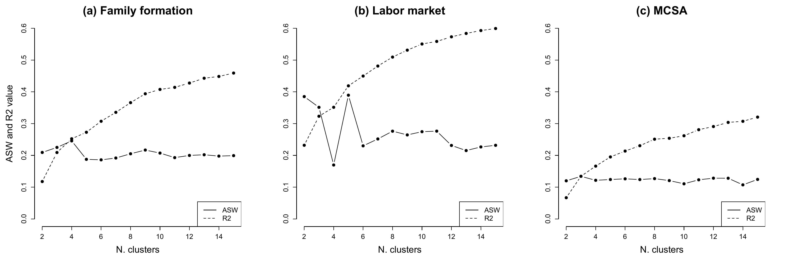
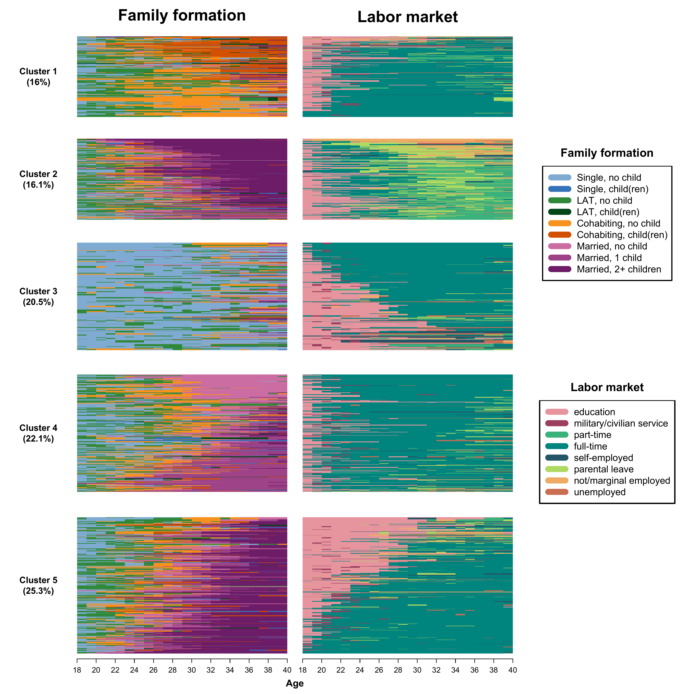

```{r setup, include=FALSE}

# Load required packages
library(here)
source(here("source", "load_libraries.R"))

# Output options
knitr::opts_chunk$set(eval=TRUE, echo=TRUE)
options("kableExtra.html.bsTable" = T)

# load data for Chapter 5
load(here("data", "5-0_ChapterSetup.RData"))

```


```{r, xaringanExtra-clipboard, echo=FALSE}
htmltools::tagList(
  xaringanExtra::use_clipboard(
    button_text = "<i class=\"fa fa-clone fa-2x\" style=\"color: #301e64\"></i>",
    success_text = "<i class=\"fa fa-check fa-2x\" style=\"color: #90BE6D\"></i>",
    error_text = "<i class=\"fa fa-times fa-2x\" style=\"color: #F94144\"></i>"
  ),
  rmarkdown::html_dependency_font_awesome()
)
```

<details><summary>**Click here to get instructions...**</summary>

- Please download and unzip the replication files for Chapter 5
([`r fontawesome::fa("far fa-file-archive")` Chapter04.zip](source/Chapter03.zip)). 
- Read `readme.html` and run `5-0_ChapterSetup.R`. This will create `5-0_ChapterSetup.RData` in the sub folder `data/R`. This file contains the data required to produce the plots shown below. 
- You also have to add the function `legend_large_box` to your environment in order to render the tweaked version of the legend described below. You find this file in the `source` folder of the unzipped Chapter 5 archive.
- We also recommend to load the libraries listed in Chapter 5's `LoadInstallPackages.R`

```{r, eval=FALSE}
# assuming you are working within .Rproj environment
library(here)

# install (if necessary) and load other required packages
source(here("source", "load_libraries.R"))

# load environment generated in "5-0_ChapterSetup.R"
load(here("data", "R", "5-0_ChapterSetup.RData"))

```
</details>

\

In chapter 5.3, we introduce the so-called multichannel sequence analysis. We are now using the `data.frame` `multidim`, which contains both family formation and labour market sequences. Note that individual 1 in one pool of sequences has to correspond to individual 1 in the other pool of sequences. The data come from a sub-sample of the German Family Panel - pairfam. For further information on the study and on how to access the full scientific use file see [here](https://www.pairfam.de/en/){target="_blank"}.


## Extract R2 and ASW for the MCSA clustering

We use the `?seqdistmc` command to compute the multichannel dissimilarity matrix. We specify the option `channels` with the sequences in the two domains stored in `mc.fam.year.seq` and `mc.act.year.seq`. Notice that here we give equal weight to the two channels by specifying the option `cweight` as follows:

```{r, eval=TRUE, echo=TRUE}
mcdist.om <- seqdistmc(channels=list(mc.fam.year.seq, mc.act.year.seq),
                       method="OM", 
                       indel=1, 
                       sm="CONSTANT", 
                       cweight=c(1,1))
```

After storing the MCSA dissimilarity matrix in the object `mcdist.om`, we can use the `?wcKMedRange` command to perform a PAM clustering

```{r, eval=TRUE, echo=TRUE}
mcdist.om.pam <- wcKMedRange(mcdist.om, 
                             weights = multidim$weight40, 
                             kvals = 2:10)
```

From the object containing the values of the cluster quality indicators for different number of clusters, we extract the part of the output where the values for all indicators are stored: 

```{r, eval=TRUE, echo=TRUE}
mc.val<-mcdist.om.pam[[4]]
```

We then select the 4th column - i.e., where the ASW values are stored...

```{r, eval=TRUE, echo=TRUE}
mc.asw <- mc.val[,4]
```

... and the 7th column - i.e., where the R2 values are stored

```{r, eval=TRUE, echo=TRUE}
mc.r2 <- mc.val[,7]
```

## Extract R2 and ASW for family formation and labor market trajectories separately

We use the same procedure on the pools of family formation and labor market trajectories separately

```{r, eval=TRUE, echo=TRUE}
# Family formation trajectory

fam.pam.test <- wcKMedRange(mc.fam.year.om, 
                            weights = multidim$weight40, 
                            kvals = 2:15)

fam.val<-fam.pam.test[[4]]

fam.asw <- fam.val[,4]

fam.r2 <- fam.val[,7]

# Labor market trajectory

act.pam.test <- wcKMedRange(mc.act.year.om, 
                            weights = multidim$weight40, 
                            kvals = 2:15)

act.val<-act.pam.test[[4]]

act.asw <- act.val[,4]

act.r2 <- act.val[,7]
```

## Compare R2 and ASW trends between MCSA and for the separate channels

We can now visualize the R2 and ASW trends across number of clusters. We first have to define the range of the x-axis to plot against the ASW/R2 values:

```{r, eval=FALSE, echo=TRUE}
x <- 2:15
```

We can now proceed with the graph

```{r, eval=FALSE, echo=TRUE}

layout.fig1 <- layout(matrix(c(1,2,3), 1, 3, byrow = TRUE),
                      heights = c(1,1,1))
layout.show(layout.fig1)

par(mar = c(5, 5, 3, 3))

## Family formation

# ASW: include the first line
plot(x, fam.asw, 
     type = "b", 
     frame = FALSE, pch = 19, 
     main="(a) Family formation",
     col = "black", 
     xlab = "N. clusters", 
     ylab = "ASW and R2 value", 
     ylim = c(0,0.6),
     cex.main=2,
     cex.lab=1.6,
     cex.axis=1.2)

# R2: add a second line to the graph
lines(x, fam.r2, 
      pch = 19, 
      col = "black", 
      type = "b", 
      lty = 2)

# Add a legend to the plot
legend("bottomright", 
       legend=c("ASW", "R2"),
       col=c("black", "black"), 
       lty = 1:2, 
       cex=1.2)

## Labor market

# ASW: include the first line
plot(x, act.asw, 
     type = "b", 
     frame = FALSE, 
     pch = 19,
     main="(b) Labor market", 
     col = "black", 
     xlab = "N. clusters", 
     ylab = "", 
     ylim = c(0,0.6),
     cex.main=2,
     cex.lab=1.6,
     cex.axis=1.2)

# R2: add a second line to the graph
lines(x, act.r2, 
      pch = 19, 
      col = "black", 
      type = "b", 
      lty = 2)

# Add a legend to the plot
legend("bottomright", 
       legend=c("ASW", "R2"),
       col=c("black", "black"), 
       lty = 1:2, 
       cex=1.2)

## MCSA

# ASW: include the first line
plot(x, mc.asw, 
     type = "b", 
     frame = FALSE, 
     pch = 19, 
     main="(c) MCSA", 
     col = "black", 
     xlab = "N. clusters", 
     ylab = "", 
     ylim = c(0,0.6),
     cex.main=2,
     cex.lab=1.6,
     cex.axis=1.2)

# R2: add a second line to the graph
lines(x, mc.r2, 
      pch = 19, 
      col = "black", 
      type = "b", 
      lty = 2)

# Add a legend to the plot
legend("bottomright", 
       legend=c("ASW", "R2"),
       col=c("black", "black"), 
       lty = 1:2, 
       cex=1.2)

dev.off()
```                

```{r fig.width=5, fig.height=3,echo=FALSE, echo=FALSE}

```

## Cluster analysis for MCSA

We use the joint dissimilarity matrix `mcdist.om` computed above and for PAM clustering with Ward output to initialize the procedure:

```{r, eval=TRUE, echo=TRUE}

# Ward

mcdist.om.ward<-hclust(as.dist(mcdist.om), 
                       method="ward.D", 
                       members=multidim$weight40)


# PAM + Ward 

mcdist.om.pam.ward <- wcKMedRange(mcdist.om, 
                                  weights = multidim$weight40, 
                                  kvals = 2:10,
                                  initialclust = mcdist.om.ward)
```

We extract 5 clusters and re-label them from 1 to 5 to replace the medoid identifiers and attach the vector with the clusters to the main `data.frame` `multidim`

```{r, eval=TRUE, echo=TRUE}
mc <- mcdist.om.pam.ward$clustering$cluster5

mc.factor <- factor(mc, levels = c(16, 202, 439, 795, 892), 
                    c("1", "2", "3", "4", "5"))

multidim$mc.factor <- as.numeric(mc.factor)

```

To display the clusters for the two channels in parallel, we have to perform some steps to prepare the data. First, we generate subsets of sequences based on the clusters they have been allocated to. We do so for both channels:

```{r, eval=TRUE, echo=TRUE}

# Family formation
fam1.seq <- mc.fam.year.seq[multidim$mc.factor == "1", ]
fam2.seq <- mc.fam.year.seq[multidim$mc.factor == "2", ]
fam3.seq <- mc.fam.year.seq[multidim$mc.factor == "3", ]
fam4.seq <- mc.fam.year.seq[multidim$mc.factor == "4", ]
fam5.seq <- mc.fam.year.seq[multidim$mc.factor == "5", ]

# Labor market
act1.seq <- mc.act.year.seq[multidim$mc.factor == "1", ]
act2.seq <- mc.act.year.seq[multidim$mc.factor == "2", ]
act3.seq <- mc.act.year.seq[multidim$mc.factor == "3", ]
act4.seq <- mc.act.year.seq[multidim$mc.factor == "4", ]
act5.seq <- mc.act.year.seq[multidim$mc.factor == "5", ]
```

We then generate an object called `relfreq` that contains the relative frequencies of the five clusters (using weights, see option `wt`):

```{r, eval=TRUE, echo=TRUE}
relfreq <- multidim %>% 
           count(mc.factor, wt = weight40) %>% 
           mutate(share = n/ sum(n)) %>%
           arrange(share)
```

We then convert relative frequencies to percentages (will be used for labeling the y-axes) and store the information in the object `share`

```{r, eval=TRUE, echo=TRUE}
share <- round(as.numeric(relfreq$share)*100, 1)
```

We can now plot the MCSA clusters, here sequences in each sub-graph are ordered by multidimensional scaling calculated on both channels

```{r, eval=FALSE, echo=TRUE}

def.par <- par(no.readonly = TRUE)

# Each state disribution plot will be displayed according to its relative size
# as we add some additional rows to the cluster some adjustments are required
heights.mc <- c(.05,as.numeric(relfreq$share)*.97,.03)
widths.mc <- c(0.1, 0.325, 0.325, 0.25)

# Specifying the location of the many figures/elements we want to plot
layout.mc <- layout(matrix(c(1,2,3,21,
                             4,5,6,21,
                             7,8,9,22,
                             10,11,12,22,
                             13,14,15,23,
                             16,17,18,23,
                             19,20,20,23), 7, 4, byrow = TRUE), 
                    widths = widths.mc, 
                    heights = heights.mc)
layout.show(layout.mc)

# Labelling of the x-axes
count <- seq(from = 0, to = 22, by = 2)
years <- seq(from = 18, to = 40, by = 2)

# start with the actual graph...

# Row 1 - columns 1-3
par(mar = c(0.2,0,0.2,0))
plot(c(0, 1), c(0, 1), ann = F, bty = 'n', type = 'n', xaxt = 'n', yaxt = 'n')

plot(c(0, 1), c(0, 1), ann = F, bty = 'n', type = 'n', xaxt = 'n', yaxt = 'n')
text(x = 0.5, y = 0.5, paste0("Family formation"), 
     cex = 2.5, col = "black", font = 2)

plot(c(0, 1), c(0, 1), ann = F, bty = 'n', type = 'n', xaxt = 'n', yaxt = 'n')
text(x = 0.5, y = 0.5, paste0("Labor market"), 
     cex = 2.5, col = "black", font = 2)

# Row 2 - columns 1-3
par(mar = c(2,1,0,0))
plot(c(0, 1), c(0, 1), ann = F, bty = 'n', type = 'n', xaxt = 'n', yaxt = 'n')
text(x = 0.5, y = 0.5, paste0("Cluster 1\n","(",share[1], "%)"), 
     cex = 1.4, col = "black", font = 2)

par(mar = c(2,1,0,1))
seqIplot(mc.fam.year.seq[multidim$mc.factor == relfreq$mc.factor[1],],
         sortv = cmdscale(mcdist.om[multidim$mc.factor == relfreq$mc.factor[1],
                                    multidim$mc.factor == relfreq$mc.factor[1]], k = 2),
         with.legend = FALSE, border = NA, 
         axes = FALSE, yaxis = FALSE,  ylab = "")

seqIplot(mc.act.year.seq[multidim$mc.factor == relfreq$mc.factor[1],]
         , sortv = cmdscale(mcdist.om[multidim$mc.factor == relfreq$mc.factor[1],
                                              multidim$mc.factor == relfreq$mc.factor[1]], k = 2)
         , with.legend = FALSE, border = NA, 
         axes = FALSE, yaxis = FALSE,  ylab = "")

# Row 3 - columns 1-3
par(mar = c(2,1,0,0))
plot(c(0, 1), c(0, 1), ann = F, bty = 'n', type = 'n', xaxt = 'n', yaxt = 'n')
text(x = 0.5, y = 0.5, paste0("Cluster 2\n","(",share[2], "%)"), 
     cex = 1.4, col = "black", font = 2)

par(mar = c(2,1,0,1))
seqIplot(mc.fam.year.seq[multidim$mc.factor == relfreq$mc.factor[2],],
         sortv = cmdscale(mcdist.om[multidim$mc.factor == relfreq$mc.factor[2],
                                    multidim$mc.factor == relfreq$mc.factor[2]], k = 2),
         with.legend = FALSE, border = NA, 
         axes = FALSE, yaxis = FALSE,  ylab = "")

seqIplot(mc.act.year.seq[multidim$mc.factor == relfreq$mc.factor[2],]
         , sortv = cmdscale(mcdist.om[multidim$mc.factor == relfreq$mc.factor[2],
                                              multidim$mc.factor == relfreq$mc.factor[2]], k = 2)
         , with.legend = FALSE, border = NA, 
         axes = FALSE, yaxis = FALSE,  ylab = "")

# Row 4 - columns 1-3
par(mar = c(2,1,0,0))
plot(c(0, 1), c(0, 1), ann = F, bty = 'n', type = 'n', xaxt = 'n', yaxt = 'n')
text(x = 0.5, y = 0.5, paste0("Cluster 3\n","(",share[3], "%)"), 
     cex = 1.4, col = "black", font = 2)

par(mar = c(2,1,0,1))
seqIplot(mc.fam.year.seq[multidim$mc.factor == relfreq$mc.factor[3],], 
         sortv = cmdscale(mcdist.om[multidim$mc.factor == relfreq$mc.factor[3],
                                    multidim$mc.factor == relfreq$mc.factor[3]], k = 2)
         , with.legend = FALSE, border = NA, 
         axes = FALSE, yaxis = FALSE,  ylab = "")

seqIplot(mc.act.year.seq[multidim$mc.factor == relfreq$mc.factor[3],]
         , sortv = cmdscale(mcdist.om[multidim$mc.factor == relfreq$mc.factor[3],
                                              multidim$mc.factor == relfreq$mc.factor[3]], k = 2)
         , with.legend = FALSE, border = NA, 
         axes = FALSE, yaxis = FALSE,  ylab = "")

# Row 5 - columns 1-3
par(mar = c(2,1,0,0))
plot(c(0, 1), c(0, 1), ann = F, bty = 'n', type = 'n', xaxt = 'n', yaxt = 'n')
text(x = 0.5, y = 0.5, paste0("Cluster 4\n","(",share[4], "%)"), 
     cex = 1.4, col = "black", font = 2)

par(mar = c(2,1,0,1))
seqIplot(mc.fam.year.seq[multidim$mc.factor == relfreq$mc.factor[4],],
         sortv = cmdscale(mcdist.om[multidim$mc.factor == relfreq$mc.factor[4],
                                    multidim$mc.factor == relfreq$mc.factor[4]], k = 2)
                          , with.legend = FALSE, border = NA, 
         axes = FALSE, yaxis = FALSE,  ylab = "")

seqIplot(mc.act.year.seq[multidim$mc.factor == relfreq$mc.factor[4],]
         , sortv = cmdscale(mcdist.om[multidim$mc.factor == relfreq$mc.factor[4],
                                              multidim$mc.factor == relfreq$mc.factor[4]], k = 2)
                                    , with.legend = FALSE, border = NA, 
         axes = FALSE, yaxis = FALSE,  ylab = "")

# Row 6 - columns 1-3
par(mar = c(2,1,0,0))
plot(c(0, 1), c(0, 1), ann = F, bty = 'n', type = 'n', xaxt = 'n', yaxt = 'n')
text(x = 0.5, y = 0.5, paste0("Cluster 5\n","(",share[5], "%)"), 
     cex = 1.4, col = "black", font = 2)

par(mar = c(2,1,0,1))
seqIplot(mc.fam.year.seq[multidim$mc.factor == relfreq$mc.factor[5],], 
         sortv = cmdscale(mcdist.om[multidim$mc.factor == relfreq$mc.factor[5],
                                    multidim$mc.factor == relfreq$mc.factor[5]], k = 2)
         , with.legend = FALSE, border = NA, 
         axes = FALSE, yaxis = FALSE,  ylab = "")
axis(1, at=(seq(0,22, by = 2)), labels = seq(18,40, by = 2), font = 1, cex.axis = 1.2, lwd = 1)

seqIplot(mc.act.year.seq[multidim$mc.factor == relfreq$mc.factor[5],]
         , sortv = cmdscale(mcdist.om[multidim$mc.factor == relfreq$mc.factor[5],
                                              multidim$mc.factor == relfreq$mc.factor[5]], k = 2)
                                    , with.legend = FALSE, border = NA, 
         axes = FALSE, yaxis = FALSE,  ylab = "")
axis(1, at = count, labels = years, font = 1, cex.axis = 1.2, lwd = 1)

# Row 7 - columns 1-3
par(mar = c(0.2,0,0.2,0))
plot(c(0, 1), c(0, 1), ann = F, bty = 'n', type = 'n', xaxt = 'n', yaxt = 'n')

plot(c(0, 1), c(0, 1), ann = F, bty = 'n', type = 'n', xaxt = 'n', yaxt = 'n')
text(x = 0.5, y = 0.5, paste0("Age"), 
     cex = 1.5, col = "black", font = 2)

# Column 4 
par(mar = c(0.2,0,0.2,0))
plot(c(0, 1), c(0, 1), ann = F, bty = 'n', type = 'n', xaxt = 'n', yaxt = 'n')

par(mar = c(4,1,4,1))
plot(1, type = "n", axes = FALSE, xlab = "", ylab = "")
legend(x = "top",inset = 0, legend = longlab.partner.child, col = colspace.partner.child, 
       lwd = 10, cex = 1.5, ncol = 1, box.lwd = 2)
mtext("Family formation",side = 3, line = 1, cex = 1.2, font = 2)

plot(1, type = "n", axes = FALSE, xlab = "", ylab = "")
legend(x = "top",inset = 0, legend = longlab.activity, col = colspace.activity, 
       lwd = 10, cex = 1.5, ncol = 1, box.lwd = 2)
mtext("Labor market",side = 3, line = 1, cex = 1.2, font = 2)

par(def.par)
dev.off()
```

```{r fig.width=5, fig.height=3,echo=FALSE, echo=FALSE}

```

For the code necessary to order the sequences based on the family trajectories only, see the R-code "5-5_Fig5-2_MCSA_colors_mds_family.R" in the folder "Chapter05.zip" at the download page.