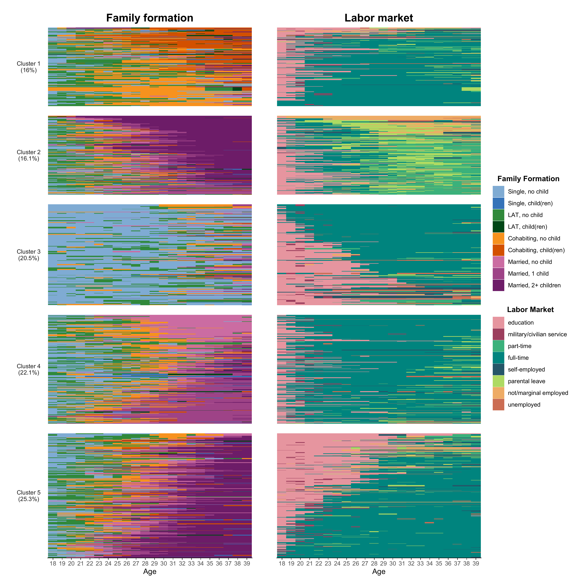

```{r setup, include=FALSE}

# Load required packages
library(here)
source(here("source", "load_libraries.R"))

# Output options
knitr::opts_chunk$set(eval=TRUE, echo=TRUE)
options("kableExtra.html.bsTable" = T)

# load data for Chapter 5
load(here("data", "5-0_ChapterSetup.RData"))

```


```{r, xaringanExtra-clipboard, echo=FALSE}
htmltools::tagList(
  xaringanExtra::use_clipboard(
    button_text = "<i class=\"fa fa-clone fa-2x\" style=\"color: #301e64\"></i>",
    success_text = "<i class=\"fa fa-check fa-2x\" style=\"color: #90BE6D\"></i>",
    error_text = "<i class=\"fa fa-times fa-2x\" style=\"color: #F94144\"></i>"
  ),
  rmarkdown::html_dependency_font_awesome()
)
```

<details><summary>**Click here to get instructions...**</summary>

- Please download and unzip the replication files for Chapter 5
([`r fontawesome::fa("far fa-file-zipper")` Chapter05.zip](source/Chapter05.zip)). 
- Read `readme.html` and run `5-0_ChapterSetup.R`. This will create `5-0_ChapterSetup.RData` in the sub folder `data/R`. This file contains the data required to produce the plots shown below. 
- You also have to add the function `legend_large_box` to your environment in order to render the tweaked version of the legend described below. You find this file in the `source` folder of the unzipped Chapter 5 archive.
- We also recommend to load the libraries listed in Chapter 5's `LoadInstallPackages.R`

```{r, eval=FALSE}
# assuming you are working within .Rproj environment
library(here)

# install (if necessary) and load other required packages
source(here("source", "load_libraries.R"))

# load environment generated in "5-0_ChapterSetup.R"
load(here("data", "R", "5-0_ChapterSetup.RData"))

```
</details>

\

In chapter 5.3, we introduce the so-called multichannel sequence analysis. We are now using the `data.frame` `multidim`, which contains both family formation and labor market sequences. Note that individual 1 in one pool of sequences has to correspond to individual 1 in the other pool of sequences. The data come from a sub-sample of the German Family Panel - pairfam. For further information on the study and on how to access the full scientific use file see [here](https://www.pairfam.de/en/){target="_blank"}.

The original companion page for Chapter 5.5 can be found [here](rChapter5-5.html). This page only shows how to render Figure 5-2 using `ggseqplot::ggesqiplot` instead of `TraMineR::seqIplot`.


## Computing dissimilarity matrix and extracting cluster variable

Here we re-use the code shown and commented on the [tutorial page for Chapter 5.5](rChapter5-5.html).
We compute the dissimilarity matrix, run a cluster analysis and generate a variable indicating the cluster membership for each of the persons in our data.


```{r, eval=TRUE, echo=TRUE}
# Compute the joint dissimilarity matrix
mcdist.om <- seqdistmc(channels=list(mc.fam.year.seq, mc.act.year.seq),
                       method="OM", indel=1, sm="CONSTANT", 
                       cweight=c(1,1))

# Apply PAM clustering + Ward starting point
mcdist.om.ward<-hclust(as.dist(mcdist.om), method="ward.D", members=multidim$weight40)

mcdist.om.pam.ward <- wcKMedRange(mcdist.om, weights = multidim$weight40, kvals = 2:10,
                                  initialclust = mcdist.om.ward)

# Cut tree at cluster==5
mc <- mcdist.om.pam.ward$clustering$cluster5
```

We opted for a five cluster solution. A variable (`cluster`) indicating the cluster membership is added to our source data (`multidim`). Note that we also added another variable indicating the row number of the observations in `multidim`. We will use this indicator to arrange the cases after merging aggregated information on the clusters in the next code chunk.  


```{r, eval=TRUE, echo=TRUE}

# add cluster membership indicator 
multidim <- multidim |>
  mutate(cluster = mc,
         id2 = row_number())
```

In the following step, we obtain the weighted relative frequencies of each cluster (stored in the variable `share`), generate a factor variable (`mc.factor`) labeling the cluster according to these frequencies, and add this information to our `multidim`data making sure the sorting order of the cases remains unaffected (by arranging using the row number indicator `id2` generated in the previous step). 


```{r, eval=TRUE, echo=TRUE}
multidim <- multidim |>
  count(cluster, wt = weight40) |> 
  mutate(share = n/ sum(n)) |>
  arrange(share) |> 
  mutate(mc.factor = glue("Cluster {row_number()}
                            ({round(share*100,1)}%)"),
         mc.factor = factor(mc.factor)) |> 
  select(cluster, mc.factor, share) |> 
  right_join(multidim, by = "cluster") |> 
  arrange(id2)
```

## Multidimensional Scaling

In Figure 2-5 the sequences for each cluster are sorted according to the results of cluster-specific
multidimensional scaling. The scaling is using the distance matrix `mcdist.om` which corresponds to the `multidim` data frame. That is, the first row of the matrix comprises the pairwise dissimilarities of the first case (=row) in `multidim` to every other case. We extract the row index of the cases (using the row names of the dissimilarity matrix and store them in the variable `idx` before we arrange the cases according to the results of the multidimensional scaling. The resulting order of cases is then used to plot the sequences in the desired order.


```{r, eval=TRUE, echo=TRUE}
cmd.idx <- map(levels(multidim$mc.factor),
               ~cmdscale(mcdist.om[multidim$mc.factor == .x,
                                   multidim$mc.factor == .x],
                         k = 2) |>
                 as_tibble(rownames = "idx", .name_repair = "unique") |> 
                 arrange(across(-idx)) |> 
                 pull(idx) |>
                 as.numeric()) |> 
  unlist()

```

Below you can see an extract of the data in their original sorting order and in the
sorting order based on the results of the cluster-specific multidimensional scaling. As we did the scaling cluster-wise, the re-arranged data start with the cases of the first cluster. Within this cluster, the rows are sorted according to the MDS results (as can be indirectly seen by looking at `id2` which shows the original row number of each case; the order obviously changed). 

```{r, eval=TRUE, echo=TRUE}
orig.order <-  multidim |>
  select(id, id2,mc.factor)

new.order <- orig.order[cmd.idx,]

# Original sorting order
orig.order

# Sorting order used for the plots
new.order
```

Like in the `new.order` example above we will use `cmd.idx` in the code for the plot  for re-arranging our sequence data.


## Composing the plot

Finally, we can start to rebuild Figure 5-2 from the book using `{ggseqplot}`.


We can now plot the MCSA clusters, here sequences in each sub-graph are ordered by multidimensional scaling calculated on both channels

```{r, eval=FALSE, echo=TRUE}

# The left panel: Family trajectories
p1 <- ggseqiplot(mc.fam.year.seq[cmd.idx,],
           group = multidim$mc.factor[cmd.idx],
           no.n = T, facet_ncol = 1, strip.position = "left") +
  scale_x_discrete(labels = 18:39, guide = guide_axis(check.overlap = TRUE)) +
  labs(title = "Family formation",
       x = "Age",
       y = NULL) +
  guides(fill = guide_legend(ncol = 1, title="Family Formation"),
         color = guide_legend(ncol = 1, title="Family Formation")) +
  force_panelsizes(rows = sort(unique(multidim$share))) +
  theme(strip.placement = "outside",
        strip.text.y.left = element_text(angle = 0)) 

# The right panel: Labor market trajectories
p2 <- ggseqiplot(mc.act.year.seq[cmd.idx,],
           group = multidim$mc.factor[cmd.idx],
           no.n = T, facet_ncol = 1, strip.position = "left") +
  scale_x_discrete(labels = 18:39, guide = guide_axis(check.overlap = TRUE)) +
  labs(title = "Labor market",
       x = "Age",
       y = NULL) +
  guides(fill = guide_legend(ncol = 1, title="Labor Market"),
         color = guide_legend(ncol = 1, title="Labor Market")) +
  force_panelsizes(rows = sort(unique(multidim$share))) +
  theme(strip.placement = "outside",
        strip.text.y.left = element_blank()) 


# Compose the final plot using {patchwork}
p1 + p2  + 
  plot_layout(guides = 'collect') & 
  theme(legend.position = "right",
        panel.spacing = unit(1, "lines"),
        axis.ticks.y = element_blank(), 
        axis.text.y = element_blank(),
        legend.title = element_text(face = "bold"),
        plot.title = element_text(hjust = .5, size = 16, face = "bold"))
```

```{r echo=FALSE, echo=FALSE, layout="l-body-outset"}

```

