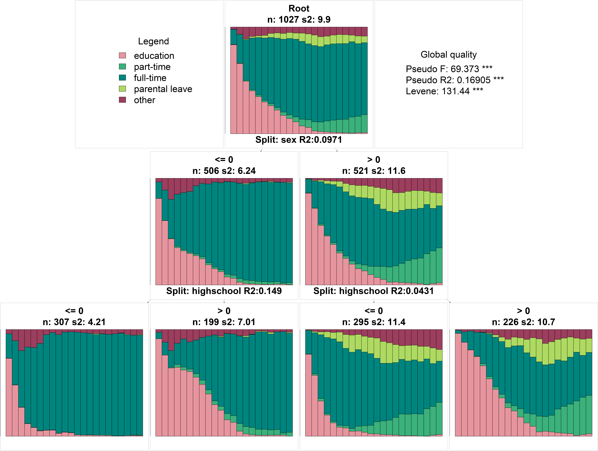

```{r setup, include=FALSE}
# Load required packages
library(here)
source(here("source", "load_libraries.R"))

# Output options
knitr::opts_chunk$set(eval=TRUE, echo=TRUE)
options("kableExtra.html.bsTable" = T)

# load data for Chapter 2
load(here("data", "6-0_ChapterSetup.RData"))

# source code required to produce table shown in the book
source(here("source", "6-2_Table_6-2_R2.R"))

```

```{r, xaringanExtra-clipboard, echo=FALSE}
htmltools::tagList(
  xaringanExtra::use_clipboard(
    button_text = "<i class=\"fa fa-clone fa-2x\" style=\"color: #301e64\"></i>",
    success_text = "<i class=\"fa fa-check fa-2x\" style=\"color: #90BE6D\"></i>",
    error_text = "<i class=\"fa fa-times fa-2x\" style=\"color: #F94144\"></i>"
  ),
  rmarkdown::html_dependency_font_awesome()
)
```

<details><summary>**Click here to get instructions...**</summary>

- Please download and unzip the replication files for Chapter 6
([`r fontawesome::fa("far fa-file-archive")` Chapter06.zip](source/Chapter06.zip)). 
- Read `readme.html` and run `6-0_ChapterSetup.R`. This will create `6-0_ChapterSetup.RData` in the sub folder `data/R`. This file contains the data required to produce the table shown at the bottom of this page. 
- We also recommend to load the libraries listed in the Chapter 6's `LoadInstallPackages.R`

```{r, eval=FALSE}
# assuming you are working within .Rproj environment
library(here)

# install (if necessary) and load other required packages
source(here("source", "LoadInstallPackages.R"))

# load environment generated in "6-0_ChapterSetup.R"
load(here("data", "R", "6-0_ChapterSetup.RData"))

```
</details>

\

## Share of explained discrepancy

**Table 6.2** in Chapter 6.2.1 shows how much of the dicrepancy in the labor market (`activity.year.seq`) and family (`partner.child.year.seq`) sequences is explained by the three dummy variables `east` (living in East vs West Germany), `sex` (male vs. female),  `highschool` (at least highschool degree: yes vs. no). The dummy variables are stored in the data frames `family` and `activity`.

When considering only one variable at a time, [`{TraMineR}`](http://traminer.unige.ch){target="_blank"}'s `dissassoc` function is the fastest solution for computing the share of explained discrepancy (pseudo-$R^2$). With `dissmfacw` [`{TraMineR}`](http://traminer.unige.ch){target="_blank"} also provides the possibility to consider multiple variables at a time. 

**Table 6.2** includes both a univariable and a mutlivariable analysis of the three variables. As the grouping variables do not explain the discrepancy of the family biographies the multivariable approach is only presented for the labor market sequences.

```{r, echo=FALSE, eval=TRUE}
kbl(kbldata,
    col.names = c("$R^2$", "p-value","$R^2$", "p-value",
                  "$\\Delta R^2$ ", "p-value"),
    align = "c") %>%
  kable_styling(full_width = F) %>%
  add_header_above(c(" ", 
                     "Family sequence\n(bivariate)" = 2,
                     "Activity sequence\n(bivariate)" = 2,
                     "Activity sequence\n(multivariate)" = 2)) 
```


Like in Chapter 6.1 we wrote a function and several lines of code to extract the results from the [`{TraMineR}`](http://traminer.unige.ch){target="_blank"} functions and to print a nice table using `{knitr}`'s `kable` and the `{kableExtra}` package. You can find the code in the script `6-2_Table_6-2_R2.R`  stored in [`r fontawesome::fa("far fa-file-archive")` Chapter06.zip](source/Chapter06.zip)). 

On this page, however, we do not further elaborate on such technicalities and rather focus on briefly showcasing the plain [`{TraMineR}`](http://traminer.unige.ch){target="_blank"} commands required to obtain the results shown in the table. As you see, this does not require a lot of coding:  


```{r echo=TRUE, eval=FALSE}
# Labor market sequences
dissassoc(activity.year.om, activity$sex)
dissassoc(activity.year.om, activity$east)
dissassoc(activity.year.om, activity$highschool)

dissmfacw(activity.year.om ~ east + sex + highschool,
          data = activity)


# Family sequences
dissassoc(partner.child.year.om, family$sex)
dissassoc(partner.child.year.om, family$east)
dissassoc(partner.child.year.om, family$highschool)
```

Extracting specifically the information needed for the table requires some additional commands. The following code chunks briefly illustrate the general procedure. We first save and inspect the results from a discrepancy analysis of `activity.year.om` by gender (`activity$sex`).


```{r}

discr_sex <- dissassoc(activity.year.om, activity$sex)
discr_sex
```

[`{TraMineR}`](http://traminer.unige.ch){target="_blank"}'s `dissassoc` produces a lot of output. We save the output in the object `discr_sex`. A closer inspection of this object with `str` or `names` shows that `dissassoc` stores its results in a list object with seven elements. The information required for **Table 6.2** - pseudo-$R^2$ and the corresponding p-value - is stored in the list element `stat`.  


```{r}
str(discr_sex)
names(discr_sex) 
discr_sex$stat

```

If we want to extract pseudo-$R^2$, for instance, we can type:

```{r}
discr_sex$stat[3,1] %>% 
  round(2)
```

The script `6-2_Table_6-2_R2.R`  illustrates all the steps required to extract, arrange, and format the output from `dissassoc` and `dissmfacw` as shown in **Table 6.2**.


## Regression Tree

The regression tree displayed in **Figure 6.1** is based on an analysis of labor market sequences with a reduced alphabet distinguishing 5 instead of 8 states. We define the new sequence object by recoding the original sequence object `activity.year.seq` stored in `6-0_ChapterSetup.RData` with [`{TraMineR}`](http://traminer.unige.ch){target="_blank"}'s `seqrecode` function. Note that you have to take care of the labels after you defined a new sequence object with `seqrecode`.


```{r}

# Inspect the original alphabet
alphabet(activity.year.seq)


# Recode alphabet
activity.year.seq2 <- seqrecode(activity.year.seq,
                                recodes = list("EDU" = "EDU", 
                                               "PT" = "PT",
                                               "FT" = c("FT", "SELF"),
                                               "PLEAVE" = "PLEAVE",
                                               "OTHER" = c("MIL/CS","MARGINAL", "UNEMP")))


# Specify labels for new alphabet
attributes(activity.year.seq2)$labels <- c("education", 
                                           "part-time", "full-time",
                                           "parental leave", "other")
```

The regression tree shown in **Figure 6.1** is based on a regression tree analysis done with [`{TraMineR}`](http://traminer.unige.ch){target="_blank"}'s  `seqtree`. The function requires to specify a regression like formula (`activity.year.seq2 ~ east + sex + highschool`) and a dissimilarity matrix (`activity.year.om2`) telling it which variables should be considered for partitioning a given sequence object. The function offers several opportunities to set cut-off criteria restricting the further growth of the tree. In the example below we restrict the depth of the tree to three (`max.depth = 3`), i.e. to branches with a maximum of two splits of the starting partition (the original sequence object).  

```{r}
# Compute dissimilarity matrix required as input for regression tree
activity.year.om2 <- seqdist(activity.year.seq2, 
                             method="OM", sm= "CONSTANT")


# Run regression tree analysis
activitytree <- seqtree(activity.year.seq2 ~ east + sex + highschool,
                        data = activity, diss = activity.year.om2,
                        weighted = F, max.depth = 3)

# Print the tree
activitytree
```

Although, the printed tree provides a lot of information a graphical visualization of the tree is more appealing and insightful. The visualization can be rendered with the function `seqtreedisplay` and the open source graph visualization software [GraphViz](https://graphviz.org/){target="_blank"}. Once you have downloaded and installed GraphViz it can be used by `seqtreedisplay`. It might be necessary, however, to inform the function where to find GraphViz on your computer (`gvpath`-argument of `seqtreedisplay`). In the following code chunk we first define the `GraphViz` path and then render the graph.


```{r eval=FALSE}
# specify GraphViz directory
graphviz.dir <- "C:/Program Files/GraphViz"

# Plot the results and save the figure
seqtreedisplay(activitytree, type = "d",
               cex.main = 2.5,
               with.legend=T,
               gvpath = graphviz.dir,
               filename = here("figures", "Figure_6-1_Tree.png"))

```

```{r layout="l-page", echo=FALSE}

```

