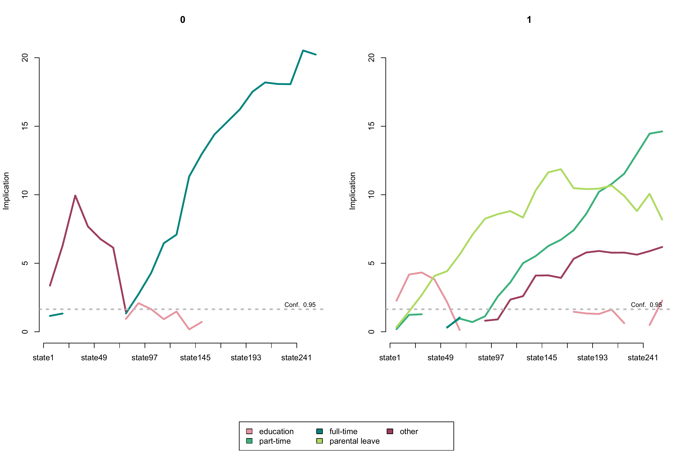
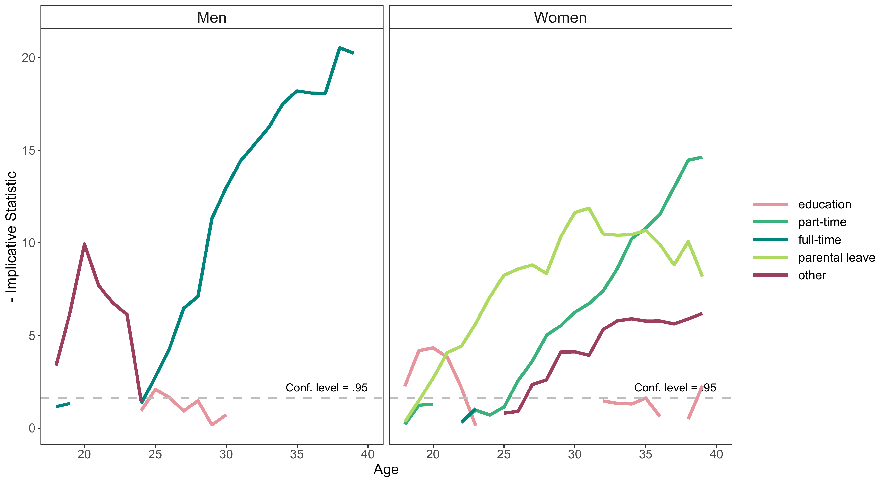
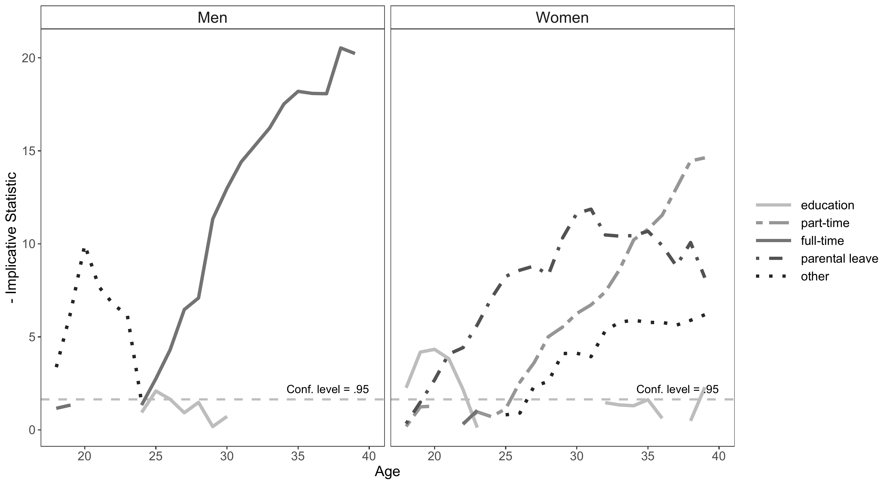

```{r setup, include=FALSE}
# Load required packages
library(here)
source(here("source", "load_libraries.R"))

# Output options
knitr::opts_chunk$set(eval=TRUE, echo=TRUE)
options("kableExtra.html.bsTable" = T)

# load data for Chapter 2
load(here("data", "6-0_ChapterSetup.RData"))

```

```{r, xaringanExtra-clipboard, echo=FALSE}
htmltools::tagList(
  xaringanExtra::use_clipboard(
    button_text = "<i class=\"fa fa-clone fa-2x\" style=\"color: #301e64\"></i>",
    success_text = "<i class=\"fa fa-check fa-2x\" style=\"color: #90BE6D\"></i>",
    error_text = "<i class=\"fa fa-times fa-2x\" style=\"color: #F94144\"></i>"
  ),
  rmarkdown::html_dependency_font_awesome()
)
```

<details><summary>**Click here to get instructions...**</summary>

- Please download and unzip the replication files for Chapter 6
([`r fontawesome::fa("far fa-file-zipper")` Chapter06.zip](source/Chapter06.zip)). 
- Read `readme.html` and run `6-0_ChapterSetup.R`. This will create `6-0_ChapterSetup.RData` in the sub folder `data/R`. This file contains the data required to produce the table shown at the bottom of this page. 
- We also recommend to load the libraries listed in the Chapter 6's `LoadInstallPackages.R`

```{r, eval=FALSE}
# assuming you are working within .Rproj environment
library(here)

# install (if necessary) and load other required packages
source(here("source", "LoadInstallPackages.R"))

# load environment generated in "6-0_ChapterSetup.R"
load(here("data", "R", "6-0_ChapterSetup.RData"))

```
</details>

\

**Figure 6.2** in Chapter 6.3 visualizes the typical states in the labor market sequences of men and women. This type of visualization is based on the implicative statistic framework which was introduced to the sequence analysis literature by Studer [-@studer2015].

The figure is based on an analysis of labor market sequences with a reduced alphabet distinguishing 5 instead of 8 states. We define the new sequence object by recoding the original sequence object `activity.year.seq` stored in `6-0_ChapterSetup.RData` with [`{TraMineR}`](http://traminer.unige.ch){target="_blank"}'s `seqrecode` function. Note that you have to take care of the labels after you defined a new sequence object with `seqrecode`.


```{r}

# Inspect the original alphabet
alphabet(activity.year.seq)


# Recode alphabet
activity.year.seq2 <- seqrecode(activity.year.seq,
                                recodes = list("EDU" = "EDU", 
                                               "PT" = "PT",
                                               "FT" = c("FT", "SELF"),
                                               "PLEAVE" = "PLEAVE",
                                               "OTHER" = c("MIL/CS","MARGINAL", "UNEMP")))


# Specify labels for new alphabet
attributes(activity.year.seq2)$labels <- c("education", 
                                           "part-time", "full-time",
                                           "parental leave", "other")
```

The position wise typical states are identified with the `seqimplic` function from the [`{TraMineRextras}`](http://traminer.unige.ch){target="_blank"} package. The function requires a sequence object and a grouping indicator as an input. In our example we use the labor market sequence object defined above (`activity.year.seq2`) and gender (`activity$sex`) as a grouping variable.
 

```{r}
sex.implic <- seqimplic(activity.year.seq2,
                        group = activity$sex)
```

Even though the output `seqimplic` shows only a selection of the 220 implication scores it contains (22 sequence positions ($k=22$) $\times$ 5 states $\times$ 2 groups), it is a little bit overwhelming. We therefore turn to the visualization of the results which can be obtained by:  

```{r eval=FALSE}
plot(sex.implic, lwd=3)
```
```{r layout="l-page", echo=FALSE}

```

Although, the initial figure is already very informative it requires some adjustments to be considered publication-ready. Given our restricted R skills and the fact that the appearance of the plot is partly hard coded in `seqimplic` it is not straightforward to revise the plot according to our wishes.

Hence, we turn to [`{ggplot2}`](https://ggplot2.tidyverse.org/){target="_blank"} for re-rendering the figure. This requires to reshape the results stored in `sex.implic`. The implication scores have to be stored in the long format with one row for each combination of gender (Men vs. Women), sequence position (Age 18 to 39), and state ("EDU", "PT", "FT", "PLEAVE", "OTHER" ). The scores are stored in a three-dimensional array `sex.implic$indices` ([1:2, 1:5, 1:22]). With [`{purrr}`](https://purrr.tidyverse.org/){target="_blank"}'s `map` function we first extract the scores for men (`sex.implic$indices[1, ,]`) iterating 22 times over each of the five states and attaching the values to each other rowwise (`bind_rows()`). We then repeat the procedure for women. Both resulting objects are joined by `bind_rows`.

To improve readability the plot displayed above shows the opposite values of the implicative statistic. We re-built this behavior by multiplying the values with $-1$ (`mutate(value = value * -1)`). The original plot does not display negative values. Accordingly, we recoded negative values to missings (`mutate(value = ifelse(value < 0, NA, value))`) and only plot values `>=0`.


```{r}

# Store men's implication scores in long format
men <- map(1:5, ~as_tibble(sex.implic$indices[1,.x,]) %>%
                mutate(state = sex.implic$labels[.x], .before = 1) %>%
                mutate(Age = row_number() + 17, .before = 1)) %>%
  bind_rows() %>%
  mutate(value = value * -1) %>% 
  mutate(value = ifelse(value < 0, NA, value)) %>%
  mutate(state = factor(state, levels = sex.implic$labels)) %>%
  mutate(group = "Men", .before = 1)

# Store women's implication scores in long format
women <- map(1:5,~as_tibble(sex.implic$indices[2,.x,]) %>%
                mutate(state = sex.implic$labels[.x], .before = 1) %>%
                mutate(Age = row_number() + 17, .before = 1)) %>%
  bind_rows() %>%
  mutate(value = value * -1) %>% 
  mutate(value = ifelse(value < 0, NA, value)) %>%
  mutate(state = factor(state, levels = sex.implic$labels)) %>%
  mutate(group = "Women", .before = 1)

# Join gender-specific files
sex.implic.long <- bind_rows(men, women)

```

```{r, echo=FALSE}
library(rmarkdown)
paged_table(sex.implic.long)
```
As usual the code for producing the plot with `ggplot` is quite verbose but also very easy to customize. We start with a colored figure. The figure is much more appealing than the one we showed above (but also required much more code). 

```{r eval=FALSE}
sex.implic.long %>% 
  ggplot(aes(x=Age, y=value, group=state)) +
  facet_wrap(~group) +
  geom_line(aes(color=state), size =1.5) +
  scale_color_manual(values = sex.implic$cpal) +
  geom_hline(yintercept=qnorm(.95), 
             linetype="dashed", color = "grey", 
             size =1) +
  annotate(geom="text", x=40, y= qnorm(.95) * 1.2,
           label="Conf. level = .95",
           color = "black", hjust = 1, vjust = 0) + 
  ylab("- Implicative Statistic") +
  theme_bw() +
  theme(legend.key.width = unit(1.5,"cm"),
        panel.grid.major = element_blank(), 
        panel.grid.minor = element_blank(),
        strip.background = element_rect(fill= "transparent"),
        legend.title = element_blank())
```

```{r layout="l-page", echo=FALSE}

```

The following example illustrates how easily the code can be adjusted to produce a grayscale version of the figure. We apply a gray "color" palette (`scale_color_manual(values=brewer.pal(7, "Greys")[3:7])`) and  different line types (`linetype = state` argument in `geom_line` and `scale_linetype_manual`) to distinguish the states of the alphabet.

```{r eval=FALSE}
ggplot(aes(x=Age, y=value, group=state)) +
  facet_wrap(~group) +
  geom_line(aes(color=state, linetype = state), size =1.5) +
  geom_hline(yintercept=qnorm(.95), 
             linetype="dashed", color = "grey", 
             size =1) +
  geom_line(aes(color=state, linetype = state), size =1.5) +
  scale_color_manual(values=brewer.pal(7, "Greys")[3:7]) +
  scale_linetype_manual(values=c("solid",
                                 "twodash",
                                 "solid",
                                 "dotdash",
                                 "dotted")) +
  annotate(geom="text", x=40, y= qnorm(.95) * 1.2,
           label="Conf. level = .95",
           color = "black", hjust = 1, vjust = 0) + 
  ylab("- Implicative Statistic") +
  theme_bw() +
  theme(strip.text = element_text(size = 15),
        axis.title = element_text(size = 14),
        axis.text = element_text(size = 12),
        legend.key.width = unit(1.5,"cm"),
        legend.text = element_text(size = 12),
        panel.grid.major = element_blank(), 
        panel.grid.minor = element_blank(),
        strip.background = element_rect(fill= "transparent"),
        legend.title = element_blank())
```

```{r layout="l-page", echo=FALSE}

```